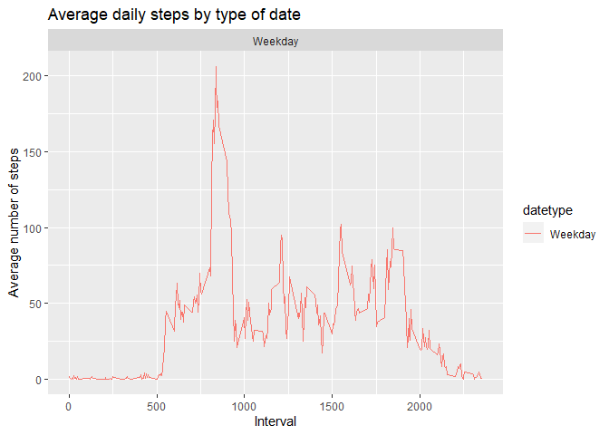

```r
knitr::opts_chunk$set(warning=FALSE)
```

## Reading csv Data into Data.Table. 

```r
activity <- read.csv("./data/activity.csv")

activity$date <- as.POSIXct(activity$date, "%Y-%m-%d")
weekday <- weekdays(activity$date)
activity <- cbind(activity,weekday)
```

# What is mean total number of steps taken per day?

1. Make a histogram of the total number of steps taken each day


```r
library(ggplot2)
activity_total_steps <- with(activity, aggregate(steps, by = list(date), FUN = sum, na.rm = TRUE))
names(activity_total_steps) <- c("date", "steps")
hist(activity_total_steps$steps, main = "Total number of steps taken per day", xlab = "Total steps taken per day", ylim = c(0,20), breaks = seq(0,25000, by=2500))
```

<!-- -->

2.Calculate and report the mean and median total number of steps taken per day 


```r
mean(activity_total_steps$steps)
```

```
## [1] 9354.23
```


```r
median(activity_total_steps$steps)
```

```
## [1] 10395
```


# What is the average daily activity pattern?

1. Make a time series plot (i.e. 𝚝𝚢𝚙𝚎 = "𝚕") of the 5-minute interval (x-axis) and the average number of steps taken, averaged across all days (y-axis)


```r
average_daily_activity <- aggregate(activity$steps, by=list(activity$interval), FUN=mean, na.rm=TRUE)
names(average_daily_activity) <- c("interval", "mean")
plot(average_daily_activity$interval, average_daily_activity$mean, type = "l", lwd = 2, xlab="Interval", ylab="Average number of steps", main="Average number of steps per intervals")
```

<!-- -->

2. Which 5-minute interval, on average across all the days in the dataset, contains the maximum number of steps?


```r
average_daily_activity[which.max(average_daily_activity$mean), ]$interval
```

```
## [1] 835
```


# Imputing missing values

1. Calculate and report the total number of missing values in the dataset (i.e. the total number of rows with 𝙽𝙰s)


```r
sum(is.na(activity$steps))
```

```
## [1] 2304
```

2. Devise a strategy for filling in all of the missing values in the dataset. The strategy does not need to be sophisticated. For example, you could use the mean/median for that day, or the mean for that 5-minute interval, etc.


```r
imputed_steps <- average_daily_activity$mean[match(activity$interval, average_daily_activity$interval)]
imputed_steps
```

```
##     [1]   1.7169811   0.3396226   0.1320755   0.1509434   0.0754717   2.0943396
##     [7]   0.5283019   0.8679245   0.0000000   1.4716981   0.3018868   0.1320755
##    [13]   0.3207547   0.6792453   0.1509434   0.3396226   0.0000000   1.1132075
##    [19]   1.8301887   0.1698113   0.1698113   0.3773585   0.2641509   0.0000000
##    [25]   0.0000000   0.0000000   1.1320755   0.0000000   0.0000000   0.1320755
##    [31]   0.0000000   0.2264151   0.0000000   0.0000000   1.5471698   0.9433962
##    [37]   0.0000000   0.0000000   0.0000000   0.0000000   0.2075472   0.6226415
##    [43]   1.6226415   0.5849057   0.4905660   0.0754717   0.0000000   0.0000000
##    [49]   1.1886792   0.9433962   2.5660377   0.0000000   0.3396226   0.3584906
##    [55]   4.1132075   0.6603774   3.4905660   0.8301887   3.1132075   1.1132075
##    [61]   0.0000000   1.5660377   3.0000000   2.2452830   3.3207547   2.9622642
##    [67]   2.0943396   6.0566038  16.0188679  18.3396226  39.4528302  44.4905660
##    [73]  31.4905660  49.2641509  53.7735849  63.4528302  49.9622642  47.0754717
##    [79]  52.1509434  39.3396226  44.0188679  44.1698113  37.3584906  49.0377358
##    [85]  43.8113208  44.3773585  50.5094340  54.5094340  49.9245283  50.9811321
##    [91]  55.6792453  44.3207547  52.2641509  69.5471698  57.8490566  56.1509434
##    [97]  73.3773585  68.2075472 129.4339623 157.5283019 171.1509434 155.3962264
##   [103] 177.3018868 206.1698113 195.9245283 179.5660377 183.3962264 167.0188679
##   [109] 143.4528302 124.0377358 109.1132075 108.1132075 103.7169811  95.9622642
##   [115]  66.2075472  45.2264151  24.7924528  38.7547170  34.9811321  21.0566038
##   [121]  40.5660377  26.9811321  42.4150943  52.6603774  38.9245283  50.7924528
##   [127]  44.2830189  37.4150943  34.6981132  28.3396226  25.0943396  31.9433962
##   [133]  31.3584906  29.6792453  21.3207547  25.5471698  28.3773585  26.4716981
##   [139]  33.4339623  49.9811321  42.0377358  44.6037736  46.0377358  59.1886792
##   [145]  63.8679245  87.6981132  94.8490566  92.7735849  63.3962264  50.1698113
##   [151]  54.4716981  32.4150943  26.5283019  37.7358491  45.0566038  67.2830189
##   [157]  42.3396226  39.8867925  43.2641509  40.9811321  46.2452830  56.4339623
##   [163]  42.7547170  25.1320755  39.9622642  53.5471698  47.3207547  60.8113208
##   [169]  55.7547170  51.9622642  43.5849057  48.6981132  35.4716981  37.5471698
##   [175]  41.8490566  27.5094340  17.1132075  26.0754717  43.6226415  43.7735849
##   [181]  30.0188679  36.0754717  35.4905660  38.8490566  45.9622642  47.7547170
##   [187]  48.1320755  65.3207547  82.9056604  98.6603774 102.1132075  83.9622642
##   [193]  62.1320755  64.1320755  74.5471698  63.1698113  56.9056604  59.7735849
##   [199]  43.8679245  38.5660377  44.6603774  45.4528302  46.2075472  43.6792453
##   [205]  46.6226415  56.3018868  50.7169811  61.2264151  72.7169811  78.9433962
##   [211]  68.9433962  59.6603774  75.0943396  56.5094340  34.7735849  37.4528302
##   [217]  40.6792453  58.0188679  74.6981132  85.3207547  59.2641509  67.7735849
##   [223]  77.6981132  74.2452830  85.3396226  99.4528302  86.5849057  85.6037736
##   [229]  84.8679245  77.8301887  58.0377358  53.3584906  36.3207547  20.7169811
##   [235]  27.3962264  40.0188679  30.2075472  25.5471698  45.6603774  33.5283019
##   [241]  19.6226415  19.0188679  19.3396226  33.3396226  26.8113208  21.1698113
##   [247]  27.3018868  21.3396226  19.5471698  21.3207547  32.3018868  20.1509434
##   [253]  15.9433962  17.2264151  23.4528302  19.2452830  12.4528302   8.0188679
##   [259]  14.6603774  16.3018868   8.6792453   7.7924528   8.1320755   2.6226415
##   [265]   1.4528302   3.6792453   4.8113208   8.5094340   7.0754717   8.6981132
##   [271]   9.7547170   2.2075472   0.3207547   0.1132075   1.6037736   4.6037736
##   [277]   3.3018868   2.8490566   0.0000000   0.8301887   0.9622642   1.5849057
##   [283]   2.6037736   4.6981132   3.3018868   0.6415094   0.2264151   1.0754717
##   [289]   1.7169811   0.3396226   0.1320755   0.1509434   0.0754717   2.0943396
##   [295]   0.5283019   0.8679245   0.0000000   1.4716981   0.3018868   0.1320755
##   [301]   0.3207547   0.6792453   0.1509434   0.3396226   0.0000000   1.1132075
##   [307]   1.8301887   0.1698113   0.1698113   0.3773585   0.2641509   0.0000000
##   [313]   0.0000000   0.0000000   1.1320755   0.0000000   0.0000000   0.1320755
##   [319]   0.0000000   0.2264151   0.0000000   0.0000000   1.5471698   0.9433962
##   [325]   0.0000000   0.0000000   0.0000000   0.0000000   0.2075472   0.6226415
##   [331]   1.6226415   0.5849057   0.4905660   0.0754717   0.0000000   0.0000000
##   [337]   1.1886792   0.9433962   2.5660377   0.0000000   0.3396226   0.3584906
##   [343]   4.1132075   0.6603774   3.4905660   0.8301887   3.1132075   1.1132075
##   [349]   0.0000000   1.5660377   3.0000000   2.2452830   3.3207547   2.9622642
##   [355]   2.0943396   6.0566038  16.0188679  18.3396226  39.4528302  44.4905660
##   [361]  31.4905660  49.2641509  53.7735849  63.4528302  49.9622642  47.0754717
##   [367]  52.1509434  39.3396226  44.0188679  44.1698113  37.3584906  49.0377358
##   [373]  43.8113208  44.3773585  50.5094340  54.5094340  49.9245283  50.9811321
##   [379]  55.6792453  44.3207547  52.2641509  69.5471698  57.8490566  56.1509434
##   [385]  73.3773585  68.2075472 129.4339623 157.5283019 171.1509434 155.3962264
##   [391] 177.3018868 206.1698113 195.9245283 179.5660377 183.3962264 167.0188679
##   [397] 143.4528302 124.0377358 109.1132075 108.1132075 103.7169811  95.9622642
##   [403]  66.2075472  45.2264151  24.7924528  38.7547170  34.9811321  21.0566038
##   [409]  40.5660377  26.9811321  42.4150943  52.6603774  38.9245283  50.7924528
##   [415]  44.2830189  37.4150943  34.6981132  28.3396226  25.0943396  31.9433962
##   [421]  31.3584906  29.6792453  21.3207547  25.5471698  28.3773585  26.4716981
##   [427]  33.4339623  49.9811321  42.0377358  44.6037736  46.0377358  59.1886792
##   [433]  63.8679245  87.6981132  94.8490566  92.7735849  63.3962264  50.1698113
##   [439]  54.4716981  32.4150943  26.5283019  37.7358491  45.0566038  67.2830189
##   [445]  42.3396226  39.8867925  43.2641509  40.9811321  46.2452830  56.4339623
##   [451]  42.7547170  25.1320755  39.9622642  53.5471698  47.3207547  60.8113208
##   [457]  55.7547170  51.9622642  43.5849057  48.6981132  35.4716981  37.5471698
##   [463]  41.8490566  27.5094340  17.1132075  26.0754717  43.6226415  43.7735849
##   [469]  30.0188679  36.0754717  35.4905660  38.8490566  45.9622642  47.7547170
##   [475]  48.1320755  65.3207547  82.9056604  98.6603774 102.1132075  83.9622642
##   [481]  62.1320755  64.1320755  74.5471698  63.1698113  56.9056604  59.7735849
##   [487]  43.8679245  38.5660377  44.6603774  45.4528302  46.2075472  43.6792453
##   [493]  46.6226415  56.3018868  50.7169811  61.2264151  72.7169811  78.9433962
##   [499]  68.9433962  59.6603774  75.0943396  56.5094340  34.7735849  37.4528302
##   [505]  40.6792453  58.0188679  74.6981132  85.3207547  59.2641509  67.7735849
##   [511]  77.6981132  74.2452830  85.3396226  99.4528302  86.5849057  85.6037736
##   [517]  84.8679245  77.8301887  58.0377358  53.3584906  36.3207547  20.7169811
##   [523]  27.3962264  40.0188679  30.2075472  25.5471698  45.6603774  33.5283019
##   [529]  19.6226415  19.0188679  19.3396226  33.3396226  26.8113208  21.1698113
##   [535]  27.3018868  21.3396226  19.5471698  21.3207547  32.3018868  20.1509434
##   [541]  15.9433962  17.2264151  23.4528302  19.2452830  12.4528302   8.0188679
##   [547]  14.6603774  16.3018868   8.6792453   7.7924528   8.1320755   2.6226415
##   [553]   1.4528302   3.6792453   4.8113208   8.5094340   7.0754717   8.6981132
##   [559]   9.7547170   2.2075472   0.3207547   0.1132075   1.6037736   4.6037736
##   [565]   3.3018868   2.8490566   0.0000000   0.8301887   0.9622642   1.5849057
##   [571]   2.6037736   4.6981132   3.3018868   0.6415094   0.2264151   1.0754717
##   [577]   1.7169811   0.3396226   0.1320755   0.1509434   0.0754717   2.0943396
##   [583]   0.5283019   0.8679245   0.0000000   1.4716981   0.3018868   0.1320755
##   [589]   0.3207547   0.6792453   0.1509434   0.3396226   0.0000000   1.1132075
##   [595]   1.8301887   0.1698113   0.1698113   0.3773585   0.2641509   0.0000000
##   [601]   0.0000000   0.0000000   1.1320755   0.0000000   0.0000000   0.1320755
##   [607]   0.0000000   0.2264151   0.0000000   0.0000000   1.5471698   0.9433962
##   [613]   0.0000000   0.0000000   0.0000000   0.0000000   0.2075472   0.6226415
##   [619]   1.6226415   0.5849057   0.4905660   0.0754717   0.0000000   0.0000000
##   [625]   1.1886792   0.9433962   2.5660377   0.0000000   0.3396226   0.3584906
##   [631]   4.1132075   0.6603774   3.4905660   0.8301887   3.1132075   1.1132075
##   [637]   0.0000000   1.5660377   3.0000000   2.2452830   3.3207547   2.9622642
##   [643]   2.0943396   6.0566038  16.0188679  18.3396226  39.4528302  44.4905660
##   [649]  31.4905660  49.2641509  53.7735849  63.4528302  49.9622642  47.0754717
##   [655]  52.1509434  39.3396226  44.0188679  44.1698113  37.3584906  49.0377358
##   [661]  43.8113208  44.3773585  50.5094340  54.5094340  49.9245283  50.9811321
##   [667]  55.6792453  44.3207547  52.2641509  69.5471698  57.8490566  56.1509434
##   [673]  73.3773585  68.2075472 129.4339623 157.5283019 171.1509434 155.3962264
##   [679] 177.3018868 206.1698113 195.9245283 179.5660377 183.3962264 167.0188679
##   [685] 143.4528302 124.0377358 109.1132075 108.1132075 103.7169811  95.9622642
##   [691]  66.2075472  45.2264151  24.7924528  38.7547170  34.9811321  21.0566038
##   [697]  40.5660377  26.9811321  42.4150943  52.6603774  38.9245283  50.7924528
##   [703]  44.2830189  37.4150943  34.6981132  28.3396226  25.0943396  31.9433962
##   [709]  31.3584906  29.6792453  21.3207547  25.5471698  28.3773585  26.4716981
##   [715]  33.4339623  49.9811321  42.0377358  44.6037736  46.0377358  59.1886792
##   [721]  63.8679245  87.6981132  94.8490566  92.7735849  63.3962264  50.1698113
##   [727]  54.4716981  32.4150943  26.5283019  37.7358491  45.0566038  67.2830189
##   [733]  42.3396226  39.8867925  43.2641509  40.9811321  46.2452830  56.4339623
##   [739]  42.7547170  25.1320755  39.9622642  53.5471698  47.3207547  60.8113208
##   [745]  55.7547170  51.9622642  43.5849057  48.6981132  35.4716981  37.5471698
##   [751]  41.8490566  27.5094340  17.1132075  26.0754717  43.6226415  43.7735849
##   [757]  30.0188679  36.0754717  35.4905660  38.8490566  45.9622642  47.7547170
##   [763]  48.1320755  65.3207547  82.9056604  98.6603774 102.1132075  83.9622642
##   [769]  62.1320755  64.1320755  74.5471698  63.1698113  56.9056604  59.7735849
##   [775]  43.8679245  38.5660377  44.6603774  45.4528302  46.2075472  43.6792453
##   [781]  46.6226415  56.3018868  50.7169811  61.2264151  72.7169811  78.9433962
##   [787]  68.9433962  59.6603774  75.0943396  56.5094340  34.7735849  37.4528302
##   [793]  40.6792453  58.0188679  74.6981132  85.3207547  59.2641509  67.7735849
##   [799]  77.6981132  74.2452830  85.3396226  99.4528302  86.5849057  85.6037736
##   [805]  84.8679245  77.8301887  58.0377358  53.3584906  36.3207547  20.7169811
##   [811]  27.3962264  40.0188679  30.2075472  25.5471698  45.6603774  33.5283019
##   [817]  19.6226415  19.0188679  19.3396226  33.3396226  26.8113208  21.1698113
##   [823]  27.3018868  21.3396226  19.5471698  21.3207547  32.3018868  20.1509434
##   [829]  15.9433962  17.2264151  23.4528302  19.2452830  12.4528302   8.0188679
##   [835]  14.6603774  16.3018868   8.6792453   7.7924528   8.1320755   2.6226415
##   [841]   1.4528302   3.6792453   4.8113208   8.5094340   7.0754717   8.6981132
##   [847]   9.7547170   2.2075472   0.3207547   0.1132075   1.6037736   4.6037736
##   [853]   3.3018868   2.8490566   0.0000000   0.8301887   0.9622642   1.5849057
##   [859]   2.6037736   4.6981132   3.3018868   0.6415094   0.2264151   1.0754717
##   [865]   1.7169811   0.3396226   0.1320755   0.1509434   0.0754717   2.0943396
##   [871]   0.5283019   0.8679245   0.0000000   1.4716981   0.3018868   0.1320755
##   [877]   0.3207547   0.6792453   0.1509434   0.3396226   0.0000000   1.1132075
##   [883]   1.8301887   0.1698113   0.1698113   0.3773585   0.2641509   0.0000000
##   [889]   0.0000000   0.0000000   1.1320755   0.0000000   0.0000000   0.1320755
##   [895]   0.0000000   0.2264151   0.0000000   0.0000000   1.5471698   0.9433962
##   [901]   0.0000000   0.0000000   0.0000000   0.0000000   0.2075472   0.6226415
##   [907]   1.6226415   0.5849057   0.4905660   0.0754717   0.0000000   0.0000000
##   [913]   1.1886792   0.9433962   2.5660377   0.0000000   0.3396226   0.3584906
##   [919]   4.1132075   0.6603774   3.4905660   0.8301887   3.1132075   1.1132075
##   [925]   0.0000000   1.5660377   3.0000000   2.2452830   3.3207547   2.9622642
##   [931]   2.0943396   6.0566038  16.0188679  18.3396226  39.4528302  44.4905660
##   [937]  31.4905660  49.2641509  53.7735849  63.4528302  49.9622642  47.0754717
##   [943]  52.1509434  39.3396226  44.0188679  44.1698113  37.3584906  49.0377358
##   [949]  43.8113208  44.3773585  50.5094340  54.5094340  49.9245283  50.9811321
##   [955]  55.6792453  44.3207547  52.2641509  69.5471698  57.8490566  56.1509434
##   [961]  73.3773585  68.2075472 129.4339623 157.5283019 171.1509434 155.3962264
##   [967] 177.3018868 206.1698113 195.9245283 179.5660377 183.3962264 167.0188679
##   [973] 143.4528302 124.0377358 109.1132075 108.1132075 103.7169811  95.9622642
##   [979]  66.2075472  45.2264151  24.7924528  38.7547170  34.9811321  21.0566038
##   [985]  40.5660377  26.9811321  42.4150943  52.6603774  38.9245283  50.7924528
##   [991]  44.2830189  37.4150943  34.6981132  28.3396226  25.0943396  31.9433962
##   [997]  31.3584906  29.6792453  21.3207547  25.5471698  28.3773585  26.4716981
##  [1003]  33.4339623  49.9811321  42.0377358  44.6037736  46.0377358  59.1886792
##  [1009]  63.8679245  87.6981132  94.8490566  92.7735849  63.3962264  50.1698113
##  [1015]  54.4716981  32.4150943  26.5283019  37.7358491  45.0566038  67.2830189
##  [1021]  42.3396226  39.8867925  43.2641509  40.9811321  46.2452830  56.4339623
##  [1027]  42.7547170  25.1320755  39.9622642  53.5471698  47.3207547  60.8113208
##  [1033]  55.7547170  51.9622642  43.5849057  48.6981132  35.4716981  37.5471698
##  [1039]  41.8490566  27.5094340  17.1132075  26.0754717  43.6226415  43.7735849
##  [1045]  30.0188679  36.0754717  35.4905660  38.8490566  45.9622642  47.7547170
##  [1051]  48.1320755  65.3207547  82.9056604  98.6603774 102.1132075  83.9622642
##  [1057]  62.1320755  64.1320755  74.5471698  63.1698113  56.9056604  59.7735849
##  [1063]  43.8679245  38.5660377  44.6603774  45.4528302  46.2075472  43.6792453
##  [1069]  46.6226415  56.3018868  50.7169811  61.2264151  72.7169811  78.9433962
##  [1075]  68.9433962  59.6603774  75.0943396  56.5094340  34.7735849  37.4528302
##  [1081]  40.6792453  58.0188679  74.6981132  85.3207547  59.2641509  67.7735849
##  [1087]  77.6981132  74.2452830  85.3396226  99.4528302  86.5849057  85.6037736
##  [1093]  84.8679245  77.8301887  58.0377358  53.3584906  36.3207547  20.7169811
##  [1099]  27.3962264  40.0188679  30.2075472  25.5471698  45.6603774  33.5283019
##  [1105]  19.6226415  19.0188679  19.3396226  33.3396226  26.8113208  21.1698113
##  [1111]  27.3018868  21.3396226  19.5471698  21.3207547  32.3018868  20.1509434
##  [1117]  15.9433962  17.2264151  23.4528302  19.2452830  12.4528302   8.0188679
##  [1123]  14.6603774  16.3018868   8.6792453   7.7924528   8.1320755   2.6226415
##  [1129]   1.4528302   3.6792453   4.8113208   8.5094340   7.0754717   8.6981132
##  [1135]   9.7547170   2.2075472   0.3207547   0.1132075   1.6037736   4.6037736
##  [1141]   3.3018868   2.8490566   0.0000000   0.8301887   0.9622642   1.5849057
##  [1147]   2.6037736   4.6981132   3.3018868   0.6415094   0.2264151   1.0754717
##  [1153]   1.7169811   0.3396226   0.1320755   0.1509434   0.0754717   2.0943396
##  [1159]   0.5283019   0.8679245   0.0000000   1.4716981   0.3018868   0.1320755
##  [1165]   0.3207547   0.6792453   0.1509434   0.3396226   0.0000000   1.1132075
##  [1171]   1.8301887   0.1698113   0.1698113   0.3773585   0.2641509   0.0000000
##  [1177]   0.0000000   0.0000000   1.1320755   0.0000000   0.0000000   0.1320755
##  [1183]   0.0000000   0.2264151   0.0000000   0.0000000   1.5471698   0.9433962
##  [1189]   0.0000000   0.0000000   0.0000000   0.0000000   0.2075472   0.6226415
##  [1195]   1.6226415   0.5849057   0.4905660   0.0754717   0.0000000   0.0000000
##  [1201]   1.1886792   0.9433962   2.5660377   0.0000000   0.3396226   0.3584906
##  [1207]   4.1132075   0.6603774   3.4905660   0.8301887   3.1132075   1.1132075
##  [1213]   0.0000000   1.5660377   3.0000000   2.2452830   3.3207547   2.9622642
##  [1219]   2.0943396   6.0566038  16.0188679  18.3396226  39.4528302  44.4905660
##  [1225]  31.4905660  49.2641509  53.7735849  63.4528302  49.9622642  47.0754717
##  [1231]  52.1509434  39.3396226  44.0188679  44.1698113  37.3584906  49.0377358
##  [1237]  43.8113208  44.3773585  50.5094340  54.5094340  49.9245283  50.9811321
##  [1243]  55.6792453  44.3207547  52.2641509  69.5471698  57.8490566  56.1509434
##  [1249]  73.3773585  68.2075472 129.4339623 157.5283019 171.1509434 155.3962264
##  [1255] 177.3018868 206.1698113 195.9245283 179.5660377 183.3962264 167.0188679
##  [1261] 143.4528302 124.0377358 109.1132075 108.1132075 103.7169811  95.9622642
##  [1267]  66.2075472  45.2264151  24.7924528  38.7547170  34.9811321  21.0566038
##  [1273]  40.5660377  26.9811321  42.4150943  52.6603774  38.9245283  50.7924528
##  [1279]  44.2830189  37.4150943  34.6981132  28.3396226  25.0943396  31.9433962
##  [1285]  31.3584906  29.6792453  21.3207547  25.5471698  28.3773585  26.4716981
##  [1291]  33.4339623  49.9811321  42.0377358  44.6037736  46.0377358  59.1886792
##  [1297]  63.8679245  87.6981132  94.8490566  92.7735849  63.3962264  50.1698113
##  [1303]  54.4716981  32.4150943  26.5283019  37.7358491  45.0566038  67.2830189
##  [1309]  42.3396226  39.8867925  43.2641509  40.9811321  46.2452830  56.4339623
##  [1315]  42.7547170  25.1320755  39.9622642  53.5471698  47.3207547  60.8113208
##  [1321]  55.7547170  51.9622642  43.5849057  48.6981132  35.4716981  37.5471698
##  [1327]  41.8490566  27.5094340  17.1132075  26.0754717  43.6226415  43.7735849
##  [1333]  30.0188679  36.0754717  35.4905660  38.8490566  45.9622642  47.7547170
##  [1339]  48.1320755  65.3207547  82.9056604  98.6603774 102.1132075  83.9622642
##  [1345]  62.1320755  64.1320755  74.5471698  63.1698113  56.9056604  59.7735849
##  [1351]  43.8679245  38.5660377  44.6603774  45.4528302  46.2075472  43.6792453
##  [1357]  46.6226415  56.3018868  50.7169811  61.2264151  72.7169811  78.9433962
##  [1363]  68.9433962  59.6603774  75.0943396  56.5094340  34.7735849  37.4528302
##  [1369]  40.6792453  58.0188679  74.6981132  85.3207547  59.2641509  67.7735849
##  [1375]  77.6981132  74.2452830  85.3396226  99.4528302  86.5849057  85.6037736
##  [1381]  84.8679245  77.8301887  58.0377358  53.3584906  36.3207547  20.7169811
##  [1387]  27.3962264  40.0188679  30.2075472  25.5471698  45.6603774  33.5283019
##  [1393]  19.6226415  19.0188679  19.3396226  33.3396226  26.8113208  21.1698113
##  [1399]  27.3018868  21.3396226  19.5471698  21.3207547  32.3018868  20.1509434
##  [1405]  15.9433962  17.2264151  23.4528302  19.2452830  12.4528302   8.0188679
##  [1411]  14.6603774  16.3018868   8.6792453   7.7924528   8.1320755   2.6226415
##  [1417]   1.4528302   3.6792453   4.8113208   8.5094340   7.0754717   8.6981132
##  [1423]   9.7547170   2.2075472   0.3207547   0.1132075   1.6037736   4.6037736
##  [1429]   3.3018868   2.8490566   0.0000000   0.8301887   0.9622642   1.5849057
##  [1435]   2.6037736   4.6981132   3.3018868   0.6415094   0.2264151   1.0754717
##  [1441]   1.7169811   0.3396226   0.1320755   0.1509434   0.0754717   2.0943396
##  [1447]   0.5283019   0.8679245   0.0000000   1.4716981   0.3018868   0.1320755
##  [1453]   0.3207547   0.6792453   0.1509434   0.3396226   0.0000000   1.1132075
##  [1459]   1.8301887   0.1698113   0.1698113   0.3773585   0.2641509   0.0000000
##  [1465]   0.0000000   0.0000000   1.1320755   0.0000000   0.0000000   0.1320755
##  [1471]   0.0000000   0.2264151   0.0000000   0.0000000   1.5471698   0.9433962
##  [1477]   0.0000000   0.0000000   0.0000000   0.0000000   0.2075472   0.6226415
##  [1483]   1.6226415   0.5849057   0.4905660   0.0754717   0.0000000   0.0000000
##  [1489]   1.1886792   0.9433962   2.5660377   0.0000000   0.3396226   0.3584906
##  [1495]   4.1132075   0.6603774   3.4905660   0.8301887   3.1132075   1.1132075
##  [1501]   0.0000000   1.5660377   3.0000000   2.2452830   3.3207547   2.9622642
##  [1507]   2.0943396   6.0566038  16.0188679  18.3396226  39.4528302  44.4905660
##  [1513]  31.4905660  49.2641509  53.7735849  63.4528302  49.9622642  47.0754717
##  [1519]  52.1509434  39.3396226  44.0188679  44.1698113  37.3584906  49.0377358
##  [1525]  43.8113208  44.3773585  50.5094340  54.5094340  49.9245283  50.9811321
##  [1531]  55.6792453  44.3207547  52.2641509  69.5471698  57.8490566  56.1509434
##  [1537]  73.3773585  68.2075472 129.4339623 157.5283019 171.1509434 155.3962264
##  [1543] 177.3018868 206.1698113 195.9245283 179.5660377 183.3962264 167.0188679
##  [1549] 143.4528302 124.0377358 109.1132075 108.1132075 103.7169811  95.9622642
##  [1555]  66.2075472  45.2264151  24.7924528  38.7547170  34.9811321  21.0566038
##  [1561]  40.5660377  26.9811321  42.4150943  52.6603774  38.9245283  50.7924528
##  [1567]  44.2830189  37.4150943  34.6981132  28.3396226  25.0943396  31.9433962
##  [1573]  31.3584906  29.6792453  21.3207547  25.5471698  28.3773585  26.4716981
##  [1579]  33.4339623  49.9811321  42.0377358  44.6037736  46.0377358  59.1886792
##  [1585]  63.8679245  87.6981132  94.8490566  92.7735849  63.3962264  50.1698113
##  [1591]  54.4716981  32.4150943  26.5283019  37.7358491  45.0566038  67.2830189
##  [1597]  42.3396226  39.8867925  43.2641509  40.9811321  46.2452830  56.4339623
##  [1603]  42.7547170  25.1320755  39.9622642  53.5471698  47.3207547  60.8113208
##  [1609]  55.7547170  51.9622642  43.5849057  48.6981132  35.4716981  37.5471698
##  [1615]  41.8490566  27.5094340  17.1132075  26.0754717  43.6226415  43.7735849
##  [1621]  30.0188679  36.0754717  35.4905660  38.8490566  45.9622642  47.7547170
##  [1627]  48.1320755  65.3207547  82.9056604  98.6603774 102.1132075  83.9622642
##  [1633]  62.1320755  64.1320755  74.5471698  63.1698113  56.9056604  59.7735849
##  [1639]  43.8679245  38.5660377  44.6603774  45.4528302  46.2075472  43.6792453
##  [1645]  46.6226415  56.3018868  50.7169811  61.2264151  72.7169811  78.9433962
##  [1651]  68.9433962  59.6603774  75.0943396  56.5094340  34.7735849  37.4528302
##  [1657]  40.6792453  58.0188679  74.6981132  85.3207547  59.2641509  67.7735849
##  [1663]  77.6981132  74.2452830  85.3396226  99.4528302  86.5849057  85.6037736
##  [1669]  84.8679245  77.8301887  58.0377358  53.3584906  36.3207547  20.7169811
##  [1675]  27.3962264  40.0188679  30.2075472  25.5471698  45.6603774  33.5283019
##  [1681]  19.6226415  19.0188679  19.3396226  33.3396226  26.8113208  21.1698113
##  [1687]  27.3018868  21.3396226  19.5471698  21.3207547  32.3018868  20.1509434
##  [1693]  15.9433962  17.2264151  23.4528302  19.2452830  12.4528302   8.0188679
##  [1699]  14.6603774  16.3018868   8.6792453   7.7924528   8.1320755   2.6226415
##  [1705]   1.4528302   3.6792453   4.8113208   8.5094340   7.0754717   8.6981132
##  [1711]   9.7547170   2.2075472   0.3207547   0.1132075   1.6037736   4.6037736
##  [1717]   3.3018868   2.8490566   0.0000000   0.8301887   0.9622642   1.5849057
##  [1723]   2.6037736   4.6981132   3.3018868   0.6415094   0.2264151   1.0754717
##  [1729]   1.7169811   0.3396226   0.1320755   0.1509434   0.0754717   2.0943396
##  [1735]   0.5283019   0.8679245   0.0000000   1.4716981   0.3018868   0.1320755
##  [1741]   0.3207547   0.6792453   0.1509434   0.3396226   0.0000000   1.1132075
##  [1747]   1.8301887   0.1698113   0.1698113   0.3773585   0.2641509   0.0000000
##  [1753]   0.0000000   0.0000000   1.1320755   0.0000000   0.0000000   0.1320755
##  [1759]   0.0000000   0.2264151   0.0000000   0.0000000   1.5471698   0.9433962
##  [1765]   0.0000000   0.0000000   0.0000000   0.0000000   0.2075472   0.6226415
##  [1771]   1.6226415   0.5849057   0.4905660   0.0754717   0.0000000   0.0000000
##  [1777]   1.1886792   0.9433962   2.5660377   0.0000000   0.3396226   0.3584906
##  [1783]   4.1132075   0.6603774   3.4905660   0.8301887   3.1132075   1.1132075
##  [1789]   0.0000000   1.5660377   3.0000000   2.2452830   3.3207547   2.9622642
##  [1795]   2.0943396   6.0566038  16.0188679  18.3396226  39.4528302  44.4905660
##  [1801]  31.4905660  49.2641509  53.7735849  63.4528302  49.9622642  47.0754717
##  [1807]  52.1509434  39.3396226  44.0188679  44.1698113  37.3584906  49.0377358
##  [1813]  43.8113208  44.3773585  50.5094340  54.5094340  49.9245283  50.9811321
##  [1819]  55.6792453  44.3207547  52.2641509  69.5471698  57.8490566  56.1509434
##  [1825]  73.3773585  68.2075472 129.4339623 157.5283019 171.1509434 155.3962264
##  [1831] 177.3018868 206.1698113 195.9245283 179.5660377 183.3962264 167.0188679
##  [1837] 143.4528302 124.0377358 109.1132075 108.1132075 103.7169811  95.9622642
##  [1843]  66.2075472  45.2264151  24.7924528  38.7547170  34.9811321  21.0566038
##  [1849]  40.5660377  26.9811321  42.4150943  52.6603774  38.9245283  50.7924528
##  [1855]  44.2830189  37.4150943  34.6981132  28.3396226  25.0943396  31.9433962
##  [1861]  31.3584906  29.6792453  21.3207547  25.5471698  28.3773585  26.4716981
##  [1867]  33.4339623  49.9811321  42.0377358  44.6037736  46.0377358  59.1886792
##  [1873]  63.8679245  87.6981132  94.8490566  92.7735849  63.3962264  50.1698113
##  [1879]  54.4716981  32.4150943  26.5283019  37.7358491  45.0566038  67.2830189
##  [1885]  42.3396226  39.8867925  43.2641509  40.9811321  46.2452830  56.4339623
##  [1891]  42.7547170  25.1320755  39.9622642  53.5471698  47.3207547  60.8113208
##  [1897]  55.7547170  51.9622642  43.5849057  48.6981132  35.4716981  37.5471698
##  [1903]  41.8490566  27.5094340  17.1132075  26.0754717  43.6226415  43.7735849
##  [1909]  30.0188679  36.0754717  35.4905660  38.8490566  45.9622642  47.7547170
##  [1915]  48.1320755  65.3207547  82.9056604  98.6603774 102.1132075  83.9622642
##  [1921]  62.1320755  64.1320755  74.5471698  63.1698113  56.9056604  59.7735849
##  [1927]  43.8679245  38.5660377  44.6603774  45.4528302  46.2075472  43.6792453
##  [1933]  46.6226415  56.3018868  50.7169811  61.2264151  72.7169811  78.9433962
##  [1939]  68.9433962  59.6603774  75.0943396  56.5094340  34.7735849  37.4528302
##  [1945]  40.6792453  58.0188679  74.6981132  85.3207547  59.2641509  67.7735849
##  [1951]  77.6981132  74.2452830  85.3396226  99.4528302  86.5849057  85.6037736
##  [1957]  84.8679245  77.8301887  58.0377358  53.3584906  36.3207547  20.7169811
##  [1963]  27.3962264  40.0188679  30.2075472  25.5471698  45.6603774  33.5283019
##  [1969]  19.6226415  19.0188679  19.3396226  33.3396226  26.8113208  21.1698113
##  [1975]  27.3018868  21.3396226  19.5471698  21.3207547  32.3018868  20.1509434
##  [1981]  15.9433962  17.2264151  23.4528302  19.2452830  12.4528302   8.0188679
##  [1987]  14.6603774  16.3018868   8.6792453   7.7924528   8.1320755   2.6226415
##  [1993]   1.4528302   3.6792453   4.8113208   8.5094340   7.0754717   8.6981132
##  [1999]   9.7547170   2.2075472   0.3207547   0.1132075   1.6037736   4.6037736
##  [2005]   3.3018868   2.8490566   0.0000000   0.8301887   0.9622642   1.5849057
##  [2011]   2.6037736   4.6981132   3.3018868   0.6415094   0.2264151   1.0754717
##  [2017]   1.7169811   0.3396226   0.1320755   0.1509434   0.0754717   2.0943396
##  [2023]   0.5283019   0.8679245   0.0000000   1.4716981   0.3018868   0.1320755
##  [2029]   0.3207547   0.6792453   0.1509434   0.3396226   0.0000000   1.1132075
##  [2035]   1.8301887   0.1698113   0.1698113   0.3773585   0.2641509   0.0000000
##  [2041]   0.0000000   0.0000000   1.1320755   0.0000000   0.0000000   0.1320755
##  [2047]   0.0000000   0.2264151   0.0000000   0.0000000   1.5471698   0.9433962
##  [2053]   0.0000000   0.0000000   0.0000000   0.0000000   0.2075472   0.6226415
##  [2059]   1.6226415   0.5849057   0.4905660   0.0754717   0.0000000   0.0000000
##  [2065]   1.1886792   0.9433962   2.5660377   0.0000000   0.3396226   0.3584906
##  [2071]   4.1132075   0.6603774   3.4905660   0.8301887   3.1132075   1.1132075
##  [2077]   0.0000000   1.5660377   3.0000000   2.2452830   3.3207547   2.9622642
##  [2083]   2.0943396   6.0566038  16.0188679  18.3396226  39.4528302  44.4905660
##  [2089]  31.4905660  49.2641509  53.7735849  63.4528302  49.9622642  47.0754717
##  [2095]  52.1509434  39.3396226  44.0188679  44.1698113  37.3584906  49.0377358
##  [2101]  43.8113208  44.3773585  50.5094340  54.5094340  49.9245283  50.9811321
##  [2107]  55.6792453  44.3207547  52.2641509  69.5471698  57.8490566  56.1509434
##  [2113]  73.3773585  68.2075472 129.4339623 157.5283019 171.1509434 155.3962264
##  [2119] 177.3018868 206.1698113 195.9245283 179.5660377 183.3962264 167.0188679
##  [2125] 143.4528302 124.0377358 109.1132075 108.1132075 103.7169811  95.9622642
##  [2131]  66.2075472  45.2264151  24.7924528  38.7547170  34.9811321  21.0566038
##  [2137]  40.5660377  26.9811321  42.4150943  52.6603774  38.9245283  50.7924528
##  [2143]  44.2830189  37.4150943  34.6981132  28.3396226  25.0943396  31.9433962
##  [2149]  31.3584906  29.6792453  21.3207547  25.5471698  28.3773585  26.4716981
##  [2155]  33.4339623  49.9811321  42.0377358  44.6037736  46.0377358  59.1886792
##  [2161]  63.8679245  87.6981132  94.8490566  92.7735849  63.3962264  50.1698113
##  [2167]  54.4716981  32.4150943  26.5283019  37.7358491  45.0566038  67.2830189
##  [2173]  42.3396226  39.8867925  43.2641509  40.9811321  46.2452830  56.4339623
##  [2179]  42.7547170  25.1320755  39.9622642  53.5471698  47.3207547  60.8113208
##  [2185]  55.7547170  51.9622642  43.5849057  48.6981132  35.4716981  37.5471698
##  [2191]  41.8490566  27.5094340  17.1132075  26.0754717  43.6226415  43.7735849
##  [2197]  30.0188679  36.0754717  35.4905660  38.8490566  45.9622642  47.7547170
##  [2203]  48.1320755  65.3207547  82.9056604  98.6603774 102.1132075  83.9622642
##  [2209]  62.1320755  64.1320755  74.5471698  63.1698113  56.9056604  59.7735849
##  [2215]  43.8679245  38.5660377  44.6603774  45.4528302  46.2075472  43.6792453
##  [2221]  46.6226415  56.3018868  50.7169811  61.2264151  72.7169811  78.9433962
##  [2227]  68.9433962  59.6603774  75.0943396  56.5094340  34.7735849  37.4528302
##  [2233]  40.6792453  58.0188679  74.6981132  85.3207547  59.2641509  67.7735849
##  [2239]  77.6981132  74.2452830  85.3396226  99.4528302  86.5849057  85.6037736
##  [2245]  84.8679245  77.8301887  58.0377358  53.3584906  36.3207547  20.7169811
##  [2251]  27.3962264  40.0188679  30.2075472  25.5471698  45.6603774  33.5283019
##  [2257]  19.6226415  19.0188679  19.3396226  33.3396226  26.8113208  21.1698113
##  [2263]  27.3018868  21.3396226  19.5471698  21.3207547  32.3018868  20.1509434
##  [2269]  15.9433962  17.2264151  23.4528302  19.2452830  12.4528302   8.0188679
##  [2275]  14.6603774  16.3018868   8.6792453   7.7924528   8.1320755   2.6226415
##  [2281]   1.4528302   3.6792453   4.8113208   8.5094340   7.0754717   8.6981132
##  [2287]   9.7547170   2.2075472   0.3207547   0.1132075   1.6037736   4.6037736
##  [2293]   3.3018868   2.8490566   0.0000000   0.8301887   0.9622642   1.5849057
##  [2299]   2.6037736   4.6981132   3.3018868   0.6415094   0.2264151   1.0754717
##  [2305]   1.7169811   0.3396226   0.1320755   0.1509434   0.0754717   2.0943396
##  [2311]   0.5283019   0.8679245   0.0000000   1.4716981   0.3018868   0.1320755
##  [2317]   0.3207547   0.6792453   0.1509434   0.3396226   0.0000000   1.1132075
##  [2323]   1.8301887   0.1698113   0.1698113   0.3773585   0.2641509   0.0000000
##  [2329]   0.0000000   0.0000000   1.1320755   0.0000000   0.0000000   0.1320755
##  [2335]   0.0000000   0.2264151   0.0000000   0.0000000   1.5471698   0.9433962
##  [2341]   0.0000000   0.0000000   0.0000000   0.0000000   0.2075472   0.6226415
##  [2347]   1.6226415   0.5849057   0.4905660   0.0754717   0.0000000   0.0000000
##  [2353]   1.1886792   0.9433962   2.5660377   0.0000000   0.3396226   0.3584906
##  [2359]   4.1132075   0.6603774   3.4905660   0.8301887   3.1132075   1.1132075
##  [2365]   0.0000000   1.5660377   3.0000000   2.2452830   3.3207547   2.9622642
##  [2371]   2.0943396   6.0566038  16.0188679  18.3396226  39.4528302  44.4905660
##  [2377]  31.4905660  49.2641509  53.7735849  63.4528302  49.9622642  47.0754717
##  [2383]  52.1509434  39.3396226  44.0188679  44.1698113  37.3584906  49.0377358
##  [2389]  43.8113208  44.3773585  50.5094340  54.5094340  49.9245283  50.9811321
##  [2395]  55.6792453  44.3207547  52.2641509  69.5471698  57.8490566  56.1509434
##  [2401]  73.3773585  68.2075472 129.4339623 157.5283019 171.1509434 155.3962264
##  [2407] 177.3018868 206.1698113 195.9245283 179.5660377 183.3962264 167.0188679
##  [2413] 143.4528302 124.0377358 109.1132075 108.1132075 103.7169811  95.9622642
##  [2419]  66.2075472  45.2264151  24.7924528  38.7547170  34.9811321  21.0566038
##  [2425]  40.5660377  26.9811321  42.4150943  52.6603774  38.9245283  50.7924528
##  [2431]  44.2830189  37.4150943  34.6981132  28.3396226  25.0943396  31.9433962
##  [2437]  31.3584906  29.6792453  21.3207547  25.5471698  28.3773585  26.4716981
##  [2443]  33.4339623  49.9811321  42.0377358  44.6037736  46.0377358  59.1886792
##  [2449]  63.8679245  87.6981132  94.8490566  92.7735849  63.3962264  50.1698113
##  [2455]  54.4716981  32.4150943  26.5283019  37.7358491  45.0566038  67.2830189
##  [2461]  42.3396226  39.8867925  43.2641509  40.9811321  46.2452830  56.4339623
##  [2467]  42.7547170  25.1320755  39.9622642  53.5471698  47.3207547  60.8113208
##  [2473]  55.7547170  51.9622642  43.5849057  48.6981132  35.4716981  37.5471698
##  [2479]  41.8490566  27.5094340  17.1132075  26.0754717  43.6226415  43.7735849
##  [2485]  30.0188679  36.0754717  35.4905660  38.8490566  45.9622642  47.7547170
##  [2491]  48.1320755  65.3207547  82.9056604  98.6603774 102.1132075  83.9622642
##  [2497]  62.1320755  64.1320755  74.5471698  63.1698113  56.9056604  59.7735849
##  [2503]  43.8679245  38.5660377  44.6603774  45.4528302  46.2075472  43.6792453
##  [2509]  46.6226415  56.3018868  50.7169811  61.2264151  72.7169811  78.9433962
##  [2515]  68.9433962  59.6603774  75.0943396  56.5094340  34.7735849  37.4528302
##  [2521]  40.6792453  58.0188679  74.6981132  85.3207547  59.2641509  67.7735849
##  [2527]  77.6981132  74.2452830  85.3396226  99.4528302  86.5849057  85.6037736
##  [2533]  84.8679245  77.8301887  58.0377358  53.3584906  36.3207547  20.7169811
##  [2539]  27.3962264  40.0188679  30.2075472  25.5471698  45.6603774  33.5283019
##  [2545]  19.6226415  19.0188679  19.3396226  33.3396226  26.8113208  21.1698113
##  [2551]  27.3018868  21.3396226  19.5471698  21.3207547  32.3018868  20.1509434
##  [2557]  15.9433962  17.2264151  23.4528302  19.2452830  12.4528302   8.0188679
##  [2563]  14.6603774  16.3018868   8.6792453   7.7924528   8.1320755   2.6226415
##  [2569]   1.4528302   3.6792453   4.8113208   8.5094340   7.0754717   8.6981132
##  [2575]   9.7547170   2.2075472   0.3207547   0.1132075   1.6037736   4.6037736
##  [2581]   3.3018868   2.8490566   0.0000000   0.8301887   0.9622642   1.5849057
##  [2587]   2.6037736   4.6981132   3.3018868   0.6415094   0.2264151   1.0754717
##  [2593]   1.7169811   0.3396226   0.1320755   0.1509434   0.0754717   2.0943396
##  [2599]   0.5283019   0.8679245   0.0000000   1.4716981   0.3018868   0.1320755
##  [2605]   0.3207547   0.6792453   0.1509434   0.3396226   0.0000000   1.1132075
##  [2611]   1.8301887   0.1698113   0.1698113   0.3773585   0.2641509   0.0000000
##  [2617]   0.0000000   0.0000000   1.1320755   0.0000000   0.0000000   0.1320755
##  [2623]   0.0000000   0.2264151   0.0000000   0.0000000   1.5471698   0.9433962
##  [2629]   0.0000000   0.0000000   0.0000000   0.0000000   0.2075472   0.6226415
##  [2635]   1.6226415   0.5849057   0.4905660   0.0754717   0.0000000   0.0000000
##  [2641]   1.1886792   0.9433962   2.5660377   0.0000000   0.3396226   0.3584906
##  [2647]   4.1132075   0.6603774   3.4905660   0.8301887   3.1132075   1.1132075
##  [2653]   0.0000000   1.5660377   3.0000000   2.2452830   3.3207547   2.9622642
##  [2659]   2.0943396   6.0566038  16.0188679  18.3396226  39.4528302  44.4905660
##  [2665]  31.4905660  49.2641509  53.7735849  63.4528302  49.9622642  47.0754717
##  [2671]  52.1509434  39.3396226  44.0188679  44.1698113  37.3584906  49.0377358
##  [2677]  43.8113208  44.3773585  50.5094340  54.5094340  49.9245283  50.9811321
##  [2683]  55.6792453  44.3207547  52.2641509  69.5471698  57.8490566  56.1509434
##  [2689]  73.3773585  68.2075472 129.4339623 157.5283019 171.1509434 155.3962264
##  [2695] 177.3018868 206.1698113 195.9245283 179.5660377 183.3962264 167.0188679
##  [2701] 143.4528302 124.0377358 109.1132075 108.1132075 103.7169811  95.9622642
##  [2707]  66.2075472  45.2264151  24.7924528  38.7547170  34.9811321  21.0566038
##  [2713]  40.5660377  26.9811321  42.4150943  52.6603774  38.9245283  50.7924528
##  [2719]  44.2830189  37.4150943  34.6981132  28.3396226  25.0943396  31.9433962
##  [2725]  31.3584906  29.6792453  21.3207547  25.5471698  28.3773585  26.4716981
##  [2731]  33.4339623  49.9811321  42.0377358  44.6037736  46.0377358  59.1886792
##  [2737]  63.8679245  87.6981132  94.8490566  92.7735849  63.3962264  50.1698113
##  [2743]  54.4716981  32.4150943  26.5283019  37.7358491  45.0566038  67.2830189
##  [2749]  42.3396226  39.8867925  43.2641509  40.9811321  46.2452830  56.4339623
##  [2755]  42.7547170  25.1320755  39.9622642  53.5471698  47.3207547  60.8113208
##  [2761]  55.7547170  51.9622642  43.5849057  48.6981132  35.4716981  37.5471698
##  [2767]  41.8490566  27.5094340  17.1132075  26.0754717  43.6226415  43.7735849
##  [2773]  30.0188679  36.0754717  35.4905660  38.8490566  45.9622642  47.7547170
##  [2779]  48.1320755  65.3207547  82.9056604  98.6603774 102.1132075  83.9622642
##  [2785]  62.1320755  64.1320755  74.5471698  63.1698113  56.9056604  59.7735849
##  [2791]  43.8679245  38.5660377  44.6603774  45.4528302  46.2075472  43.6792453
##  [2797]  46.6226415  56.3018868  50.7169811  61.2264151  72.7169811  78.9433962
##  [2803]  68.9433962  59.6603774  75.0943396  56.5094340  34.7735849  37.4528302
##  [2809]  40.6792453  58.0188679  74.6981132  85.3207547  59.2641509  67.7735849
##  [2815]  77.6981132  74.2452830  85.3396226  99.4528302  86.5849057  85.6037736
##  [2821]  84.8679245  77.8301887  58.0377358  53.3584906  36.3207547  20.7169811
##  [2827]  27.3962264  40.0188679  30.2075472  25.5471698  45.6603774  33.5283019
##  [2833]  19.6226415  19.0188679  19.3396226  33.3396226  26.8113208  21.1698113
##  [2839]  27.3018868  21.3396226  19.5471698  21.3207547  32.3018868  20.1509434
##  [2845]  15.9433962  17.2264151  23.4528302  19.2452830  12.4528302   8.0188679
##  [2851]  14.6603774  16.3018868   8.6792453   7.7924528   8.1320755   2.6226415
##  [2857]   1.4528302   3.6792453   4.8113208   8.5094340   7.0754717   8.6981132
##  [2863]   9.7547170   2.2075472   0.3207547   0.1132075   1.6037736   4.6037736
##  [2869]   3.3018868   2.8490566   0.0000000   0.8301887   0.9622642   1.5849057
##  [2875]   2.6037736   4.6981132   3.3018868   0.6415094   0.2264151   1.0754717
##  [2881]   1.7169811   0.3396226   0.1320755   0.1509434   0.0754717   2.0943396
##  [2887]   0.5283019   0.8679245   0.0000000   1.4716981   0.3018868   0.1320755
##  [2893]   0.3207547   0.6792453   0.1509434   0.3396226   0.0000000   1.1132075
##  [2899]   1.8301887   0.1698113   0.1698113   0.3773585   0.2641509   0.0000000
##  [2905]   0.0000000   0.0000000   1.1320755   0.0000000   0.0000000   0.1320755
##  [2911]   0.0000000   0.2264151   0.0000000   0.0000000   1.5471698   0.9433962
##  [2917]   0.0000000   0.0000000   0.0000000   0.0000000   0.2075472   0.6226415
##  [2923]   1.6226415   0.5849057   0.4905660   0.0754717   0.0000000   0.0000000
##  [2929]   1.1886792   0.9433962   2.5660377   0.0000000   0.3396226   0.3584906
##  [2935]   4.1132075   0.6603774   3.4905660   0.8301887   3.1132075   1.1132075
##  [2941]   0.0000000   1.5660377   3.0000000   2.2452830   3.3207547   2.9622642
##  [2947]   2.0943396   6.0566038  16.0188679  18.3396226  39.4528302  44.4905660
##  [2953]  31.4905660  49.2641509  53.7735849  63.4528302  49.9622642  47.0754717
##  [2959]  52.1509434  39.3396226  44.0188679  44.1698113  37.3584906  49.0377358
##  [2965]  43.8113208  44.3773585  50.5094340  54.5094340  49.9245283  50.9811321
##  [2971]  55.6792453  44.3207547  52.2641509  69.5471698  57.8490566  56.1509434
##  [2977]  73.3773585  68.2075472 129.4339623 157.5283019 171.1509434 155.3962264
##  [2983] 177.3018868 206.1698113 195.9245283 179.5660377 183.3962264 167.0188679
##  [2989] 143.4528302 124.0377358 109.1132075 108.1132075 103.7169811  95.9622642
##  [2995]  66.2075472  45.2264151  24.7924528  38.7547170  34.9811321  21.0566038
##  [3001]  40.5660377  26.9811321  42.4150943  52.6603774  38.9245283  50.7924528
##  [3007]  44.2830189  37.4150943  34.6981132  28.3396226  25.0943396  31.9433962
##  [3013]  31.3584906  29.6792453  21.3207547  25.5471698  28.3773585  26.4716981
##  [3019]  33.4339623  49.9811321  42.0377358  44.6037736  46.0377358  59.1886792
##  [3025]  63.8679245  87.6981132  94.8490566  92.7735849  63.3962264  50.1698113
##  [3031]  54.4716981  32.4150943  26.5283019  37.7358491  45.0566038  67.2830189
##  [3037]  42.3396226  39.8867925  43.2641509  40.9811321  46.2452830  56.4339623
##  [3043]  42.7547170  25.1320755  39.9622642  53.5471698  47.3207547  60.8113208
##  [3049]  55.7547170  51.9622642  43.5849057  48.6981132  35.4716981  37.5471698
##  [3055]  41.8490566  27.5094340  17.1132075  26.0754717  43.6226415  43.7735849
##  [3061]  30.0188679  36.0754717  35.4905660  38.8490566  45.9622642  47.7547170
##  [3067]  48.1320755  65.3207547  82.9056604  98.6603774 102.1132075  83.9622642
##  [3073]  62.1320755  64.1320755  74.5471698  63.1698113  56.9056604  59.7735849
##  [3079]  43.8679245  38.5660377  44.6603774  45.4528302  46.2075472  43.6792453
##  [3085]  46.6226415  56.3018868  50.7169811  61.2264151  72.7169811  78.9433962
##  [3091]  68.9433962  59.6603774  75.0943396  56.5094340  34.7735849  37.4528302
##  [3097]  40.6792453  58.0188679  74.6981132  85.3207547  59.2641509  67.7735849
##  [3103]  77.6981132  74.2452830  85.3396226  99.4528302  86.5849057  85.6037736
##  [3109]  84.8679245  77.8301887  58.0377358  53.3584906  36.3207547  20.7169811
##  [3115]  27.3962264  40.0188679  30.2075472  25.5471698  45.6603774  33.5283019
##  [3121]  19.6226415  19.0188679  19.3396226  33.3396226  26.8113208  21.1698113
##  [3127]  27.3018868  21.3396226  19.5471698  21.3207547  32.3018868  20.1509434
##  [3133]  15.9433962  17.2264151  23.4528302  19.2452830  12.4528302   8.0188679
##  [3139]  14.6603774  16.3018868   8.6792453   7.7924528   8.1320755   2.6226415
##  [3145]   1.4528302   3.6792453   4.8113208   8.5094340   7.0754717   8.6981132
##  [3151]   9.7547170   2.2075472   0.3207547   0.1132075   1.6037736   4.6037736
##  [3157]   3.3018868   2.8490566   0.0000000   0.8301887   0.9622642   1.5849057
##  [3163]   2.6037736   4.6981132   3.3018868   0.6415094   0.2264151   1.0754717
##  [3169]   1.7169811   0.3396226   0.1320755   0.1509434   0.0754717   2.0943396
##  [3175]   0.5283019   0.8679245   0.0000000   1.4716981   0.3018868   0.1320755
##  [3181]   0.3207547   0.6792453   0.1509434   0.3396226   0.0000000   1.1132075
##  [3187]   1.8301887   0.1698113   0.1698113   0.3773585   0.2641509   0.0000000
##  [3193]   0.0000000   0.0000000   1.1320755   0.0000000   0.0000000   0.1320755
##  [3199]   0.0000000   0.2264151   0.0000000   0.0000000   1.5471698   0.9433962
##  [3205]   0.0000000   0.0000000   0.0000000   0.0000000   0.2075472   0.6226415
##  [3211]   1.6226415   0.5849057   0.4905660   0.0754717   0.0000000   0.0000000
##  [3217]   1.1886792   0.9433962   2.5660377   0.0000000   0.3396226   0.3584906
##  [3223]   4.1132075   0.6603774   3.4905660   0.8301887   3.1132075   1.1132075
##  [3229]   0.0000000   1.5660377   3.0000000   2.2452830   3.3207547   2.9622642
##  [3235]   2.0943396   6.0566038  16.0188679  18.3396226  39.4528302  44.4905660
##  [3241]  31.4905660  49.2641509  53.7735849  63.4528302  49.9622642  47.0754717
##  [3247]  52.1509434  39.3396226  44.0188679  44.1698113  37.3584906  49.0377358
##  [3253]  43.8113208  44.3773585  50.5094340  54.5094340  49.9245283  50.9811321
##  [3259]  55.6792453  44.3207547  52.2641509  69.5471698  57.8490566  56.1509434
##  [3265]  73.3773585  68.2075472 129.4339623 157.5283019 171.1509434 155.3962264
##  [3271] 177.3018868 206.1698113 195.9245283 179.5660377 183.3962264 167.0188679
##  [3277] 143.4528302 124.0377358 109.1132075 108.1132075 103.7169811  95.9622642
##  [3283]  66.2075472  45.2264151  24.7924528  38.7547170  34.9811321  21.0566038
##  [3289]  40.5660377  26.9811321  42.4150943  52.6603774  38.9245283  50.7924528
##  [3295]  44.2830189  37.4150943  34.6981132  28.3396226  25.0943396  31.9433962
##  [3301]  31.3584906  29.6792453  21.3207547  25.5471698  28.3773585  26.4716981
##  [3307]  33.4339623  49.9811321  42.0377358  44.6037736  46.0377358  59.1886792
##  [3313]  63.8679245  87.6981132  94.8490566  92.7735849  63.3962264  50.1698113
##  [3319]  54.4716981  32.4150943  26.5283019  37.7358491  45.0566038  67.2830189
##  [3325]  42.3396226  39.8867925  43.2641509  40.9811321  46.2452830  56.4339623
##  [3331]  42.7547170  25.1320755  39.9622642  53.5471698  47.3207547  60.8113208
##  [3337]  55.7547170  51.9622642  43.5849057  48.6981132  35.4716981  37.5471698
##  [3343]  41.8490566  27.5094340  17.1132075  26.0754717  43.6226415  43.7735849
##  [3349]  30.0188679  36.0754717  35.4905660  38.8490566  45.9622642  47.7547170
##  [3355]  48.1320755  65.3207547  82.9056604  98.6603774 102.1132075  83.9622642
##  [3361]  62.1320755  64.1320755  74.5471698  63.1698113  56.9056604  59.7735849
##  [3367]  43.8679245  38.5660377  44.6603774  45.4528302  46.2075472  43.6792453
##  [3373]  46.6226415  56.3018868  50.7169811  61.2264151  72.7169811  78.9433962
##  [3379]  68.9433962  59.6603774  75.0943396  56.5094340  34.7735849  37.4528302
##  [3385]  40.6792453  58.0188679  74.6981132  85.3207547  59.2641509  67.7735849
##  [3391]  77.6981132  74.2452830  85.3396226  99.4528302  86.5849057  85.6037736
##  [3397]  84.8679245  77.8301887  58.0377358  53.3584906  36.3207547  20.7169811
##  [3403]  27.3962264  40.0188679  30.2075472  25.5471698  45.6603774  33.5283019
##  [3409]  19.6226415  19.0188679  19.3396226  33.3396226  26.8113208  21.1698113
##  [3415]  27.3018868  21.3396226  19.5471698  21.3207547  32.3018868  20.1509434
##  [3421]  15.9433962  17.2264151  23.4528302  19.2452830  12.4528302   8.0188679
##  [3427]  14.6603774  16.3018868   8.6792453   7.7924528   8.1320755   2.6226415
##  [3433]   1.4528302   3.6792453   4.8113208   8.5094340   7.0754717   8.6981132
##  [3439]   9.7547170   2.2075472   0.3207547   0.1132075   1.6037736   4.6037736
##  [3445]   3.3018868   2.8490566   0.0000000   0.8301887   0.9622642   1.5849057
##  [3451]   2.6037736   4.6981132   3.3018868   0.6415094   0.2264151   1.0754717
##  [3457]   1.7169811   0.3396226   0.1320755   0.1509434   0.0754717   2.0943396
##  [3463]   0.5283019   0.8679245   0.0000000   1.4716981   0.3018868   0.1320755
##  [3469]   0.3207547   0.6792453   0.1509434   0.3396226   0.0000000   1.1132075
##  [3475]   1.8301887   0.1698113   0.1698113   0.3773585   0.2641509   0.0000000
##  [3481]   0.0000000   0.0000000   1.1320755   0.0000000   0.0000000   0.1320755
##  [3487]   0.0000000   0.2264151   0.0000000   0.0000000   1.5471698   0.9433962
##  [3493]   0.0000000   0.0000000   0.0000000   0.0000000   0.2075472   0.6226415
##  [3499]   1.6226415   0.5849057   0.4905660   0.0754717   0.0000000   0.0000000
##  [3505]   1.1886792   0.9433962   2.5660377   0.0000000   0.3396226   0.3584906
##  [3511]   4.1132075   0.6603774   3.4905660   0.8301887   3.1132075   1.1132075
##  [3517]   0.0000000   1.5660377   3.0000000   2.2452830   3.3207547   2.9622642
##  [3523]   2.0943396   6.0566038  16.0188679  18.3396226  39.4528302  44.4905660
##  [3529]  31.4905660  49.2641509  53.7735849  63.4528302  49.9622642  47.0754717
##  [3535]  52.1509434  39.3396226  44.0188679  44.1698113  37.3584906  49.0377358
##  [3541]  43.8113208  44.3773585  50.5094340  54.5094340  49.9245283  50.9811321
##  [3547]  55.6792453  44.3207547  52.2641509  69.5471698  57.8490566  56.1509434
##  [3553]  73.3773585  68.2075472 129.4339623 157.5283019 171.1509434 155.3962264
##  [3559] 177.3018868 206.1698113 195.9245283 179.5660377 183.3962264 167.0188679
##  [3565] 143.4528302 124.0377358 109.1132075 108.1132075 103.7169811  95.9622642
##  [3571]  66.2075472  45.2264151  24.7924528  38.7547170  34.9811321  21.0566038
##  [3577]  40.5660377  26.9811321  42.4150943  52.6603774  38.9245283  50.7924528
##  [3583]  44.2830189  37.4150943  34.6981132  28.3396226  25.0943396  31.9433962
##  [3589]  31.3584906  29.6792453  21.3207547  25.5471698  28.3773585  26.4716981
##  [3595]  33.4339623  49.9811321  42.0377358  44.6037736  46.0377358  59.1886792
##  [3601]  63.8679245  87.6981132  94.8490566  92.7735849  63.3962264  50.1698113
##  [3607]  54.4716981  32.4150943  26.5283019  37.7358491  45.0566038  67.2830189
##  [3613]  42.3396226  39.8867925  43.2641509  40.9811321  46.2452830  56.4339623
##  [3619]  42.7547170  25.1320755  39.9622642  53.5471698  47.3207547  60.8113208
##  [3625]  55.7547170  51.9622642  43.5849057  48.6981132  35.4716981  37.5471698
##  [3631]  41.8490566  27.5094340  17.1132075  26.0754717  43.6226415  43.7735849
##  [3637]  30.0188679  36.0754717  35.4905660  38.8490566  45.9622642  47.7547170
##  [3643]  48.1320755  65.3207547  82.9056604  98.6603774 102.1132075  83.9622642
##  [3649]  62.1320755  64.1320755  74.5471698  63.1698113  56.9056604  59.7735849
##  [3655]  43.8679245  38.5660377  44.6603774  45.4528302  46.2075472  43.6792453
##  [3661]  46.6226415  56.3018868  50.7169811  61.2264151  72.7169811  78.9433962
##  [3667]  68.9433962  59.6603774  75.0943396  56.5094340  34.7735849  37.4528302
##  [3673]  40.6792453  58.0188679  74.6981132  85.3207547  59.2641509  67.7735849
##  [3679]  77.6981132  74.2452830  85.3396226  99.4528302  86.5849057  85.6037736
##  [3685]  84.8679245  77.8301887  58.0377358  53.3584906  36.3207547  20.7169811
##  [3691]  27.3962264  40.0188679  30.2075472  25.5471698  45.6603774  33.5283019
##  [3697]  19.6226415  19.0188679  19.3396226  33.3396226  26.8113208  21.1698113
##  [3703]  27.3018868  21.3396226  19.5471698  21.3207547  32.3018868  20.1509434
##  [3709]  15.9433962  17.2264151  23.4528302  19.2452830  12.4528302   8.0188679
##  [3715]  14.6603774  16.3018868   8.6792453   7.7924528   8.1320755   2.6226415
##  [3721]   1.4528302   3.6792453   4.8113208   8.5094340   7.0754717   8.6981132
##  [3727]   9.7547170   2.2075472   0.3207547   0.1132075   1.6037736   4.6037736
##  [3733]   3.3018868   2.8490566   0.0000000   0.8301887   0.9622642   1.5849057
##  [3739]   2.6037736   4.6981132   3.3018868   0.6415094   0.2264151   1.0754717
##  [3745]   1.7169811   0.3396226   0.1320755   0.1509434   0.0754717   2.0943396
##  [3751]   0.5283019   0.8679245   0.0000000   1.4716981   0.3018868   0.1320755
##  [3757]   0.3207547   0.6792453   0.1509434   0.3396226   0.0000000   1.1132075
##  [3763]   1.8301887   0.1698113   0.1698113   0.3773585   0.2641509   0.0000000
##  [3769]   0.0000000   0.0000000   1.1320755   0.0000000   0.0000000   0.1320755
##  [3775]   0.0000000   0.2264151   0.0000000   0.0000000   1.5471698   0.9433962
##  [3781]   0.0000000   0.0000000   0.0000000   0.0000000   0.2075472   0.6226415
##  [3787]   1.6226415   0.5849057   0.4905660   0.0754717   0.0000000   0.0000000
##  [3793]   1.1886792   0.9433962   2.5660377   0.0000000   0.3396226   0.3584906
##  [3799]   4.1132075   0.6603774   3.4905660   0.8301887   3.1132075   1.1132075
##  [3805]   0.0000000   1.5660377   3.0000000   2.2452830   3.3207547   2.9622642
##  [3811]   2.0943396   6.0566038  16.0188679  18.3396226  39.4528302  44.4905660
##  [3817]  31.4905660  49.2641509  53.7735849  63.4528302  49.9622642  47.0754717
##  [3823]  52.1509434  39.3396226  44.0188679  44.1698113  37.3584906  49.0377358
##  [3829]  43.8113208  44.3773585  50.5094340  54.5094340  49.9245283  50.9811321
##  [3835]  55.6792453  44.3207547  52.2641509  69.5471698  57.8490566  56.1509434
##  [3841]  73.3773585  68.2075472 129.4339623 157.5283019 171.1509434 155.3962264
##  [3847] 177.3018868 206.1698113 195.9245283 179.5660377 183.3962264 167.0188679
##  [3853] 143.4528302 124.0377358 109.1132075 108.1132075 103.7169811  95.9622642
##  [3859]  66.2075472  45.2264151  24.7924528  38.7547170  34.9811321  21.0566038
##  [3865]  40.5660377  26.9811321  42.4150943  52.6603774  38.9245283  50.7924528
##  [3871]  44.2830189  37.4150943  34.6981132  28.3396226  25.0943396  31.9433962
##  [3877]  31.3584906  29.6792453  21.3207547  25.5471698  28.3773585  26.4716981
##  [3883]  33.4339623  49.9811321  42.0377358  44.6037736  46.0377358  59.1886792
##  [3889]  63.8679245  87.6981132  94.8490566  92.7735849  63.3962264  50.1698113
##  [3895]  54.4716981  32.4150943  26.5283019  37.7358491  45.0566038  67.2830189
##  [3901]  42.3396226  39.8867925  43.2641509  40.9811321  46.2452830  56.4339623
##  [3907]  42.7547170  25.1320755  39.9622642  53.5471698  47.3207547  60.8113208
##  [3913]  55.7547170  51.9622642  43.5849057  48.6981132  35.4716981  37.5471698
##  [3919]  41.8490566  27.5094340  17.1132075  26.0754717  43.6226415  43.7735849
##  [3925]  30.0188679  36.0754717  35.4905660  38.8490566  45.9622642  47.7547170
##  [3931]  48.1320755  65.3207547  82.9056604  98.6603774 102.1132075  83.9622642
##  [3937]  62.1320755  64.1320755  74.5471698  63.1698113  56.9056604  59.7735849
##  [3943]  43.8679245  38.5660377  44.6603774  45.4528302  46.2075472  43.6792453
##  [3949]  46.6226415  56.3018868  50.7169811  61.2264151  72.7169811  78.9433962
##  [3955]  68.9433962  59.6603774  75.0943396  56.5094340  34.7735849  37.4528302
##  [3961]  40.6792453  58.0188679  74.6981132  85.3207547  59.2641509  67.7735849
##  [3967]  77.6981132  74.2452830  85.3396226  99.4528302  86.5849057  85.6037736
##  [3973]  84.8679245  77.8301887  58.0377358  53.3584906  36.3207547  20.7169811
##  [3979]  27.3962264  40.0188679  30.2075472  25.5471698  45.6603774  33.5283019
##  [3985]  19.6226415  19.0188679  19.3396226  33.3396226  26.8113208  21.1698113
##  [3991]  27.3018868  21.3396226  19.5471698  21.3207547  32.3018868  20.1509434
##  [3997]  15.9433962  17.2264151  23.4528302  19.2452830  12.4528302   8.0188679
##  [4003]  14.6603774  16.3018868   8.6792453   7.7924528   8.1320755   2.6226415
##  [4009]   1.4528302   3.6792453   4.8113208   8.5094340   7.0754717   8.6981132
##  [4015]   9.7547170   2.2075472   0.3207547   0.1132075   1.6037736   4.6037736
##  [4021]   3.3018868   2.8490566   0.0000000   0.8301887   0.9622642   1.5849057
##  [4027]   2.6037736   4.6981132   3.3018868   0.6415094   0.2264151   1.0754717
##  [4033]   1.7169811   0.3396226   0.1320755   0.1509434   0.0754717   2.0943396
##  [4039]   0.5283019   0.8679245   0.0000000   1.4716981   0.3018868   0.1320755
##  [4045]   0.3207547   0.6792453   0.1509434   0.3396226   0.0000000   1.1132075
##  [4051]   1.8301887   0.1698113   0.1698113   0.3773585   0.2641509   0.0000000
##  [4057]   0.0000000   0.0000000   1.1320755   0.0000000   0.0000000   0.1320755
##  [4063]   0.0000000   0.2264151   0.0000000   0.0000000   1.5471698   0.9433962
##  [4069]   0.0000000   0.0000000   0.0000000   0.0000000   0.2075472   0.6226415
##  [4075]   1.6226415   0.5849057   0.4905660   0.0754717   0.0000000   0.0000000
##  [4081]   1.1886792   0.9433962   2.5660377   0.0000000   0.3396226   0.3584906
##  [4087]   4.1132075   0.6603774   3.4905660   0.8301887   3.1132075   1.1132075
##  [4093]   0.0000000   1.5660377   3.0000000   2.2452830   3.3207547   2.9622642
##  [4099]   2.0943396   6.0566038  16.0188679  18.3396226  39.4528302  44.4905660
##  [4105]  31.4905660  49.2641509  53.7735849  63.4528302  49.9622642  47.0754717
##  [4111]  52.1509434  39.3396226  44.0188679  44.1698113  37.3584906  49.0377358
##  [4117]  43.8113208  44.3773585  50.5094340  54.5094340  49.9245283  50.9811321
##  [4123]  55.6792453  44.3207547  52.2641509  69.5471698  57.8490566  56.1509434
##  [4129]  73.3773585  68.2075472 129.4339623 157.5283019 171.1509434 155.3962264
##  [4135] 177.3018868 206.1698113 195.9245283 179.5660377 183.3962264 167.0188679
##  [4141] 143.4528302 124.0377358 109.1132075 108.1132075 103.7169811  95.9622642
##  [4147]  66.2075472  45.2264151  24.7924528  38.7547170  34.9811321  21.0566038
##  [4153]  40.5660377  26.9811321  42.4150943  52.6603774  38.9245283  50.7924528
##  [4159]  44.2830189  37.4150943  34.6981132  28.3396226  25.0943396  31.9433962
##  [4165]  31.3584906  29.6792453  21.3207547  25.5471698  28.3773585  26.4716981
##  [4171]  33.4339623  49.9811321  42.0377358  44.6037736  46.0377358  59.1886792
##  [4177]  63.8679245  87.6981132  94.8490566  92.7735849  63.3962264  50.1698113
##  [4183]  54.4716981  32.4150943  26.5283019  37.7358491  45.0566038  67.2830189
##  [4189]  42.3396226  39.8867925  43.2641509  40.9811321  46.2452830  56.4339623
##  [4195]  42.7547170  25.1320755  39.9622642  53.5471698  47.3207547  60.8113208
##  [4201]  55.7547170  51.9622642  43.5849057  48.6981132  35.4716981  37.5471698
##  [4207]  41.8490566  27.5094340  17.1132075  26.0754717  43.6226415  43.7735849
##  [4213]  30.0188679  36.0754717  35.4905660  38.8490566  45.9622642  47.7547170
##  [4219]  48.1320755  65.3207547  82.9056604  98.6603774 102.1132075  83.9622642
##  [4225]  62.1320755  64.1320755  74.5471698  63.1698113  56.9056604  59.7735849
##  [4231]  43.8679245  38.5660377  44.6603774  45.4528302  46.2075472  43.6792453
##  [4237]  46.6226415  56.3018868  50.7169811  61.2264151  72.7169811  78.9433962
##  [4243]  68.9433962  59.6603774  75.0943396  56.5094340  34.7735849  37.4528302
##  [4249]  40.6792453  58.0188679  74.6981132  85.3207547  59.2641509  67.7735849
##  [4255]  77.6981132  74.2452830  85.3396226  99.4528302  86.5849057  85.6037736
##  [4261]  84.8679245  77.8301887  58.0377358  53.3584906  36.3207547  20.7169811
##  [4267]  27.3962264  40.0188679  30.2075472  25.5471698  45.6603774  33.5283019
##  [4273]  19.6226415  19.0188679  19.3396226  33.3396226  26.8113208  21.1698113
##  [4279]  27.3018868  21.3396226  19.5471698  21.3207547  32.3018868  20.1509434
##  [4285]  15.9433962  17.2264151  23.4528302  19.2452830  12.4528302   8.0188679
##  [4291]  14.6603774  16.3018868   8.6792453   7.7924528   8.1320755   2.6226415
##  [4297]   1.4528302   3.6792453   4.8113208   8.5094340   7.0754717   8.6981132
##  [4303]   9.7547170   2.2075472   0.3207547   0.1132075   1.6037736   4.6037736
##  [4309]   3.3018868   2.8490566   0.0000000   0.8301887   0.9622642   1.5849057
##  [4315]   2.6037736   4.6981132   3.3018868   0.6415094   0.2264151   1.0754717
##  [4321]   1.7169811   0.3396226   0.1320755   0.1509434   0.0754717   2.0943396
##  [4327]   0.5283019   0.8679245   0.0000000   1.4716981   0.3018868   0.1320755
##  [4333]   0.3207547   0.6792453   0.1509434   0.3396226   0.0000000   1.1132075
##  [4339]   1.8301887   0.1698113   0.1698113   0.3773585   0.2641509   0.0000000
##  [4345]   0.0000000   0.0000000   1.1320755   0.0000000   0.0000000   0.1320755
##  [4351]   0.0000000   0.2264151   0.0000000   0.0000000   1.5471698   0.9433962
##  [4357]   0.0000000   0.0000000   0.0000000   0.0000000   0.2075472   0.6226415
##  [4363]   1.6226415   0.5849057   0.4905660   0.0754717   0.0000000   0.0000000
##  [4369]   1.1886792   0.9433962   2.5660377   0.0000000   0.3396226   0.3584906
##  [4375]   4.1132075   0.6603774   3.4905660   0.8301887   3.1132075   1.1132075
##  [4381]   0.0000000   1.5660377   3.0000000   2.2452830   3.3207547   2.9622642
##  [4387]   2.0943396   6.0566038  16.0188679  18.3396226  39.4528302  44.4905660
##  [4393]  31.4905660  49.2641509  53.7735849  63.4528302  49.9622642  47.0754717
##  [4399]  52.1509434  39.3396226  44.0188679  44.1698113  37.3584906  49.0377358
##  [4405]  43.8113208  44.3773585  50.5094340  54.5094340  49.9245283  50.9811321
##  [4411]  55.6792453  44.3207547  52.2641509  69.5471698  57.8490566  56.1509434
##  [4417]  73.3773585  68.2075472 129.4339623 157.5283019 171.1509434 155.3962264
##  [4423] 177.3018868 206.1698113 195.9245283 179.5660377 183.3962264 167.0188679
##  [4429] 143.4528302 124.0377358 109.1132075 108.1132075 103.7169811  95.9622642
##  [4435]  66.2075472  45.2264151  24.7924528  38.7547170  34.9811321  21.0566038
##  [4441]  40.5660377  26.9811321  42.4150943  52.6603774  38.9245283  50.7924528
##  [4447]  44.2830189  37.4150943  34.6981132  28.3396226  25.0943396  31.9433962
##  [4453]  31.3584906  29.6792453  21.3207547  25.5471698  28.3773585  26.4716981
##  [4459]  33.4339623  49.9811321  42.0377358  44.6037736  46.0377358  59.1886792
##  [4465]  63.8679245  87.6981132  94.8490566  92.7735849  63.3962264  50.1698113
##  [4471]  54.4716981  32.4150943  26.5283019  37.7358491  45.0566038  67.2830189
##  [4477]  42.3396226  39.8867925  43.2641509  40.9811321  46.2452830  56.4339623
##  [4483]  42.7547170  25.1320755  39.9622642  53.5471698  47.3207547  60.8113208
##  [4489]  55.7547170  51.9622642  43.5849057  48.6981132  35.4716981  37.5471698
##  [4495]  41.8490566  27.5094340  17.1132075  26.0754717  43.6226415  43.7735849
##  [4501]  30.0188679  36.0754717  35.4905660  38.8490566  45.9622642  47.7547170
##  [4507]  48.1320755  65.3207547  82.9056604  98.6603774 102.1132075  83.9622642
##  [4513]  62.1320755  64.1320755  74.5471698  63.1698113  56.9056604  59.7735849
##  [4519]  43.8679245  38.5660377  44.6603774  45.4528302  46.2075472  43.6792453
##  [4525]  46.6226415  56.3018868  50.7169811  61.2264151  72.7169811  78.9433962
##  [4531]  68.9433962  59.6603774  75.0943396  56.5094340  34.7735849  37.4528302
##  [4537]  40.6792453  58.0188679  74.6981132  85.3207547  59.2641509  67.7735849
##  [4543]  77.6981132  74.2452830  85.3396226  99.4528302  86.5849057  85.6037736
##  [4549]  84.8679245  77.8301887  58.0377358  53.3584906  36.3207547  20.7169811
##  [4555]  27.3962264  40.0188679  30.2075472  25.5471698  45.6603774  33.5283019
##  [4561]  19.6226415  19.0188679  19.3396226  33.3396226  26.8113208  21.1698113
##  [4567]  27.3018868  21.3396226  19.5471698  21.3207547  32.3018868  20.1509434
##  [4573]  15.9433962  17.2264151  23.4528302  19.2452830  12.4528302   8.0188679
##  [4579]  14.6603774  16.3018868   8.6792453   7.7924528   8.1320755   2.6226415
##  [4585]   1.4528302   3.6792453   4.8113208   8.5094340   7.0754717   8.6981132
##  [4591]   9.7547170   2.2075472   0.3207547   0.1132075   1.6037736   4.6037736
##  [4597]   3.3018868   2.8490566   0.0000000   0.8301887   0.9622642   1.5849057
##  [4603]   2.6037736   4.6981132   3.3018868   0.6415094   0.2264151   1.0754717
##  [4609]   1.7169811   0.3396226   0.1320755   0.1509434   0.0754717   2.0943396
##  [4615]   0.5283019   0.8679245   0.0000000   1.4716981   0.3018868   0.1320755
##  [4621]   0.3207547   0.6792453   0.1509434   0.3396226   0.0000000   1.1132075
##  [4627]   1.8301887   0.1698113   0.1698113   0.3773585   0.2641509   0.0000000
##  [4633]   0.0000000   0.0000000   1.1320755   0.0000000   0.0000000   0.1320755
##  [4639]   0.0000000   0.2264151   0.0000000   0.0000000   1.5471698   0.9433962
##  [4645]   0.0000000   0.0000000   0.0000000   0.0000000   0.2075472   0.6226415
##  [4651]   1.6226415   0.5849057   0.4905660   0.0754717   0.0000000   0.0000000
##  [4657]   1.1886792   0.9433962   2.5660377   0.0000000   0.3396226   0.3584906
##  [4663]   4.1132075   0.6603774   3.4905660   0.8301887   3.1132075   1.1132075
##  [4669]   0.0000000   1.5660377   3.0000000   2.2452830   3.3207547   2.9622642
##  [4675]   2.0943396   6.0566038  16.0188679  18.3396226  39.4528302  44.4905660
##  [4681]  31.4905660  49.2641509  53.7735849  63.4528302  49.9622642  47.0754717
##  [4687]  52.1509434  39.3396226  44.0188679  44.1698113  37.3584906  49.0377358
##  [4693]  43.8113208  44.3773585  50.5094340  54.5094340  49.9245283  50.9811321
##  [4699]  55.6792453  44.3207547  52.2641509  69.5471698  57.8490566  56.1509434
##  [4705]  73.3773585  68.2075472 129.4339623 157.5283019 171.1509434 155.3962264
##  [4711] 177.3018868 206.1698113 195.9245283 179.5660377 183.3962264 167.0188679
##  [4717] 143.4528302 124.0377358 109.1132075 108.1132075 103.7169811  95.9622642
##  [4723]  66.2075472  45.2264151  24.7924528  38.7547170  34.9811321  21.0566038
##  [4729]  40.5660377  26.9811321  42.4150943  52.6603774  38.9245283  50.7924528
##  [4735]  44.2830189  37.4150943  34.6981132  28.3396226  25.0943396  31.9433962
##  [4741]  31.3584906  29.6792453  21.3207547  25.5471698  28.3773585  26.4716981
##  [4747]  33.4339623  49.9811321  42.0377358  44.6037736  46.0377358  59.1886792
##  [4753]  63.8679245  87.6981132  94.8490566  92.7735849  63.3962264  50.1698113
##  [4759]  54.4716981  32.4150943  26.5283019  37.7358491  45.0566038  67.2830189
##  [4765]  42.3396226  39.8867925  43.2641509  40.9811321  46.2452830  56.4339623
##  [4771]  42.7547170  25.1320755  39.9622642  53.5471698  47.3207547  60.8113208
##  [4777]  55.7547170  51.9622642  43.5849057  48.6981132  35.4716981  37.5471698
##  [4783]  41.8490566  27.5094340  17.1132075  26.0754717  43.6226415  43.7735849
##  [4789]  30.0188679  36.0754717  35.4905660  38.8490566  45.9622642  47.7547170
##  [4795]  48.1320755  65.3207547  82.9056604  98.6603774 102.1132075  83.9622642
##  [4801]  62.1320755  64.1320755  74.5471698  63.1698113  56.9056604  59.7735849
##  [4807]  43.8679245  38.5660377  44.6603774  45.4528302  46.2075472  43.6792453
##  [4813]  46.6226415  56.3018868  50.7169811  61.2264151  72.7169811  78.9433962
##  [4819]  68.9433962  59.6603774  75.0943396  56.5094340  34.7735849  37.4528302
##  [4825]  40.6792453  58.0188679  74.6981132  85.3207547  59.2641509  67.7735849
##  [4831]  77.6981132  74.2452830  85.3396226  99.4528302  86.5849057  85.6037736
##  [4837]  84.8679245  77.8301887  58.0377358  53.3584906  36.3207547  20.7169811
##  [4843]  27.3962264  40.0188679  30.2075472  25.5471698  45.6603774  33.5283019
##  [4849]  19.6226415  19.0188679  19.3396226  33.3396226  26.8113208  21.1698113
##  [4855]  27.3018868  21.3396226  19.5471698  21.3207547  32.3018868  20.1509434
##  [4861]  15.9433962  17.2264151  23.4528302  19.2452830  12.4528302   8.0188679
##  [4867]  14.6603774  16.3018868   8.6792453   7.7924528   8.1320755   2.6226415
##  [4873]   1.4528302   3.6792453   4.8113208   8.5094340   7.0754717   8.6981132
##  [4879]   9.7547170   2.2075472   0.3207547   0.1132075   1.6037736   4.6037736
##  [4885]   3.3018868   2.8490566   0.0000000   0.8301887   0.9622642   1.5849057
##  [4891]   2.6037736   4.6981132   3.3018868   0.6415094   0.2264151   1.0754717
##  [4897]   1.7169811   0.3396226   0.1320755   0.1509434   0.0754717   2.0943396
##  [4903]   0.5283019   0.8679245   0.0000000   1.4716981   0.3018868   0.1320755
##  [4909]   0.3207547   0.6792453   0.1509434   0.3396226   0.0000000   1.1132075
##  [4915]   1.8301887   0.1698113   0.1698113   0.3773585   0.2641509   0.0000000
##  [4921]   0.0000000   0.0000000   1.1320755   0.0000000   0.0000000   0.1320755
##  [4927]   0.0000000   0.2264151   0.0000000   0.0000000   1.5471698   0.9433962
##  [4933]   0.0000000   0.0000000   0.0000000   0.0000000   0.2075472   0.6226415
##  [4939]   1.6226415   0.5849057   0.4905660   0.0754717   0.0000000   0.0000000
##  [4945]   1.1886792   0.9433962   2.5660377   0.0000000   0.3396226   0.3584906
##  [4951]   4.1132075   0.6603774   3.4905660   0.8301887   3.1132075   1.1132075
##  [4957]   0.0000000   1.5660377   3.0000000   2.2452830   3.3207547   2.9622642
##  [4963]   2.0943396   6.0566038  16.0188679  18.3396226  39.4528302  44.4905660
##  [4969]  31.4905660  49.2641509  53.7735849  63.4528302  49.9622642  47.0754717
##  [4975]  52.1509434  39.3396226  44.0188679  44.1698113  37.3584906  49.0377358
##  [4981]  43.8113208  44.3773585  50.5094340  54.5094340  49.9245283  50.9811321
##  [4987]  55.6792453  44.3207547  52.2641509  69.5471698  57.8490566  56.1509434
##  [4993]  73.3773585  68.2075472 129.4339623 157.5283019 171.1509434 155.3962264
##  [4999] 177.3018868 206.1698113 195.9245283 179.5660377 183.3962264 167.0188679
##  [5005] 143.4528302 124.0377358 109.1132075 108.1132075 103.7169811  95.9622642
##  [5011]  66.2075472  45.2264151  24.7924528  38.7547170  34.9811321  21.0566038
##  [5017]  40.5660377  26.9811321  42.4150943  52.6603774  38.9245283  50.7924528
##  [5023]  44.2830189  37.4150943  34.6981132  28.3396226  25.0943396  31.9433962
##  [5029]  31.3584906  29.6792453  21.3207547  25.5471698  28.3773585  26.4716981
##  [5035]  33.4339623  49.9811321  42.0377358  44.6037736  46.0377358  59.1886792
##  [5041]  63.8679245  87.6981132  94.8490566  92.7735849  63.3962264  50.1698113
##  [5047]  54.4716981  32.4150943  26.5283019  37.7358491  45.0566038  67.2830189
##  [5053]  42.3396226  39.8867925  43.2641509  40.9811321  46.2452830  56.4339623
##  [5059]  42.7547170  25.1320755  39.9622642  53.5471698  47.3207547  60.8113208
##  [5065]  55.7547170  51.9622642  43.5849057  48.6981132  35.4716981  37.5471698
##  [5071]  41.8490566  27.5094340  17.1132075  26.0754717  43.6226415  43.7735849
##  [5077]  30.0188679  36.0754717  35.4905660  38.8490566  45.9622642  47.7547170
##  [5083]  48.1320755  65.3207547  82.9056604  98.6603774 102.1132075  83.9622642
##  [5089]  62.1320755  64.1320755  74.5471698  63.1698113  56.9056604  59.7735849
##  [5095]  43.8679245  38.5660377  44.6603774  45.4528302  46.2075472  43.6792453
##  [5101]  46.6226415  56.3018868  50.7169811  61.2264151  72.7169811  78.9433962
##  [5107]  68.9433962  59.6603774  75.0943396  56.5094340  34.7735849  37.4528302
##  [5113]  40.6792453  58.0188679  74.6981132  85.3207547  59.2641509  67.7735849
##  [5119]  77.6981132  74.2452830  85.3396226  99.4528302  86.5849057  85.6037736
##  [5125]  84.8679245  77.8301887  58.0377358  53.3584906  36.3207547  20.7169811
##  [5131]  27.3962264  40.0188679  30.2075472  25.5471698  45.6603774  33.5283019
##  [5137]  19.6226415  19.0188679  19.3396226  33.3396226  26.8113208  21.1698113
##  [5143]  27.3018868  21.3396226  19.5471698  21.3207547  32.3018868  20.1509434
##  [5149]  15.9433962  17.2264151  23.4528302  19.2452830  12.4528302   8.0188679
##  [5155]  14.6603774  16.3018868   8.6792453   7.7924528   8.1320755   2.6226415
##  [5161]   1.4528302   3.6792453   4.8113208   8.5094340   7.0754717   8.6981132
##  [5167]   9.7547170   2.2075472   0.3207547   0.1132075   1.6037736   4.6037736
##  [5173]   3.3018868   2.8490566   0.0000000   0.8301887   0.9622642   1.5849057
##  [5179]   2.6037736   4.6981132   3.3018868   0.6415094   0.2264151   1.0754717
##  [5185]   1.7169811   0.3396226   0.1320755   0.1509434   0.0754717   2.0943396
##  [5191]   0.5283019   0.8679245   0.0000000   1.4716981   0.3018868   0.1320755
##  [5197]   0.3207547   0.6792453   0.1509434   0.3396226   0.0000000   1.1132075
##  [5203]   1.8301887   0.1698113   0.1698113   0.3773585   0.2641509   0.0000000
##  [5209]   0.0000000   0.0000000   1.1320755   0.0000000   0.0000000   0.1320755
##  [5215]   0.0000000   0.2264151   0.0000000   0.0000000   1.5471698   0.9433962
##  [5221]   0.0000000   0.0000000   0.0000000   0.0000000   0.2075472   0.6226415
##  [5227]   1.6226415   0.5849057   0.4905660   0.0754717   0.0000000   0.0000000
##  [5233]   1.1886792   0.9433962   2.5660377   0.0000000   0.3396226   0.3584906
##  [5239]   4.1132075   0.6603774   3.4905660   0.8301887   3.1132075   1.1132075
##  [5245]   0.0000000   1.5660377   3.0000000   2.2452830   3.3207547   2.9622642
##  [5251]   2.0943396   6.0566038  16.0188679  18.3396226  39.4528302  44.4905660
##  [5257]  31.4905660  49.2641509  53.7735849  63.4528302  49.9622642  47.0754717
##  [5263]  52.1509434  39.3396226  44.0188679  44.1698113  37.3584906  49.0377358
##  [5269]  43.8113208  44.3773585  50.5094340  54.5094340  49.9245283  50.9811321
##  [5275]  55.6792453  44.3207547  52.2641509  69.5471698  57.8490566  56.1509434
##  [5281]  73.3773585  68.2075472 129.4339623 157.5283019 171.1509434 155.3962264
##  [5287] 177.3018868 206.1698113 195.9245283 179.5660377 183.3962264 167.0188679
##  [5293] 143.4528302 124.0377358 109.1132075 108.1132075 103.7169811  95.9622642
##  [5299]  66.2075472  45.2264151  24.7924528  38.7547170  34.9811321  21.0566038
##  [5305]  40.5660377  26.9811321  42.4150943  52.6603774  38.9245283  50.7924528
##  [5311]  44.2830189  37.4150943  34.6981132  28.3396226  25.0943396  31.9433962
##  [5317]  31.3584906  29.6792453  21.3207547  25.5471698  28.3773585  26.4716981
##  [5323]  33.4339623  49.9811321  42.0377358  44.6037736  46.0377358  59.1886792
##  [5329]  63.8679245  87.6981132  94.8490566  92.7735849  63.3962264  50.1698113
##  [5335]  54.4716981  32.4150943  26.5283019  37.7358491  45.0566038  67.2830189
##  [5341]  42.3396226  39.8867925  43.2641509  40.9811321  46.2452830  56.4339623
##  [5347]  42.7547170  25.1320755  39.9622642  53.5471698  47.3207547  60.8113208
##  [5353]  55.7547170  51.9622642  43.5849057  48.6981132  35.4716981  37.5471698
##  [5359]  41.8490566  27.5094340  17.1132075  26.0754717  43.6226415  43.7735849
##  [5365]  30.0188679  36.0754717  35.4905660  38.8490566  45.9622642  47.7547170
##  [5371]  48.1320755  65.3207547  82.9056604  98.6603774 102.1132075  83.9622642
##  [5377]  62.1320755  64.1320755  74.5471698  63.1698113  56.9056604  59.7735849
##  [5383]  43.8679245  38.5660377  44.6603774  45.4528302  46.2075472  43.6792453
##  [5389]  46.6226415  56.3018868  50.7169811  61.2264151  72.7169811  78.9433962
##  [5395]  68.9433962  59.6603774  75.0943396  56.5094340  34.7735849  37.4528302
##  [5401]  40.6792453  58.0188679  74.6981132  85.3207547  59.2641509  67.7735849
##  [5407]  77.6981132  74.2452830  85.3396226  99.4528302  86.5849057  85.6037736
##  [5413]  84.8679245  77.8301887  58.0377358  53.3584906  36.3207547  20.7169811
##  [5419]  27.3962264  40.0188679  30.2075472  25.5471698  45.6603774  33.5283019
##  [5425]  19.6226415  19.0188679  19.3396226  33.3396226  26.8113208  21.1698113
##  [5431]  27.3018868  21.3396226  19.5471698  21.3207547  32.3018868  20.1509434
##  [5437]  15.9433962  17.2264151  23.4528302  19.2452830  12.4528302   8.0188679
##  [5443]  14.6603774  16.3018868   8.6792453   7.7924528   8.1320755   2.6226415
##  [5449]   1.4528302   3.6792453   4.8113208   8.5094340   7.0754717   8.6981132
##  [5455]   9.7547170   2.2075472   0.3207547   0.1132075   1.6037736   4.6037736
##  [5461]   3.3018868   2.8490566   0.0000000   0.8301887   0.9622642   1.5849057
##  [5467]   2.6037736   4.6981132   3.3018868   0.6415094   0.2264151   1.0754717
##  [5473]   1.7169811   0.3396226   0.1320755   0.1509434   0.0754717   2.0943396
##  [5479]   0.5283019   0.8679245   0.0000000   1.4716981   0.3018868   0.1320755
##  [5485]   0.3207547   0.6792453   0.1509434   0.3396226   0.0000000   1.1132075
##  [5491]   1.8301887   0.1698113   0.1698113   0.3773585   0.2641509   0.0000000
##  [5497]   0.0000000   0.0000000   1.1320755   0.0000000   0.0000000   0.1320755
##  [5503]   0.0000000   0.2264151   0.0000000   0.0000000   1.5471698   0.9433962
##  [5509]   0.0000000   0.0000000   0.0000000   0.0000000   0.2075472   0.6226415
##  [5515]   1.6226415   0.5849057   0.4905660   0.0754717   0.0000000   0.0000000
##  [5521]   1.1886792   0.9433962   2.5660377   0.0000000   0.3396226   0.3584906
##  [5527]   4.1132075   0.6603774   3.4905660   0.8301887   3.1132075   1.1132075
##  [5533]   0.0000000   1.5660377   3.0000000   2.2452830   3.3207547   2.9622642
##  [5539]   2.0943396   6.0566038  16.0188679  18.3396226  39.4528302  44.4905660
##  [5545]  31.4905660  49.2641509  53.7735849  63.4528302  49.9622642  47.0754717
##  [5551]  52.1509434  39.3396226  44.0188679  44.1698113  37.3584906  49.0377358
##  [5557]  43.8113208  44.3773585  50.5094340  54.5094340  49.9245283  50.9811321
##  [5563]  55.6792453  44.3207547  52.2641509  69.5471698  57.8490566  56.1509434
##  [5569]  73.3773585  68.2075472 129.4339623 157.5283019 171.1509434 155.3962264
##  [5575] 177.3018868 206.1698113 195.9245283 179.5660377 183.3962264 167.0188679
##  [5581] 143.4528302 124.0377358 109.1132075 108.1132075 103.7169811  95.9622642
##  [5587]  66.2075472  45.2264151  24.7924528  38.7547170  34.9811321  21.0566038
##  [5593]  40.5660377  26.9811321  42.4150943  52.6603774  38.9245283  50.7924528
##  [5599]  44.2830189  37.4150943  34.6981132  28.3396226  25.0943396  31.9433962
##  [5605]  31.3584906  29.6792453  21.3207547  25.5471698  28.3773585  26.4716981
##  [5611]  33.4339623  49.9811321  42.0377358  44.6037736  46.0377358  59.1886792
##  [5617]  63.8679245  87.6981132  94.8490566  92.7735849  63.3962264  50.1698113
##  [5623]  54.4716981  32.4150943  26.5283019  37.7358491  45.0566038  67.2830189
##  [5629]  42.3396226  39.8867925  43.2641509  40.9811321  46.2452830  56.4339623
##  [5635]  42.7547170  25.1320755  39.9622642  53.5471698  47.3207547  60.8113208
##  [5641]  55.7547170  51.9622642  43.5849057  48.6981132  35.4716981  37.5471698
##  [5647]  41.8490566  27.5094340  17.1132075  26.0754717  43.6226415  43.7735849
##  [5653]  30.0188679  36.0754717  35.4905660  38.8490566  45.9622642  47.7547170
##  [5659]  48.1320755  65.3207547  82.9056604  98.6603774 102.1132075  83.9622642
##  [5665]  62.1320755  64.1320755  74.5471698  63.1698113  56.9056604  59.7735849
##  [5671]  43.8679245  38.5660377  44.6603774  45.4528302  46.2075472  43.6792453
##  [5677]  46.6226415  56.3018868  50.7169811  61.2264151  72.7169811  78.9433962
##  [5683]  68.9433962  59.6603774  75.0943396  56.5094340  34.7735849  37.4528302
##  [5689]  40.6792453  58.0188679  74.6981132  85.3207547  59.2641509  67.7735849
##  [5695]  77.6981132  74.2452830  85.3396226  99.4528302  86.5849057  85.6037736
##  [5701]  84.8679245  77.8301887  58.0377358  53.3584906  36.3207547  20.7169811
##  [5707]  27.3962264  40.0188679  30.2075472  25.5471698  45.6603774  33.5283019
##  [5713]  19.6226415  19.0188679  19.3396226  33.3396226  26.8113208  21.1698113
##  [5719]  27.3018868  21.3396226  19.5471698  21.3207547  32.3018868  20.1509434
##  [5725]  15.9433962  17.2264151  23.4528302  19.2452830  12.4528302   8.0188679
##  [5731]  14.6603774  16.3018868   8.6792453   7.7924528   8.1320755   2.6226415
##  [5737]   1.4528302   3.6792453   4.8113208   8.5094340   7.0754717   8.6981132
##  [5743]   9.7547170   2.2075472   0.3207547   0.1132075   1.6037736   4.6037736
##  [5749]   3.3018868   2.8490566   0.0000000   0.8301887   0.9622642   1.5849057
##  [5755]   2.6037736   4.6981132   3.3018868   0.6415094   0.2264151   1.0754717
##  [5761]   1.7169811   0.3396226   0.1320755   0.1509434   0.0754717   2.0943396
##  [5767]   0.5283019   0.8679245   0.0000000   1.4716981   0.3018868   0.1320755
##  [5773]   0.3207547   0.6792453   0.1509434   0.3396226   0.0000000   1.1132075
##  [5779]   1.8301887   0.1698113   0.1698113   0.3773585   0.2641509   0.0000000
##  [5785]   0.0000000   0.0000000   1.1320755   0.0000000   0.0000000   0.1320755
##  [5791]   0.0000000   0.2264151   0.0000000   0.0000000   1.5471698   0.9433962
##  [5797]   0.0000000   0.0000000   0.0000000   0.0000000   0.2075472   0.6226415
##  [5803]   1.6226415   0.5849057   0.4905660   0.0754717   0.0000000   0.0000000
##  [5809]   1.1886792   0.9433962   2.5660377   0.0000000   0.3396226   0.3584906
##  [5815]   4.1132075   0.6603774   3.4905660   0.8301887   3.1132075   1.1132075
##  [5821]   0.0000000   1.5660377   3.0000000   2.2452830   3.3207547   2.9622642
##  [5827]   2.0943396   6.0566038  16.0188679  18.3396226  39.4528302  44.4905660
##  [5833]  31.4905660  49.2641509  53.7735849  63.4528302  49.9622642  47.0754717
##  [5839]  52.1509434  39.3396226  44.0188679  44.1698113  37.3584906  49.0377358
##  [5845]  43.8113208  44.3773585  50.5094340  54.5094340  49.9245283  50.9811321
##  [5851]  55.6792453  44.3207547  52.2641509  69.5471698  57.8490566  56.1509434
##  [5857]  73.3773585  68.2075472 129.4339623 157.5283019 171.1509434 155.3962264
##  [5863] 177.3018868 206.1698113 195.9245283 179.5660377 183.3962264 167.0188679
##  [5869] 143.4528302 124.0377358 109.1132075 108.1132075 103.7169811  95.9622642
##  [5875]  66.2075472  45.2264151  24.7924528  38.7547170  34.9811321  21.0566038
##  [5881]  40.5660377  26.9811321  42.4150943  52.6603774  38.9245283  50.7924528
##  [5887]  44.2830189  37.4150943  34.6981132  28.3396226  25.0943396  31.9433962
##  [5893]  31.3584906  29.6792453  21.3207547  25.5471698  28.3773585  26.4716981
##  [5899]  33.4339623  49.9811321  42.0377358  44.6037736  46.0377358  59.1886792
##  [5905]  63.8679245  87.6981132  94.8490566  92.7735849  63.3962264  50.1698113
##  [5911]  54.4716981  32.4150943  26.5283019  37.7358491  45.0566038  67.2830189
##  [5917]  42.3396226  39.8867925  43.2641509  40.9811321  46.2452830  56.4339623
##  [5923]  42.7547170  25.1320755  39.9622642  53.5471698  47.3207547  60.8113208
##  [5929]  55.7547170  51.9622642  43.5849057  48.6981132  35.4716981  37.5471698
##  [5935]  41.8490566  27.5094340  17.1132075  26.0754717  43.6226415  43.7735849
##  [5941]  30.0188679  36.0754717  35.4905660  38.8490566  45.9622642  47.7547170
##  [5947]  48.1320755  65.3207547  82.9056604  98.6603774 102.1132075  83.9622642
##  [5953]  62.1320755  64.1320755  74.5471698  63.1698113  56.9056604  59.7735849
##  [5959]  43.8679245  38.5660377  44.6603774  45.4528302  46.2075472  43.6792453
##  [5965]  46.6226415  56.3018868  50.7169811  61.2264151  72.7169811  78.9433962
##  [5971]  68.9433962  59.6603774  75.0943396  56.5094340  34.7735849  37.4528302
##  [5977]  40.6792453  58.0188679  74.6981132  85.3207547  59.2641509  67.7735849
##  [5983]  77.6981132  74.2452830  85.3396226  99.4528302  86.5849057  85.6037736
##  [5989]  84.8679245  77.8301887  58.0377358  53.3584906  36.3207547  20.7169811
##  [5995]  27.3962264  40.0188679  30.2075472  25.5471698  45.6603774  33.5283019
##  [6001]  19.6226415  19.0188679  19.3396226  33.3396226  26.8113208  21.1698113
##  [6007]  27.3018868  21.3396226  19.5471698  21.3207547  32.3018868  20.1509434
##  [6013]  15.9433962  17.2264151  23.4528302  19.2452830  12.4528302   8.0188679
##  [6019]  14.6603774  16.3018868   8.6792453   7.7924528   8.1320755   2.6226415
##  [6025]   1.4528302   3.6792453   4.8113208   8.5094340   7.0754717   8.6981132
##  [6031]   9.7547170   2.2075472   0.3207547   0.1132075   1.6037736   4.6037736
##  [6037]   3.3018868   2.8490566   0.0000000   0.8301887   0.9622642   1.5849057
##  [6043]   2.6037736   4.6981132   3.3018868   0.6415094   0.2264151   1.0754717
##  [6049]   1.7169811   0.3396226   0.1320755   0.1509434   0.0754717   2.0943396
##  [6055]   0.5283019   0.8679245   0.0000000   1.4716981   0.3018868   0.1320755
##  [6061]   0.3207547   0.6792453   0.1509434   0.3396226   0.0000000   1.1132075
##  [6067]   1.8301887   0.1698113   0.1698113   0.3773585   0.2641509   0.0000000
##  [6073]   0.0000000   0.0000000   1.1320755   0.0000000   0.0000000   0.1320755
##  [6079]   0.0000000   0.2264151   0.0000000   0.0000000   1.5471698   0.9433962
##  [6085]   0.0000000   0.0000000   0.0000000   0.0000000   0.2075472   0.6226415
##  [6091]   1.6226415   0.5849057   0.4905660   0.0754717   0.0000000   0.0000000
##  [6097]   1.1886792   0.9433962   2.5660377   0.0000000   0.3396226   0.3584906
##  [6103]   4.1132075   0.6603774   3.4905660   0.8301887   3.1132075   1.1132075
##  [6109]   0.0000000   1.5660377   3.0000000   2.2452830   3.3207547   2.9622642
##  [6115]   2.0943396   6.0566038  16.0188679  18.3396226  39.4528302  44.4905660
##  [6121]  31.4905660  49.2641509  53.7735849  63.4528302  49.9622642  47.0754717
##  [6127]  52.1509434  39.3396226  44.0188679  44.1698113  37.3584906  49.0377358
##  [6133]  43.8113208  44.3773585  50.5094340  54.5094340  49.9245283  50.9811321
##  [6139]  55.6792453  44.3207547  52.2641509  69.5471698  57.8490566  56.1509434
##  [6145]  73.3773585  68.2075472 129.4339623 157.5283019 171.1509434 155.3962264
##  [6151] 177.3018868 206.1698113 195.9245283 179.5660377 183.3962264 167.0188679
##  [6157] 143.4528302 124.0377358 109.1132075 108.1132075 103.7169811  95.9622642
##  [6163]  66.2075472  45.2264151  24.7924528  38.7547170  34.9811321  21.0566038
##  [6169]  40.5660377  26.9811321  42.4150943  52.6603774  38.9245283  50.7924528
##  [6175]  44.2830189  37.4150943  34.6981132  28.3396226  25.0943396  31.9433962
##  [6181]  31.3584906  29.6792453  21.3207547  25.5471698  28.3773585  26.4716981
##  [6187]  33.4339623  49.9811321  42.0377358  44.6037736  46.0377358  59.1886792
##  [6193]  63.8679245  87.6981132  94.8490566  92.7735849  63.3962264  50.1698113
##  [6199]  54.4716981  32.4150943  26.5283019  37.7358491  45.0566038  67.2830189
##  [6205]  42.3396226  39.8867925  43.2641509  40.9811321  46.2452830  56.4339623
##  [6211]  42.7547170  25.1320755  39.9622642  53.5471698  47.3207547  60.8113208
##  [6217]  55.7547170  51.9622642  43.5849057  48.6981132  35.4716981  37.5471698
##  [6223]  41.8490566  27.5094340  17.1132075  26.0754717  43.6226415  43.7735849
##  [6229]  30.0188679  36.0754717  35.4905660  38.8490566  45.9622642  47.7547170
##  [6235]  48.1320755  65.3207547  82.9056604  98.6603774 102.1132075  83.9622642
##  [6241]  62.1320755  64.1320755  74.5471698  63.1698113  56.9056604  59.7735849
##  [6247]  43.8679245  38.5660377  44.6603774  45.4528302  46.2075472  43.6792453
##  [6253]  46.6226415  56.3018868  50.7169811  61.2264151  72.7169811  78.9433962
##  [6259]  68.9433962  59.6603774  75.0943396  56.5094340  34.7735849  37.4528302
##  [6265]  40.6792453  58.0188679  74.6981132  85.3207547  59.2641509  67.7735849
##  [6271]  77.6981132  74.2452830  85.3396226  99.4528302  86.5849057  85.6037736
##  [6277]  84.8679245  77.8301887  58.0377358  53.3584906  36.3207547  20.7169811
##  [6283]  27.3962264  40.0188679  30.2075472  25.5471698  45.6603774  33.5283019
##  [6289]  19.6226415  19.0188679  19.3396226  33.3396226  26.8113208  21.1698113
##  [6295]  27.3018868  21.3396226  19.5471698  21.3207547  32.3018868  20.1509434
##  [6301]  15.9433962  17.2264151  23.4528302  19.2452830  12.4528302   8.0188679
##  [6307]  14.6603774  16.3018868   8.6792453   7.7924528   8.1320755   2.6226415
##  [6313]   1.4528302   3.6792453   4.8113208   8.5094340   7.0754717   8.6981132
##  [6319]   9.7547170   2.2075472   0.3207547   0.1132075   1.6037736   4.6037736
##  [6325]   3.3018868   2.8490566   0.0000000   0.8301887   0.9622642   1.5849057
##  [6331]   2.6037736   4.6981132   3.3018868   0.6415094   0.2264151   1.0754717
##  [6337]   1.7169811   0.3396226   0.1320755   0.1509434   0.0754717   2.0943396
##  [6343]   0.5283019   0.8679245   0.0000000   1.4716981   0.3018868   0.1320755
##  [6349]   0.3207547   0.6792453   0.1509434   0.3396226   0.0000000   1.1132075
##  [6355]   1.8301887   0.1698113   0.1698113   0.3773585   0.2641509   0.0000000
##  [6361]   0.0000000   0.0000000   1.1320755   0.0000000   0.0000000   0.1320755
##  [6367]   0.0000000   0.2264151   0.0000000   0.0000000   1.5471698   0.9433962
##  [6373]   0.0000000   0.0000000   0.0000000   0.0000000   0.2075472   0.6226415
##  [6379]   1.6226415   0.5849057   0.4905660   0.0754717   0.0000000   0.0000000
##  [6385]   1.1886792   0.9433962   2.5660377   0.0000000   0.3396226   0.3584906
##  [6391]   4.1132075   0.6603774   3.4905660   0.8301887   3.1132075   1.1132075
##  [6397]   0.0000000   1.5660377   3.0000000   2.2452830   3.3207547   2.9622642
##  [6403]   2.0943396   6.0566038  16.0188679  18.3396226  39.4528302  44.4905660
##  [6409]  31.4905660  49.2641509  53.7735849  63.4528302  49.9622642  47.0754717
##  [6415]  52.1509434  39.3396226  44.0188679  44.1698113  37.3584906  49.0377358
##  [6421]  43.8113208  44.3773585  50.5094340  54.5094340  49.9245283  50.9811321
##  [6427]  55.6792453  44.3207547  52.2641509  69.5471698  57.8490566  56.1509434
##  [6433]  73.3773585  68.2075472 129.4339623 157.5283019 171.1509434 155.3962264
##  [6439] 177.3018868 206.1698113 195.9245283 179.5660377 183.3962264 167.0188679
##  [6445] 143.4528302 124.0377358 109.1132075 108.1132075 103.7169811  95.9622642
##  [6451]  66.2075472  45.2264151  24.7924528  38.7547170  34.9811321  21.0566038
##  [6457]  40.5660377  26.9811321  42.4150943  52.6603774  38.9245283  50.7924528
##  [6463]  44.2830189  37.4150943  34.6981132  28.3396226  25.0943396  31.9433962
##  [6469]  31.3584906  29.6792453  21.3207547  25.5471698  28.3773585  26.4716981
##  [6475]  33.4339623  49.9811321  42.0377358  44.6037736  46.0377358  59.1886792
##  [6481]  63.8679245  87.6981132  94.8490566  92.7735849  63.3962264  50.1698113
##  [6487]  54.4716981  32.4150943  26.5283019  37.7358491  45.0566038  67.2830189
##  [6493]  42.3396226  39.8867925  43.2641509  40.9811321  46.2452830  56.4339623
##  [6499]  42.7547170  25.1320755  39.9622642  53.5471698  47.3207547  60.8113208
##  [6505]  55.7547170  51.9622642  43.5849057  48.6981132  35.4716981  37.5471698
##  [6511]  41.8490566  27.5094340  17.1132075  26.0754717  43.6226415  43.7735849
##  [6517]  30.0188679  36.0754717  35.4905660  38.8490566  45.9622642  47.7547170
##  [6523]  48.1320755  65.3207547  82.9056604  98.6603774 102.1132075  83.9622642
##  [6529]  62.1320755  64.1320755  74.5471698  63.1698113  56.9056604  59.7735849
##  [6535]  43.8679245  38.5660377  44.6603774  45.4528302  46.2075472  43.6792453
##  [6541]  46.6226415  56.3018868  50.7169811  61.2264151  72.7169811  78.9433962
##  [6547]  68.9433962  59.6603774  75.0943396  56.5094340  34.7735849  37.4528302
##  [6553]  40.6792453  58.0188679  74.6981132  85.3207547  59.2641509  67.7735849
##  [6559]  77.6981132  74.2452830  85.3396226  99.4528302  86.5849057  85.6037736
##  [6565]  84.8679245  77.8301887  58.0377358  53.3584906  36.3207547  20.7169811
##  [6571]  27.3962264  40.0188679  30.2075472  25.5471698  45.6603774  33.5283019
##  [6577]  19.6226415  19.0188679  19.3396226  33.3396226  26.8113208  21.1698113
##  [6583]  27.3018868  21.3396226  19.5471698  21.3207547  32.3018868  20.1509434
##  [6589]  15.9433962  17.2264151  23.4528302  19.2452830  12.4528302   8.0188679
##  [6595]  14.6603774  16.3018868   8.6792453   7.7924528   8.1320755   2.6226415
##  [6601]   1.4528302   3.6792453   4.8113208   8.5094340   7.0754717   8.6981132
##  [6607]   9.7547170   2.2075472   0.3207547   0.1132075   1.6037736   4.6037736
##  [6613]   3.3018868   2.8490566   0.0000000   0.8301887   0.9622642   1.5849057
##  [6619]   2.6037736   4.6981132   3.3018868   0.6415094   0.2264151   1.0754717
##  [6625]   1.7169811   0.3396226   0.1320755   0.1509434   0.0754717   2.0943396
##  [6631]   0.5283019   0.8679245   0.0000000   1.4716981   0.3018868   0.1320755
##  [6637]   0.3207547   0.6792453   0.1509434   0.3396226   0.0000000   1.1132075
##  [6643]   1.8301887   0.1698113   0.1698113   0.3773585   0.2641509   0.0000000
##  [6649]   0.0000000   0.0000000   1.1320755   0.0000000   0.0000000   0.1320755
##  [6655]   0.0000000   0.2264151   0.0000000   0.0000000   1.5471698   0.9433962
##  [6661]   0.0000000   0.0000000   0.0000000   0.0000000   0.2075472   0.6226415
##  [6667]   1.6226415   0.5849057   0.4905660   0.0754717   0.0000000   0.0000000
##  [6673]   1.1886792   0.9433962   2.5660377   0.0000000   0.3396226   0.3584906
##  [6679]   4.1132075   0.6603774   3.4905660   0.8301887   3.1132075   1.1132075
##  [6685]   0.0000000   1.5660377   3.0000000   2.2452830   3.3207547   2.9622642
##  [6691]   2.0943396   6.0566038  16.0188679  18.3396226  39.4528302  44.4905660
##  [6697]  31.4905660  49.2641509  53.7735849  63.4528302  49.9622642  47.0754717
##  [6703]  52.1509434  39.3396226  44.0188679  44.1698113  37.3584906  49.0377358
##  [6709]  43.8113208  44.3773585  50.5094340  54.5094340  49.9245283  50.9811321
##  [6715]  55.6792453  44.3207547  52.2641509  69.5471698  57.8490566  56.1509434
##  [6721]  73.3773585  68.2075472 129.4339623 157.5283019 171.1509434 155.3962264
##  [6727] 177.3018868 206.1698113 195.9245283 179.5660377 183.3962264 167.0188679
##  [6733] 143.4528302 124.0377358 109.1132075 108.1132075 103.7169811  95.9622642
##  [6739]  66.2075472  45.2264151  24.7924528  38.7547170  34.9811321  21.0566038
##  [6745]  40.5660377  26.9811321  42.4150943  52.6603774  38.9245283  50.7924528
##  [6751]  44.2830189  37.4150943  34.6981132  28.3396226  25.0943396  31.9433962
##  [6757]  31.3584906  29.6792453  21.3207547  25.5471698  28.3773585  26.4716981
##  [6763]  33.4339623  49.9811321  42.0377358  44.6037736  46.0377358  59.1886792
##  [6769]  63.8679245  87.6981132  94.8490566  92.7735849  63.3962264  50.1698113
##  [6775]  54.4716981  32.4150943  26.5283019  37.7358491  45.0566038  67.2830189
##  [6781]  42.3396226  39.8867925  43.2641509  40.9811321  46.2452830  56.4339623
##  [6787]  42.7547170  25.1320755  39.9622642  53.5471698  47.3207547  60.8113208
##  [6793]  55.7547170  51.9622642  43.5849057  48.6981132  35.4716981  37.5471698
##  [6799]  41.8490566  27.5094340  17.1132075  26.0754717  43.6226415  43.7735849
##  [6805]  30.0188679  36.0754717  35.4905660  38.8490566  45.9622642  47.7547170
##  [6811]  48.1320755  65.3207547  82.9056604  98.6603774 102.1132075  83.9622642
##  [6817]  62.1320755  64.1320755  74.5471698  63.1698113  56.9056604  59.7735849
##  [6823]  43.8679245  38.5660377  44.6603774  45.4528302  46.2075472  43.6792453
##  [6829]  46.6226415  56.3018868  50.7169811  61.2264151  72.7169811  78.9433962
##  [6835]  68.9433962  59.6603774  75.0943396  56.5094340  34.7735849  37.4528302
##  [6841]  40.6792453  58.0188679  74.6981132  85.3207547  59.2641509  67.7735849
##  [6847]  77.6981132  74.2452830  85.3396226  99.4528302  86.5849057  85.6037736
##  [6853]  84.8679245  77.8301887  58.0377358  53.3584906  36.3207547  20.7169811
##  [6859]  27.3962264  40.0188679  30.2075472  25.5471698  45.6603774  33.5283019
##  [6865]  19.6226415  19.0188679  19.3396226  33.3396226  26.8113208  21.1698113
##  [6871]  27.3018868  21.3396226  19.5471698  21.3207547  32.3018868  20.1509434
##  [6877]  15.9433962  17.2264151  23.4528302  19.2452830  12.4528302   8.0188679
##  [6883]  14.6603774  16.3018868   8.6792453   7.7924528   8.1320755   2.6226415
##  [6889]   1.4528302   3.6792453   4.8113208   8.5094340   7.0754717   8.6981132
##  [6895]   9.7547170   2.2075472   0.3207547   0.1132075   1.6037736   4.6037736
##  [6901]   3.3018868   2.8490566   0.0000000   0.8301887   0.9622642   1.5849057
##  [6907]   2.6037736   4.6981132   3.3018868   0.6415094   0.2264151   1.0754717
##  [6913]   1.7169811   0.3396226   0.1320755   0.1509434   0.0754717   2.0943396
##  [6919]   0.5283019   0.8679245   0.0000000   1.4716981   0.3018868   0.1320755
##  [6925]   0.3207547   0.6792453   0.1509434   0.3396226   0.0000000   1.1132075
##  [6931]   1.8301887   0.1698113   0.1698113   0.3773585   0.2641509   0.0000000
##  [6937]   0.0000000   0.0000000   1.1320755   0.0000000   0.0000000   0.1320755
##  [6943]   0.0000000   0.2264151   0.0000000   0.0000000   1.5471698   0.9433962
##  [6949]   0.0000000   0.0000000   0.0000000   0.0000000   0.2075472   0.6226415
##  [6955]   1.6226415   0.5849057   0.4905660   0.0754717   0.0000000   0.0000000
##  [6961]   1.1886792   0.9433962   2.5660377   0.0000000   0.3396226   0.3584906
##  [6967]   4.1132075   0.6603774   3.4905660   0.8301887   3.1132075   1.1132075
##  [6973]   0.0000000   1.5660377   3.0000000   2.2452830   3.3207547   2.9622642
##  [6979]   2.0943396   6.0566038  16.0188679  18.3396226  39.4528302  44.4905660
##  [6985]  31.4905660  49.2641509  53.7735849  63.4528302  49.9622642  47.0754717
##  [6991]  52.1509434  39.3396226  44.0188679  44.1698113  37.3584906  49.0377358
##  [6997]  43.8113208  44.3773585  50.5094340  54.5094340  49.9245283  50.9811321
##  [7003]  55.6792453  44.3207547  52.2641509  69.5471698  57.8490566  56.1509434
##  [7009]  73.3773585  68.2075472 129.4339623 157.5283019 171.1509434 155.3962264
##  [7015] 177.3018868 206.1698113 195.9245283 179.5660377 183.3962264 167.0188679
##  [7021] 143.4528302 124.0377358 109.1132075 108.1132075 103.7169811  95.9622642
##  [7027]  66.2075472  45.2264151  24.7924528  38.7547170  34.9811321  21.0566038
##  [7033]  40.5660377  26.9811321  42.4150943  52.6603774  38.9245283  50.7924528
##  [7039]  44.2830189  37.4150943  34.6981132  28.3396226  25.0943396  31.9433962
##  [7045]  31.3584906  29.6792453  21.3207547  25.5471698  28.3773585  26.4716981
##  [7051]  33.4339623  49.9811321  42.0377358  44.6037736  46.0377358  59.1886792
##  [7057]  63.8679245  87.6981132  94.8490566  92.7735849  63.3962264  50.1698113
##  [7063]  54.4716981  32.4150943  26.5283019  37.7358491  45.0566038  67.2830189
##  [7069]  42.3396226  39.8867925  43.2641509  40.9811321  46.2452830  56.4339623
##  [7075]  42.7547170  25.1320755  39.9622642  53.5471698  47.3207547  60.8113208
##  [7081]  55.7547170  51.9622642  43.5849057  48.6981132  35.4716981  37.5471698
##  [7087]  41.8490566  27.5094340  17.1132075  26.0754717  43.6226415  43.7735849
##  [7093]  30.0188679  36.0754717  35.4905660  38.8490566  45.9622642  47.7547170
##  [7099]  48.1320755  65.3207547  82.9056604  98.6603774 102.1132075  83.9622642
##  [7105]  62.1320755  64.1320755  74.5471698  63.1698113  56.9056604  59.7735849
##  [7111]  43.8679245  38.5660377  44.6603774  45.4528302  46.2075472  43.6792453
##  [7117]  46.6226415  56.3018868  50.7169811  61.2264151  72.7169811  78.9433962
##  [7123]  68.9433962  59.6603774  75.0943396  56.5094340  34.7735849  37.4528302
##  [7129]  40.6792453  58.0188679  74.6981132  85.3207547  59.2641509  67.7735849
##  [7135]  77.6981132  74.2452830  85.3396226  99.4528302  86.5849057  85.6037736
##  [7141]  84.8679245  77.8301887  58.0377358  53.3584906  36.3207547  20.7169811
##  [7147]  27.3962264  40.0188679  30.2075472  25.5471698  45.6603774  33.5283019
##  [7153]  19.6226415  19.0188679  19.3396226  33.3396226  26.8113208  21.1698113
##  [7159]  27.3018868  21.3396226  19.5471698  21.3207547  32.3018868  20.1509434
##  [7165]  15.9433962  17.2264151  23.4528302  19.2452830  12.4528302   8.0188679
##  [7171]  14.6603774  16.3018868   8.6792453   7.7924528   8.1320755   2.6226415
##  [7177]   1.4528302   3.6792453   4.8113208   8.5094340   7.0754717   8.6981132
##  [7183]   9.7547170   2.2075472   0.3207547   0.1132075   1.6037736   4.6037736
##  [7189]   3.3018868   2.8490566   0.0000000   0.8301887   0.9622642   1.5849057
##  [7195]   2.6037736   4.6981132   3.3018868   0.6415094   0.2264151   1.0754717
##  [7201]   1.7169811   0.3396226   0.1320755   0.1509434   0.0754717   2.0943396
##  [7207]   0.5283019   0.8679245   0.0000000   1.4716981   0.3018868   0.1320755
##  [7213]   0.3207547   0.6792453   0.1509434   0.3396226   0.0000000   1.1132075
##  [7219]   1.8301887   0.1698113   0.1698113   0.3773585   0.2641509   0.0000000
##  [7225]   0.0000000   0.0000000   1.1320755   0.0000000   0.0000000   0.1320755
##  [7231]   0.0000000   0.2264151   0.0000000   0.0000000   1.5471698   0.9433962
##  [7237]   0.0000000   0.0000000   0.0000000   0.0000000   0.2075472   0.6226415
##  [7243]   1.6226415   0.5849057   0.4905660   0.0754717   0.0000000   0.0000000
##  [7249]   1.1886792   0.9433962   2.5660377   0.0000000   0.3396226   0.3584906
##  [7255]   4.1132075   0.6603774   3.4905660   0.8301887   3.1132075   1.1132075
##  [7261]   0.0000000   1.5660377   3.0000000   2.2452830   3.3207547   2.9622642
##  [7267]   2.0943396   6.0566038  16.0188679  18.3396226  39.4528302  44.4905660
##  [7273]  31.4905660  49.2641509  53.7735849  63.4528302  49.9622642  47.0754717
##  [7279]  52.1509434  39.3396226  44.0188679  44.1698113  37.3584906  49.0377358
##  [7285]  43.8113208  44.3773585  50.5094340  54.5094340  49.9245283  50.9811321
##  [7291]  55.6792453  44.3207547  52.2641509  69.5471698  57.8490566  56.1509434
##  [7297]  73.3773585  68.2075472 129.4339623 157.5283019 171.1509434 155.3962264
##  [7303] 177.3018868 206.1698113 195.9245283 179.5660377 183.3962264 167.0188679
##  [7309] 143.4528302 124.0377358 109.1132075 108.1132075 103.7169811  95.9622642
##  [7315]  66.2075472  45.2264151  24.7924528  38.7547170  34.9811321  21.0566038
##  [7321]  40.5660377  26.9811321  42.4150943  52.6603774  38.9245283  50.7924528
##  [7327]  44.2830189  37.4150943  34.6981132  28.3396226  25.0943396  31.9433962
##  [7333]  31.3584906  29.6792453  21.3207547  25.5471698  28.3773585  26.4716981
##  [7339]  33.4339623  49.9811321  42.0377358  44.6037736  46.0377358  59.1886792
##  [7345]  63.8679245  87.6981132  94.8490566  92.7735849  63.3962264  50.1698113
##  [7351]  54.4716981  32.4150943  26.5283019  37.7358491  45.0566038  67.2830189
##  [7357]  42.3396226  39.8867925  43.2641509  40.9811321  46.2452830  56.4339623
##  [7363]  42.7547170  25.1320755  39.9622642  53.5471698  47.3207547  60.8113208
##  [7369]  55.7547170  51.9622642  43.5849057  48.6981132  35.4716981  37.5471698
##  [7375]  41.8490566  27.5094340  17.1132075  26.0754717  43.6226415  43.7735849
##  [7381]  30.0188679  36.0754717  35.4905660  38.8490566  45.9622642  47.7547170
##  [7387]  48.1320755  65.3207547  82.9056604  98.6603774 102.1132075  83.9622642
##  [7393]  62.1320755  64.1320755  74.5471698  63.1698113  56.9056604  59.7735849
##  [7399]  43.8679245  38.5660377  44.6603774  45.4528302  46.2075472  43.6792453
##  [7405]  46.6226415  56.3018868  50.7169811  61.2264151  72.7169811  78.9433962
##  [7411]  68.9433962  59.6603774  75.0943396  56.5094340  34.7735849  37.4528302
##  [7417]  40.6792453  58.0188679  74.6981132  85.3207547  59.2641509  67.7735849
##  [7423]  77.6981132  74.2452830  85.3396226  99.4528302  86.5849057  85.6037736
##  [7429]  84.8679245  77.8301887  58.0377358  53.3584906  36.3207547  20.7169811
##  [7435]  27.3962264  40.0188679  30.2075472  25.5471698  45.6603774  33.5283019
##  [7441]  19.6226415  19.0188679  19.3396226  33.3396226  26.8113208  21.1698113
##  [7447]  27.3018868  21.3396226  19.5471698  21.3207547  32.3018868  20.1509434
##  [7453]  15.9433962  17.2264151  23.4528302  19.2452830  12.4528302   8.0188679
##  [7459]  14.6603774  16.3018868   8.6792453   7.7924528   8.1320755   2.6226415
##  [7465]   1.4528302   3.6792453   4.8113208   8.5094340   7.0754717   8.6981132
##  [7471]   9.7547170   2.2075472   0.3207547   0.1132075   1.6037736   4.6037736
##  [7477]   3.3018868   2.8490566   0.0000000   0.8301887   0.9622642   1.5849057
##  [7483]   2.6037736   4.6981132   3.3018868   0.6415094   0.2264151   1.0754717
##  [7489]   1.7169811   0.3396226   0.1320755   0.1509434   0.0754717   2.0943396
##  [7495]   0.5283019   0.8679245   0.0000000   1.4716981   0.3018868   0.1320755
##  [7501]   0.3207547   0.6792453   0.1509434   0.3396226   0.0000000   1.1132075
##  [7507]   1.8301887   0.1698113   0.1698113   0.3773585   0.2641509   0.0000000
##  [7513]   0.0000000   0.0000000   1.1320755   0.0000000   0.0000000   0.1320755
##  [7519]   0.0000000   0.2264151   0.0000000   0.0000000   1.5471698   0.9433962
##  [7525]   0.0000000   0.0000000   0.0000000   0.0000000   0.2075472   0.6226415
##  [7531]   1.6226415   0.5849057   0.4905660   0.0754717   0.0000000   0.0000000
##  [7537]   1.1886792   0.9433962   2.5660377   0.0000000   0.3396226   0.3584906
##  [7543]   4.1132075   0.6603774   3.4905660   0.8301887   3.1132075   1.1132075
##  [7549]   0.0000000   1.5660377   3.0000000   2.2452830   3.3207547   2.9622642
##  [7555]   2.0943396   6.0566038  16.0188679  18.3396226  39.4528302  44.4905660
##  [7561]  31.4905660  49.2641509  53.7735849  63.4528302  49.9622642  47.0754717
##  [7567]  52.1509434  39.3396226  44.0188679  44.1698113  37.3584906  49.0377358
##  [7573]  43.8113208  44.3773585  50.5094340  54.5094340  49.9245283  50.9811321
##  [7579]  55.6792453  44.3207547  52.2641509  69.5471698  57.8490566  56.1509434
##  [7585]  73.3773585  68.2075472 129.4339623 157.5283019 171.1509434 155.3962264
##  [7591] 177.3018868 206.1698113 195.9245283 179.5660377 183.3962264 167.0188679
##  [7597] 143.4528302 124.0377358 109.1132075 108.1132075 103.7169811  95.9622642
##  [7603]  66.2075472  45.2264151  24.7924528  38.7547170  34.9811321  21.0566038
##  [7609]  40.5660377  26.9811321  42.4150943  52.6603774  38.9245283  50.7924528
##  [7615]  44.2830189  37.4150943  34.6981132  28.3396226  25.0943396  31.9433962
##  [7621]  31.3584906  29.6792453  21.3207547  25.5471698  28.3773585  26.4716981
##  [7627]  33.4339623  49.9811321  42.0377358  44.6037736  46.0377358  59.1886792
##  [7633]  63.8679245  87.6981132  94.8490566  92.7735849  63.3962264  50.1698113
##  [7639]  54.4716981  32.4150943  26.5283019  37.7358491  45.0566038  67.2830189
##  [7645]  42.3396226  39.8867925  43.2641509  40.9811321  46.2452830  56.4339623
##  [7651]  42.7547170  25.1320755  39.9622642  53.5471698  47.3207547  60.8113208
##  [7657]  55.7547170  51.9622642  43.5849057  48.6981132  35.4716981  37.5471698
##  [7663]  41.8490566  27.5094340  17.1132075  26.0754717  43.6226415  43.7735849
##  [7669]  30.0188679  36.0754717  35.4905660  38.8490566  45.9622642  47.7547170
##  [7675]  48.1320755  65.3207547  82.9056604  98.6603774 102.1132075  83.9622642
##  [7681]  62.1320755  64.1320755  74.5471698  63.1698113  56.9056604  59.7735849
##  [7687]  43.8679245  38.5660377  44.6603774  45.4528302  46.2075472  43.6792453
##  [7693]  46.6226415  56.3018868  50.7169811  61.2264151  72.7169811  78.9433962
##  [7699]  68.9433962  59.6603774  75.0943396  56.5094340  34.7735849  37.4528302
##  [7705]  40.6792453  58.0188679  74.6981132  85.3207547  59.2641509  67.7735849
##  [7711]  77.6981132  74.2452830  85.3396226  99.4528302  86.5849057  85.6037736
##  [7717]  84.8679245  77.8301887  58.0377358  53.3584906  36.3207547  20.7169811
##  [7723]  27.3962264  40.0188679  30.2075472  25.5471698  45.6603774  33.5283019
##  [7729]  19.6226415  19.0188679  19.3396226  33.3396226  26.8113208  21.1698113
##  [7735]  27.3018868  21.3396226  19.5471698  21.3207547  32.3018868  20.1509434
##  [7741]  15.9433962  17.2264151  23.4528302  19.2452830  12.4528302   8.0188679
##  [7747]  14.6603774  16.3018868   8.6792453   7.7924528   8.1320755   2.6226415
##  [7753]   1.4528302   3.6792453   4.8113208   8.5094340   7.0754717   8.6981132
##  [7759]   9.7547170   2.2075472   0.3207547   0.1132075   1.6037736   4.6037736
##  [7765]   3.3018868   2.8490566   0.0000000   0.8301887   0.9622642   1.5849057
##  [7771]   2.6037736   4.6981132   3.3018868   0.6415094   0.2264151   1.0754717
##  [7777]   1.7169811   0.3396226   0.1320755   0.1509434   0.0754717   2.0943396
##  [7783]   0.5283019   0.8679245   0.0000000   1.4716981   0.3018868   0.1320755
##  [7789]   0.3207547   0.6792453   0.1509434   0.3396226   0.0000000   1.1132075
##  [7795]   1.8301887   0.1698113   0.1698113   0.3773585   0.2641509   0.0000000
##  [7801]   0.0000000   0.0000000   1.1320755   0.0000000   0.0000000   0.1320755
##  [7807]   0.0000000   0.2264151   0.0000000   0.0000000   1.5471698   0.9433962
##  [7813]   0.0000000   0.0000000   0.0000000   0.0000000   0.2075472   0.6226415
##  [7819]   1.6226415   0.5849057   0.4905660   0.0754717   0.0000000   0.0000000
##  [7825]   1.1886792   0.9433962   2.5660377   0.0000000   0.3396226   0.3584906
##  [7831]   4.1132075   0.6603774   3.4905660   0.8301887   3.1132075   1.1132075
##  [7837]   0.0000000   1.5660377   3.0000000   2.2452830   3.3207547   2.9622642
##  [7843]   2.0943396   6.0566038  16.0188679  18.3396226  39.4528302  44.4905660
##  [7849]  31.4905660  49.2641509  53.7735849  63.4528302  49.9622642  47.0754717
##  [7855]  52.1509434  39.3396226  44.0188679  44.1698113  37.3584906  49.0377358
##  [7861]  43.8113208  44.3773585  50.5094340  54.5094340  49.9245283  50.9811321
##  [7867]  55.6792453  44.3207547  52.2641509  69.5471698  57.8490566  56.1509434
##  [7873]  73.3773585  68.2075472 129.4339623 157.5283019 171.1509434 155.3962264
##  [7879] 177.3018868 206.1698113 195.9245283 179.5660377 183.3962264 167.0188679
##  [7885] 143.4528302 124.0377358 109.1132075 108.1132075 103.7169811  95.9622642
##  [7891]  66.2075472  45.2264151  24.7924528  38.7547170  34.9811321  21.0566038
##  [7897]  40.5660377  26.9811321  42.4150943  52.6603774  38.9245283  50.7924528
##  [7903]  44.2830189  37.4150943  34.6981132  28.3396226  25.0943396  31.9433962
##  [7909]  31.3584906  29.6792453  21.3207547  25.5471698  28.3773585  26.4716981
##  [7915]  33.4339623  49.9811321  42.0377358  44.6037736  46.0377358  59.1886792
##  [7921]  63.8679245  87.6981132  94.8490566  92.7735849  63.3962264  50.1698113
##  [7927]  54.4716981  32.4150943  26.5283019  37.7358491  45.0566038  67.2830189
##  [7933]  42.3396226  39.8867925  43.2641509  40.9811321  46.2452830  56.4339623
##  [7939]  42.7547170  25.1320755  39.9622642  53.5471698  47.3207547  60.8113208
##  [7945]  55.7547170  51.9622642  43.5849057  48.6981132  35.4716981  37.5471698
##  [7951]  41.8490566  27.5094340  17.1132075  26.0754717  43.6226415  43.7735849
##  [7957]  30.0188679  36.0754717  35.4905660  38.8490566  45.9622642  47.7547170
##  [7963]  48.1320755  65.3207547  82.9056604  98.6603774 102.1132075  83.9622642
##  [7969]  62.1320755  64.1320755  74.5471698  63.1698113  56.9056604  59.7735849
##  [7975]  43.8679245  38.5660377  44.6603774  45.4528302  46.2075472  43.6792453
##  [7981]  46.6226415  56.3018868  50.7169811  61.2264151  72.7169811  78.9433962
##  [7987]  68.9433962  59.6603774  75.0943396  56.5094340  34.7735849  37.4528302
##  [7993]  40.6792453  58.0188679  74.6981132  85.3207547  59.2641509  67.7735849
##  [7999]  77.6981132  74.2452830  85.3396226  99.4528302  86.5849057  85.6037736
##  [8005]  84.8679245  77.8301887  58.0377358  53.3584906  36.3207547  20.7169811
##  [8011]  27.3962264  40.0188679  30.2075472  25.5471698  45.6603774  33.5283019
##  [8017]  19.6226415  19.0188679  19.3396226  33.3396226  26.8113208  21.1698113
##  [8023]  27.3018868  21.3396226  19.5471698  21.3207547  32.3018868  20.1509434
##  [8029]  15.9433962  17.2264151  23.4528302  19.2452830  12.4528302   8.0188679
##  [8035]  14.6603774  16.3018868   8.6792453   7.7924528   8.1320755   2.6226415
##  [8041]   1.4528302   3.6792453   4.8113208   8.5094340   7.0754717   8.6981132
##  [8047]   9.7547170   2.2075472   0.3207547   0.1132075   1.6037736   4.6037736
##  [8053]   3.3018868   2.8490566   0.0000000   0.8301887   0.9622642   1.5849057
##  [8059]   2.6037736   4.6981132   3.3018868   0.6415094   0.2264151   1.0754717
##  [8065]   1.7169811   0.3396226   0.1320755   0.1509434   0.0754717   2.0943396
##  [8071]   0.5283019   0.8679245   0.0000000   1.4716981   0.3018868   0.1320755
##  [8077]   0.3207547   0.6792453   0.1509434   0.3396226   0.0000000   1.1132075
##  [8083]   1.8301887   0.1698113   0.1698113   0.3773585   0.2641509   0.0000000
##  [8089]   0.0000000   0.0000000   1.1320755   0.0000000   0.0000000   0.1320755
##  [8095]   0.0000000   0.2264151   0.0000000   0.0000000   1.5471698   0.9433962
##  [8101]   0.0000000   0.0000000   0.0000000   0.0000000   0.2075472   0.6226415
##  [8107]   1.6226415   0.5849057   0.4905660   0.0754717   0.0000000   0.0000000
##  [8113]   1.1886792   0.9433962   2.5660377   0.0000000   0.3396226   0.3584906
##  [8119]   4.1132075   0.6603774   3.4905660   0.8301887   3.1132075   1.1132075
##  [8125]   0.0000000   1.5660377   3.0000000   2.2452830   3.3207547   2.9622642
##  [8131]   2.0943396   6.0566038  16.0188679  18.3396226  39.4528302  44.4905660
##  [8137]  31.4905660  49.2641509  53.7735849  63.4528302  49.9622642  47.0754717
##  [8143]  52.1509434  39.3396226  44.0188679  44.1698113  37.3584906  49.0377358
##  [8149]  43.8113208  44.3773585  50.5094340  54.5094340  49.9245283  50.9811321
##  [8155]  55.6792453  44.3207547  52.2641509  69.5471698  57.8490566  56.1509434
##  [8161]  73.3773585  68.2075472 129.4339623 157.5283019 171.1509434 155.3962264
##  [8167] 177.3018868 206.1698113 195.9245283 179.5660377 183.3962264 167.0188679
##  [8173] 143.4528302 124.0377358 109.1132075 108.1132075 103.7169811  95.9622642
##  [8179]  66.2075472  45.2264151  24.7924528  38.7547170  34.9811321  21.0566038
##  [8185]  40.5660377  26.9811321  42.4150943  52.6603774  38.9245283  50.7924528
##  [8191]  44.2830189  37.4150943  34.6981132  28.3396226  25.0943396  31.9433962
##  [8197]  31.3584906  29.6792453  21.3207547  25.5471698  28.3773585  26.4716981
##  [8203]  33.4339623  49.9811321  42.0377358  44.6037736  46.0377358  59.1886792
##  [8209]  63.8679245  87.6981132  94.8490566  92.7735849  63.3962264  50.1698113
##  [8215]  54.4716981  32.4150943  26.5283019  37.7358491  45.0566038  67.2830189
##  [8221]  42.3396226  39.8867925  43.2641509  40.9811321  46.2452830  56.4339623
##  [8227]  42.7547170  25.1320755  39.9622642  53.5471698  47.3207547  60.8113208
##  [8233]  55.7547170  51.9622642  43.5849057  48.6981132  35.4716981  37.5471698
##  [8239]  41.8490566  27.5094340  17.1132075  26.0754717  43.6226415  43.7735849
##  [8245]  30.0188679  36.0754717  35.4905660  38.8490566  45.9622642  47.7547170
##  [8251]  48.1320755  65.3207547  82.9056604  98.6603774 102.1132075  83.9622642
##  [8257]  62.1320755  64.1320755  74.5471698  63.1698113  56.9056604  59.7735849
##  [8263]  43.8679245  38.5660377  44.6603774  45.4528302  46.2075472  43.6792453
##  [8269]  46.6226415  56.3018868  50.7169811  61.2264151  72.7169811  78.9433962
##  [8275]  68.9433962  59.6603774  75.0943396  56.5094340  34.7735849  37.4528302
##  [8281]  40.6792453  58.0188679  74.6981132  85.3207547  59.2641509  67.7735849
##  [8287]  77.6981132  74.2452830  85.3396226  99.4528302  86.5849057  85.6037736
##  [8293]  84.8679245  77.8301887  58.0377358  53.3584906  36.3207547  20.7169811
##  [8299]  27.3962264  40.0188679  30.2075472  25.5471698  45.6603774  33.5283019
##  [8305]  19.6226415  19.0188679  19.3396226  33.3396226  26.8113208  21.1698113
##  [8311]  27.3018868  21.3396226  19.5471698  21.3207547  32.3018868  20.1509434
##  [8317]  15.9433962  17.2264151  23.4528302  19.2452830  12.4528302   8.0188679
##  [8323]  14.6603774  16.3018868   8.6792453   7.7924528   8.1320755   2.6226415
##  [8329]   1.4528302   3.6792453   4.8113208   8.5094340   7.0754717   8.6981132
##  [8335]   9.7547170   2.2075472   0.3207547   0.1132075   1.6037736   4.6037736
##  [8341]   3.3018868   2.8490566   0.0000000   0.8301887   0.9622642   1.5849057
##  [8347]   2.6037736   4.6981132   3.3018868   0.6415094   0.2264151   1.0754717
##  [8353]   1.7169811   0.3396226   0.1320755   0.1509434   0.0754717   2.0943396
##  [8359]   0.5283019   0.8679245   0.0000000   1.4716981   0.3018868   0.1320755
##  [8365]   0.3207547   0.6792453   0.1509434   0.3396226   0.0000000   1.1132075
##  [8371]   1.8301887   0.1698113   0.1698113   0.3773585   0.2641509   0.0000000
##  [8377]   0.0000000   0.0000000   1.1320755   0.0000000   0.0000000   0.1320755
##  [8383]   0.0000000   0.2264151   0.0000000   0.0000000   1.5471698   0.9433962
##  [8389]   0.0000000   0.0000000   0.0000000   0.0000000   0.2075472   0.6226415
##  [8395]   1.6226415   0.5849057   0.4905660   0.0754717   0.0000000   0.0000000
##  [8401]   1.1886792   0.9433962   2.5660377   0.0000000   0.3396226   0.3584906
##  [8407]   4.1132075   0.6603774   3.4905660   0.8301887   3.1132075   1.1132075
##  [8413]   0.0000000   1.5660377   3.0000000   2.2452830   3.3207547   2.9622642
##  [8419]   2.0943396   6.0566038  16.0188679  18.3396226  39.4528302  44.4905660
##  [8425]  31.4905660  49.2641509  53.7735849  63.4528302  49.9622642  47.0754717
##  [8431]  52.1509434  39.3396226  44.0188679  44.1698113  37.3584906  49.0377358
##  [8437]  43.8113208  44.3773585  50.5094340  54.5094340  49.9245283  50.9811321
##  [8443]  55.6792453  44.3207547  52.2641509  69.5471698  57.8490566  56.1509434
##  [8449]  73.3773585  68.2075472 129.4339623 157.5283019 171.1509434 155.3962264
##  [8455] 177.3018868 206.1698113 195.9245283 179.5660377 183.3962264 167.0188679
##  [8461] 143.4528302 124.0377358 109.1132075 108.1132075 103.7169811  95.9622642
##  [8467]  66.2075472  45.2264151  24.7924528  38.7547170  34.9811321  21.0566038
##  [8473]  40.5660377  26.9811321  42.4150943  52.6603774  38.9245283  50.7924528
##  [8479]  44.2830189  37.4150943  34.6981132  28.3396226  25.0943396  31.9433962
##  [8485]  31.3584906  29.6792453  21.3207547  25.5471698  28.3773585  26.4716981
##  [8491]  33.4339623  49.9811321  42.0377358  44.6037736  46.0377358  59.1886792
##  [8497]  63.8679245  87.6981132  94.8490566  92.7735849  63.3962264  50.1698113
##  [8503]  54.4716981  32.4150943  26.5283019  37.7358491  45.0566038  67.2830189
##  [8509]  42.3396226  39.8867925  43.2641509  40.9811321  46.2452830  56.4339623
##  [8515]  42.7547170  25.1320755  39.9622642  53.5471698  47.3207547  60.8113208
##  [8521]  55.7547170  51.9622642  43.5849057  48.6981132  35.4716981  37.5471698
##  [8527]  41.8490566  27.5094340  17.1132075  26.0754717  43.6226415  43.7735849
##  [8533]  30.0188679  36.0754717  35.4905660  38.8490566  45.9622642  47.7547170
##  [8539]  48.1320755  65.3207547  82.9056604  98.6603774 102.1132075  83.9622642
##  [8545]  62.1320755  64.1320755  74.5471698  63.1698113  56.9056604  59.7735849
##  [8551]  43.8679245  38.5660377  44.6603774  45.4528302  46.2075472  43.6792453
##  [8557]  46.6226415  56.3018868  50.7169811  61.2264151  72.7169811  78.9433962
##  [8563]  68.9433962  59.6603774  75.0943396  56.5094340  34.7735849  37.4528302
##  [8569]  40.6792453  58.0188679  74.6981132  85.3207547  59.2641509  67.7735849
##  [8575]  77.6981132  74.2452830  85.3396226  99.4528302  86.5849057  85.6037736
##  [8581]  84.8679245  77.8301887  58.0377358  53.3584906  36.3207547  20.7169811
##  [8587]  27.3962264  40.0188679  30.2075472  25.5471698  45.6603774  33.5283019
##  [8593]  19.6226415  19.0188679  19.3396226  33.3396226  26.8113208  21.1698113
##  [8599]  27.3018868  21.3396226  19.5471698  21.3207547  32.3018868  20.1509434
##  [8605]  15.9433962  17.2264151  23.4528302  19.2452830  12.4528302   8.0188679
##  [8611]  14.6603774  16.3018868   8.6792453   7.7924528   8.1320755   2.6226415
##  [8617]   1.4528302   3.6792453   4.8113208   8.5094340   7.0754717   8.6981132
##  [8623]   9.7547170   2.2075472   0.3207547   0.1132075   1.6037736   4.6037736
##  [8629]   3.3018868   2.8490566   0.0000000   0.8301887   0.9622642   1.5849057
##  [8635]   2.6037736   4.6981132   3.3018868   0.6415094   0.2264151   1.0754717
##  [8641]   1.7169811   0.3396226   0.1320755   0.1509434   0.0754717   2.0943396
##  [8647]   0.5283019   0.8679245   0.0000000   1.4716981   0.3018868   0.1320755
##  [8653]   0.3207547   0.6792453   0.1509434   0.3396226   0.0000000   1.1132075
##  [8659]   1.8301887   0.1698113   0.1698113   0.3773585   0.2641509   0.0000000
##  [8665]   0.0000000   0.0000000   1.1320755   0.0000000   0.0000000   0.1320755
##  [8671]   0.0000000   0.2264151   0.0000000   0.0000000   1.5471698   0.9433962
##  [8677]   0.0000000   0.0000000   0.0000000   0.0000000   0.2075472   0.6226415
##  [8683]   1.6226415   0.5849057   0.4905660   0.0754717   0.0000000   0.0000000
##  [8689]   1.1886792   0.9433962   2.5660377   0.0000000   0.3396226   0.3584906
##  [8695]   4.1132075   0.6603774   3.4905660   0.8301887   3.1132075   1.1132075
##  [8701]   0.0000000   1.5660377   3.0000000   2.2452830   3.3207547   2.9622642
##  [8707]   2.0943396   6.0566038  16.0188679  18.3396226  39.4528302  44.4905660
##  [8713]  31.4905660  49.2641509  53.7735849  63.4528302  49.9622642  47.0754717
##  [8719]  52.1509434  39.3396226  44.0188679  44.1698113  37.3584906  49.0377358
##  [8725]  43.8113208  44.3773585  50.5094340  54.5094340  49.9245283  50.9811321
##  [8731]  55.6792453  44.3207547  52.2641509  69.5471698  57.8490566  56.1509434
##  [8737]  73.3773585  68.2075472 129.4339623 157.5283019 171.1509434 155.3962264
##  [8743] 177.3018868 206.1698113 195.9245283 179.5660377 183.3962264 167.0188679
##  [8749] 143.4528302 124.0377358 109.1132075 108.1132075 103.7169811  95.9622642
##  [8755]  66.2075472  45.2264151  24.7924528  38.7547170  34.9811321  21.0566038
##  [8761]  40.5660377  26.9811321  42.4150943  52.6603774  38.9245283  50.7924528
##  [8767]  44.2830189  37.4150943  34.6981132  28.3396226  25.0943396  31.9433962
##  [8773]  31.3584906  29.6792453  21.3207547  25.5471698  28.3773585  26.4716981
##  [8779]  33.4339623  49.9811321  42.0377358  44.6037736  46.0377358  59.1886792
##  [8785]  63.8679245  87.6981132  94.8490566  92.7735849  63.3962264  50.1698113
##  [8791]  54.4716981  32.4150943  26.5283019  37.7358491  45.0566038  67.2830189
##  [8797]  42.3396226  39.8867925  43.2641509  40.9811321  46.2452830  56.4339623
##  [8803]  42.7547170  25.1320755  39.9622642  53.5471698  47.3207547  60.8113208
##  [8809]  55.7547170  51.9622642  43.5849057  48.6981132  35.4716981  37.5471698
##  [8815]  41.8490566  27.5094340  17.1132075  26.0754717  43.6226415  43.7735849
##  [8821]  30.0188679  36.0754717  35.4905660  38.8490566  45.9622642  47.7547170
##  [8827]  48.1320755  65.3207547  82.9056604  98.6603774 102.1132075  83.9622642
##  [8833]  62.1320755  64.1320755  74.5471698  63.1698113  56.9056604  59.7735849
##  [8839]  43.8679245  38.5660377  44.6603774  45.4528302  46.2075472  43.6792453
##  [8845]  46.6226415  56.3018868  50.7169811  61.2264151  72.7169811  78.9433962
##  [8851]  68.9433962  59.6603774  75.0943396  56.5094340  34.7735849  37.4528302
##  [8857]  40.6792453  58.0188679  74.6981132  85.3207547  59.2641509  67.7735849
##  [8863]  77.6981132  74.2452830  85.3396226  99.4528302  86.5849057  85.6037736
##  [8869]  84.8679245  77.8301887  58.0377358  53.3584906  36.3207547  20.7169811
##  [8875]  27.3962264  40.0188679  30.2075472  25.5471698  45.6603774  33.5283019
##  [8881]  19.6226415  19.0188679  19.3396226  33.3396226  26.8113208  21.1698113
##  [8887]  27.3018868  21.3396226  19.5471698  21.3207547  32.3018868  20.1509434
##  [8893]  15.9433962  17.2264151  23.4528302  19.2452830  12.4528302   8.0188679
##  [8899]  14.6603774  16.3018868   8.6792453   7.7924528   8.1320755   2.6226415
##  [8905]   1.4528302   3.6792453   4.8113208   8.5094340   7.0754717   8.6981132
##  [8911]   9.7547170   2.2075472   0.3207547   0.1132075   1.6037736   4.6037736
##  [8917]   3.3018868   2.8490566   0.0000000   0.8301887   0.9622642   1.5849057
##  [8923]   2.6037736   4.6981132   3.3018868   0.6415094   0.2264151   1.0754717
##  [8929]   1.7169811   0.3396226   0.1320755   0.1509434   0.0754717   2.0943396
##  [8935]   0.5283019   0.8679245   0.0000000   1.4716981   0.3018868   0.1320755
##  [8941]   0.3207547   0.6792453   0.1509434   0.3396226   0.0000000   1.1132075
##  [8947]   1.8301887   0.1698113   0.1698113   0.3773585   0.2641509   0.0000000
##  [8953]   0.0000000   0.0000000   1.1320755   0.0000000   0.0000000   0.1320755
##  [8959]   0.0000000   0.2264151   0.0000000   0.0000000   1.5471698   0.9433962
##  [8965]   0.0000000   0.0000000   0.0000000   0.0000000   0.2075472   0.6226415
##  [8971]   1.6226415   0.5849057   0.4905660   0.0754717   0.0000000   0.0000000
##  [8977]   1.1886792   0.9433962   2.5660377   0.0000000   0.3396226   0.3584906
##  [8983]   4.1132075   0.6603774   3.4905660   0.8301887   3.1132075   1.1132075
##  [8989]   0.0000000   1.5660377   3.0000000   2.2452830   3.3207547   2.9622642
##  [8995]   2.0943396   6.0566038  16.0188679  18.3396226  39.4528302  44.4905660
##  [9001]  31.4905660  49.2641509  53.7735849  63.4528302  49.9622642  47.0754717
##  [9007]  52.1509434  39.3396226  44.0188679  44.1698113  37.3584906  49.0377358
##  [9013]  43.8113208  44.3773585  50.5094340  54.5094340  49.9245283  50.9811321
##  [9019]  55.6792453  44.3207547  52.2641509  69.5471698  57.8490566  56.1509434
##  [9025]  73.3773585  68.2075472 129.4339623 157.5283019 171.1509434 155.3962264
##  [9031] 177.3018868 206.1698113 195.9245283 179.5660377 183.3962264 167.0188679
##  [9037] 143.4528302 124.0377358 109.1132075 108.1132075 103.7169811  95.9622642
##  [9043]  66.2075472  45.2264151  24.7924528  38.7547170  34.9811321  21.0566038
##  [9049]  40.5660377  26.9811321  42.4150943  52.6603774  38.9245283  50.7924528
##  [9055]  44.2830189  37.4150943  34.6981132  28.3396226  25.0943396  31.9433962
##  [9061]  31.3584906  29.6792453  21.3207547  25.5471698  28.3773585  26.4716981
##  [9067]  33.4339623  49.9811321  42.0377358  44.6037736  46.0377358  59.1886792
##  [9073]  63.8679245  87.6981132  94.8490566  92.7735849  63.3962264  50.1698113
##  [9079]  54.4716981  32.4150943  26.5283019  37.7358491  45.0566038  67.2830189
##  [9085]  42.3396226  39.8867925  43.2641509  40.9811321  46.2452830  56.4339623
##  [9091]  42.7547170  25.1320755  39.9622642  53.5471698  47.3207547  60.8113208
##  [9097]  55.7547170  51.9622642  43.5849057  48.6981132  35.4716981  37.5471698
##  [9103]  41.8490566  27.5094340  17.1132075  26.0754717  43.6226415  43.7735849
##  [9109]  30.0188679  36.0754717  35.4905660  38.8490566  45.9622642  47.7547170
##  [9115]  48.1320755  65.3207547  82.9056604  98.6603774 102.1132075  83.9622642
##  [9121]  62.1320755  64.1320755  74.5471698  63.1698113  56.9056604  59.7735849
##  [9127]  43.8679245  38.5660377  44.6603774  45.4528302  46.2075472  43.6792453
##  [9133]  46.6226415  56.3018868  50.7169811  61.2264151  72.7169811  78.9433962
##  [9139]  68.9433962  59.6603774  75.0943396  56.5094340  34.7735849  37.4528302
##  [9145]  40.6792453  58.0188679  74.6981132  85.3207547  59.2641509  67.7735849
##  [9151]  77.6981132  74.2452830  85.3396226  99.4528302  86.5849057  85.6037736
##  [9157]  84.8679245  77.8301887  58.0377358  53.3584906  36.3207547  20.7169811
##  [9163]  27.3962264  40.0188679  30.2075472  25.5471698  45.6603774  33.5283019
##  [9169]  19.6226415  19.0188679  19.3396226  33.3396226  26.8113208  21.1698113
##  [9175]  27.3018868  21.3396226  19.5471698  21.3207547  32.3018868  20.1509434
##  [9181]  15.9433962  17.2264151  23.4528302  19.2452830  12.4528302   8.0188679
##  [9187]  14.6603774  16.3018868   8.6792453   7.7924528   8.1320755   2.6226415
##  [9193]   1.4528302   3.6792453   4.8113208   8.5094340   7.0754717   8.6981132
##  [9199]   9.7547170   2.2075472   0.3207547   0.1132075   1.6037736   4.6037736
##  [9205]   3.3018868   2.8490566   0.0000000   0.8301887   0.9622642   1.5849057
##  [9211]   2.6037736   4.6981132   3.3018868   0.6415094   0.2264151   1.0754717
##  [9217]   1.7169811   0.3396226   0.1320755   0.1509434   0.0754717   2.0943396
##  [9223]   0.5283019   0.8679245   0.0000000   1.4716981   0.3018868   0.1320755
##  [9229]   0.3207547   0.6792453   0.1509434   0.3396226   0.0000000   1.1132075
##  [9235]   1.8301887   0.1698113   0.1698113   0.3773585   0.2641509   0.0000000
##  [9241]   0.0000000   0.0000000   1.1320755   0.0000000   0.0000000   0.1320755
##  [9247]   0.0000000   0.2264151   0.0000000   0.0000000   1.5471698   0.9433962
##  [9253]   0.0000000   0.0000000   0.0000000   0.0000000   0.2075472   0.6226415
##  [9259]   1.6226415   0.5849057   0.4905660   0.0754717   0.0000000   0.0000000
##  [9265]   1.1886792   0.9433962   2.5660377   0.0000000   0.3396226   0.3584906
##  [9271]   4.1132075   0.6603774   3.4905660   0.8301887   3.1132075   1.1132075
##  [9277]   0.0000000   1.5660377   3.0000000   2.2452830   3.3207547   2.9622642
##  [9283]   2.0943396   6.0566038  16.0188679  18.3396226  39.4528302  44.4905660
##  [9289]  31.4905660  49.2641509  53.7735849  63.4528302  49.9622642  47.0754717
##  [9295]  52.1509434  39.3396226  44.0188679  44.1698113  37.3584906  49.0377358
##  [9301]  43.8113208  44.3773585  50.5094340  54.5094340  49.9245283  50.9811321
##  [9307]  55.6792453  44.3207547  52.2641509  69.5471698  57.8490566  56.1509434
##  [9313]  73.3773585  68.2075472 129.4339623 157.5283019 171.1509434 155.3962264
##  [9319] 177.3018868 206.1698113 195.9245283 179.5660377 183.3962264 167.0188679
##  [9325] 143.4528302 124.0377358 109.1132075 108.1132075 103.7169811  95.9622642
##  [9331]  66.2075472  45.2264151  24.7924528  38.7547170  34.9811321  21.0566038
##  [9337]  40.5660377  26.9811321  42.4150943  52.6603774  38.9245283  50.7924528
##  [9343]  44.2830189  37.4150943  34.6981132  28.3396226  25.0943396  31.9433962
##  [9349]  31.3584906  29.6792453  21.3207547  25.5471698  28.3773585  26.4716981
##  [9355]  33.4339623  49.9811321  42.0377358  44.6037736  46.0377358  59.1886792
##  [9361]  63.8679245  87.6981132  94.8490566  92.7735849  63.3962264  50.1698113
##  [9367]  54.4716981  32.4150943  26.5283019  37.7358491  45.0566038  67.2830189
##  [9373]  42.3396226  39.8867925  43.2641509  40.9811321  46.2452830  56.4339623
##  [9379]  42.7547170  25.1320755  39.9622642  53.5471698  47.3207547  60.8113208
##  [9385]  55.7547170  51.9622642  43.5849057  48.6981132  35.4716981  37.5471698
##  [9391]  41.8490566  27.5094340  17.1132075  26.0754717  43.6226415  43.7735849
##  [9397]  30.0188679  36.0754717  35.4905660  38.8490566  45.9622642  47.7547170
##  [9403]  48.1320755  65.3207547  82.9056604  98.6603774 102.1132075  83.9622642
##  [9409]  62.1320755  64.1320755  74.5471698  63.1698113  56.9056604  59.7735849
##  [9415]  43.8679245  38.5660377  44.6603774  45.4528302  46.2075472  43.6792453
##  [9421]  46.6226415  56.3018868  50.7169811  61.2264151  72.7169811  78.9433962
##  [9427]  68.9433962  59.6603774  75.0943396  56.5094340  34.7735849  37.4528302
##  [9433]  40.6792453  58.0188679  74.6981132  85.3207547  59.2641509  67.7735849
##  [9439]  77.6981132  74.2452830  85.3396226  99.4528302  86.5849057  85.6037736
##  [9445]  84.8679245  77.8301887  58.0377358  53.3584906  36.3207547  20.7169811
##  [9451]  27.3962264  40.0188679  30.2075472  25.5471698  45.6603774  33.5283019
##  [9457]  19.6226415  19.0188679  19.3396226  33.3396226  26.8113208  21.1698113
##  [9463]  27.3018868  21.3396226  19.5471698  21.3207547  32.3018868  20.1509434
##  [9469]  15.9433962  17.2264151  23.4528302  19.2452830  12.4528302   8.0188679
##  [9475]  14.6603774  16.3018868   8.6792453   7.7924528   8.1320755   2.6226415
##  [9481]   1.4528302   3.6792453   4.8113208   8.5094340   7.0754717   8.6981132
##  [9487]   9.7547170   2.2075472   0.3207547   0.1132075   1.6037736   4.6037736
##  [9493]   3.3018868   2.8490566   0.0000000   0.8301887   0.9622642   1.5849057
##  [9499]   2.6037736   4.6981132   3.3018868   0.6415094   0.2264151   1.0754717
##  [9505]   1.7169811   0.3396226   0.1320755   0.1509434   0.0754717   2.0943396
##  [9511]   0.5283019   0.8679245   0.0000000   1.4716981   0.3018868   0.1320755
##  [9517]   0.3207547   0.6792453   0.1509434   0.3396226   0.0000000   1.1132075
##  [9523]   1.8301887   0.1698113   0.1698113   0.3773585   0.2641509   0.0000000
##  [9529]   0.0000000   0.0000000   1.1320755   0.0000000   0.0000000   0.1320755
##  [9535]   0.0000000   0.2264151   0.0000000   0.0000000   1.5471698   0.9433962
##  [9541]   0.0000000   0.0000000   0.0000000   0.0000000   0.2075472   0.6226415
##  [9547]   1.6226415   0.5849057   0.4905660   0.0754717   0.0000000   0.0000000
##  [9553]   1.1886792   0.9433962   2.5660377   0.0000000   0.3396226   0.3584906
##  [9559]   4.1132075   0.6603774   3.4905660   0.8301887   3.1132075   1.1132075
##  [9565]   0.0000000   1.5660377   3.0000000   2.2452830   3.3207547   2.9622642
##  [9571]   2.0943396   6.0566038  16.0188679  18.3396226  39.4528302  44.4905660
##  [9577]  31.4905660  49.2641509  53.7735849  63.4528302  49.9622642  47.0754717
##  [9583]  52.1509434  39.3396226  44.0188679  44.1698113  37.3584906  49.0377358
##  [9589]  43.8113208  44.3773585  50.5094340  54.5094340  49.9245283  50.9811321
##  [9595]  55.6792453  44.3207547  52.2641509  69.5471698  57.8490566  56.1509434
##  [9601]  73.3773585  68.2075472 129.4339623 157.5283019 171.1509434 155.3962264
##  [9607] 177.3018868 206.1698113 195.9245283 179.5660377 183.3962264 167.0188679
##  [9613] 143.4528302 124.0377358 109.1132075 108.1132075 103.7169811  95.9622642
##  [9619]  66.2075472  45.2264151  24.7924528  38.7547170  34.9811321  21.0566038
##  [9625]  40.5660377  26.9811321  42.4150943  52.6603774  38.9245283  50.7924528
##  [9631]  44.2830189  37.4150943  34.6981132  28.3396226  25.0943396  31.9433962
##  [9637]  31.3584906  29.6792453  21.3207547  25.5471698  28.3773585  26.4716981
##  [9643]  33.4339623  49.9811321  42.0377358  44.6037736  46.0377358  59.1886792
##  [9649]  63.8679245  87.6981132  94.8490566  92.7735849  63.3962264  50.1698113
##  [9655]  54.4716981  32.4150943  26.5283019  37.7358491  45.0566038  67.2830189
##  [9661]  42.3396226  39.8867925  43.2641509  40.9811321  46.2452830  56.4339623
##  [9667]  42.7547170  25.1320755  39.9622642  53.5471698  47.3207547  60.8113208
##  [9673]  55.7547170  51.9622642  43.5849057  48.6981132  35.4716981  37.5471698
##  [9679]  41.8490566  27.5094340  17.1132075  26.0754717  43.6226415  43.7735849
##  [9685]  30.0188679  36.0754717  35.4905660  38.8490566  45.9622642  47.7547170
##  [9691]  48.1320755  65.3207547  82.9056604  98.6603774 102.1132075  83.9622642
##  [9697]  62.1320755  64.1320755  74.5471698  63.1698113  56.9056604  59.7735849
##  [9703]  43.8679245  38.5660377  44.6603774  45.4528302  46.2075472  43.6792453
##  [9709]  46.6226415  56.3018868  50.7169811  61.2264151  72.7169811  78.9433962
##  [9715]  68.9433962  59.6603774  75.0943396  56.5094340  34.7735849  37.4528302
##  [9721]  40.6792453  58.0188679  74.6981132  85.3207547  59.2641509  67.7735849
##  [9727]  77.6981132  74.2452830  85.3396226  99.4528302  86.5849057  85.6037736
##  [9733]  84.8679245  77.8301887  58.0377358  53.3584906  36.3207547  20.7169811
##  [9739]  27.3962264  40.0188679  30.2075472  25.5471698  45.6603774  33.5283019
##  [9745]  19.6226415  19.0188679  19.3396226  33.3396226  26.8113208  21.1698113
##  [9751]  27.3018868  21.3396226  19.5471698  21.3207547  32.3018868  20.1509434
##  [9757]  15.9433962  17.2264151  23.4528302  19.2452830  12.4528302   8.0188679
##  [9763]  14.6603774  16.3018868   8.6792453   7.7924528   8.1320755   2.6226415
##  [9769]   1.4528302   3.6792453   4.8113208   8.5094340   7.0754717   8.6981132
##  [9775]   9.7547170   2.2075472   0.3207547   0.1132075   1.6037736   4.6037736
##  [9781]   3.3018868   2.8490566   0.0000000   0.8301887   0.9622642   1.5849057
##  [9787]   2.6037736   4.6981132   3.3018868   0.6415094   0.2264151   1.0754717
##  [9793]   1.7169811   0.3396226   0.1320755   0.1509434   0.0754717   2.0943396
##  [9799]   0.5283019   0.8679245   0.0000000   1.4716981   0.3018868   0.1320755
##  [9805]   0.3207547   0.6792453   0.1509434   0.3396226   0.0000000   1.1132075
##  [9811]   1.8301887   0.1698113   0.1698113   0.3773585   0.2641509   0.0000000
##  [9817]   0.0000000   0.0000000   1.1320755   0.0000000   0.0000000   0.1320755
##  [9823]   0.0000000   0.2264151   0.0000000   0.0000000   1.5471698   0.9433962
##  [9829]   0.0000000   0.0000000   0.0000000   0.0000000   0.2075472   0.6226415
##  [9835]   1.6226415   0.5849057   0.4905660   0.0754717   0.0000000   0.0000000
##  [9841]   1.1886792   0.9433962   2.5660377   0.0000000   0.3396226   0.3584906
##  [9847]   4.1132075   0.6603774   3.4905660   0.8301887   3.1132075   1.1132075
##  [9853]   0.0000000   1.5660377   3.0000000   2.2452830   3.3207547   2.9622642
##  [9859]   2.0943396   6.0566038  16.0188679  18.3396226  39.4528302  44.4905660
##  [9865]  31.4905660  49.2641509  53.7735849  63.4528302  49.9622642  47.0754717
##  [9871]  52.1509434  39.3396226  44.0188679  44.1698113  37.3584906  49.0377358
##  [9877]  43.8113208  44.3773585  50.5094340  54.5094340  49.9245283  50.9811321
##  [9883]  55.6792453  44.3207547  52.2641509  69.5471698  57.8490566  56.1509434
##  [9889]  73.3773585  68.2075472 129.4339623 157.5283019 171.1509434 155.3962264
##  [9895] 177.3018868 206.1698113 195.9245283 179.5660377 183.3962264 167.0188679
##  [9901] 143.4528302 124.0377358 109.1132075 108.1132075 103.7169811  95.9622642
##  [9907]  66.2075472  45.2264151  24.7924528  38.7547170  34.9811321  21.0566038
##  [9913]  40.5660377  26.9811321  42.4150943  52.6603774  38.9245283  50.7924528
##  [9919]  44.2830189  37.4150943  34.6981132  28.3396226  25.0943396  31.9433962
##  [9925]  31.3584906  29.6792453  21.3207547  25.5471698  28.3773585  26.4716981
##  [9931]  33.4339623  49.9811321  42.0377358  44.6037736  46.0377358  59.1886792
##  [9937]  63.8679245  87.6981132  94.8490566  92.7735849  63.3962264  50.1698113
##  [9943]  54.4716981  32.4150943  26.5283019  37.7358491  45.0566038  67.2830189
##  [9949]  42.3396226  39.8867925  43.2641509  40.9811321  46.2452830  56.4339623
##  [9955]  42.7547170  25.1320755  39.9622642  53.5471698  47.3207547  60.8113208
##  [9961]  55.7547170  51.9622642  43.5849057  48.6981132  35.4716981  37.5471698
##  [9967]  41.8490566  27.5094340  17.1132075  26.0754717  43.6226415  43.7735849
##  [9973]  30.0188679  36.0754717  35.4905660  38.8490566  45.9622642  47.7547170
##  [9979]  48.1320755  65.3207547  82.9056604  98.6603774 102.1132075  83.9622642
##  [9985]  62.1320755  64.1320755  74.5471698  63.1698113  56.9056604  59.7735849
##  [9991]  43.8679245  38.5660377  44.6603774  45.4528302  46.2075472  43.6792453
##  [9997]  46.6226415  56.3018868  50.7169811  61.2264151  72.7169811  78.9433962
## [10003]  68.9433962  59.6603774  75.0943396  56.5094340  34.7735849  37.4528302
## [10009]  40.6792453  58.0188679  74.6981132  85.3207547  59.2641509  67.7735849
## [10015]  77.6981132  74.2452830  85.3396226  99.4528302  86.5849057  85.6037736
## [10021]  84.8679245  77.8301887  58.0377358  53.3584906  36.3207547  20.7169811
## [10027]  27.3962264  40.0188679  30.2075472  25.5471698  45.6603774  33.5283019
## [10033]  19.6226415  19.0188679  19.3396226  33.3396226  26.8113208  21.1698113
## [10039]  27.3018868  21.3396226  19.5471698  21.3207547  32.3018868  20.1509434
## [10045]  15.9433962  17.2264151  23.4528302  19.2452830  12.4528302   8.0188679
## [10051]  14.6603774  16.3018868   8.6792453   7.7924528   8.1320755   2.6226415
## [10057]   1.4528302   3.6792453   4.8113208   8.5094340   7.0754717   8.6981132
## [10063]   9.7547170   2.2075472   0.3207547   0.1132075   1.6037736   4.6037736
## [10069]   3.3018868   2.8490566   0.0000000   0.8301887   0.9622642   1.5849057
## [10075]   2.6037736   4.6981132   3.3018868   0.6415094   0.2264151   1.0754717
## [10081]   1.7169811   0.3396226   0.1320755   0.1509434   0.0754717   2.0943396
## [10087]   0.5283019   0.8679245   0.0000000   1.4716981   0.3018868   0.1320755
## [10093]   0.3207547   0.6792453   0.1509434   0.3396226   0.0000000   1.1132075
## [10099]   1.8301887   0.1698113   0.1698113   0.3773585   0.2641509   0.0000000
## [10105]   0.0000000   0.0000000   1.1320755   0.0000000   0.0000000   0.1320755
## [10111]   0.0000000   0.2264151   0.0000000   0.0000000   1.5471698   0.9433962
## [10117]   0.0000000   0.0000000   0.0000000   0.0000000   0.2075472   0.6226415
## [10123]   1.6226415   0.5849057   0.4905660   0.0754717   0.0000000   0.0000000
## [10129]   1.1886792   0.9433962   2.5660377   0.0000000   0.3396226   0.3584906
## [10135]   4.1132075   0.6603774   3.4905660   0.8301887   3.1132075   1.1132075
## [10141]   0.0000000   1.5660377   3.0000000   2.2452830   3.3207547   2.9622642
## [10147]   2.0943396   6.0566038  16.0188679  18.3396226  39.4528302  44.4905660
## [10153]  31.4905660  49.2641509  53.7735849  63.4528302  49.9622642  47.0754717
## [10159]  52.1509434  39.3396226  44.0188679  44.1698113  37.3584906  49.0377358
## [10165]  43.8113208  44.3773585  50.5094340  54.5094340  49.9245283  50.9811321
## [10171]  55.6792453  44.3207547  52.2641509  69.5471698  57.8490566  56.1509434
## [10177]  73.3773585  68.2075472 129.4339623 157.5283019 171.1509434 155.3962264
## [10183] 177.3018868 206.1698113 195.9245283 179.5660377 183.3962264 167.0188679
## [10189] 143.4528302 124.0377358 109.1132075 108.1132075 103.7169811  95.9622642
## [10195]  66.2075472  45.2264151  24.7924528  38.7547170  34.9811321  21.0566038
## [10201]  40.5660377  26.9811321  42.4150943  52.6603774  38.9245283  50.7924528
## [10207]  44.2830189  37.4150943  34.6981132  28.3396226  25.0943396  31.9433962
## [10213]  31.3584906  29.6792453  21.3207547  25.5471698  28.3773585  26.4716981
## [10219]  33.4339623  49.9811321  42.0377358  44.6037736  46.0377358  59.1886792
## [10225]  63.8679245  87.6981132  94.8490566  92.7735849  63.3962264  50.1698113
## [10231]  54.4716981  32.4150943  26.5283019  37.7358491  45.0566038  67.2830189
## [10237]  42.3396226  39.8867925  43.2641509  40.9811321  46.2452830  56.4339623
## [10243]  42.7547170  25.1320755  39.9622642  53.5471698  47.3207547  60.8113208
## [10249]  55.7547170  51.9622642  43.5849057  48.6981132  35.4716981  37.5471698
## [10255]  41.8490566  27.5094340  17.1132075  26.0754717  43.6226415  43.7735849
## [10261]  30.0188679  36.0754717  35.4905660  38.8490566  45.9622642  47.7547170
## [10267]  48.1320755  65.3207547  82.9056604  98.6603774 102.1132075  83.9622642
## [10273]  62.1320755  64.1320755  74.5471698  63.1698113  56.9056604  59.7735849
## [10279]  43.8679245  38.5660377  44.6603774  45.4528302  46.2075472  43.6792453
## [10285]  46.6226415  56.3018868  50.7169811  61.2264151  72.7169811  78.9433962
## [10291]  68.9433962  59.6603774  75.0943396  56.5094340  34.7735849  37.4528302
## [10297]  40.6792453  58.0188679  74.6981132  85.3207547  59.2641509  67.7735849
## [10303]  77.6981132  74.2452830  85.3396226  99.4528302  86.5849057  85.6037736
## [10309]  84.8679245  77.8301887  58.0377358  53.3584906  36.3207547  20.7169811
## [10315]  27.3962264  40.0188679  30.2075472  25.5471698  45.6603774  33.5283019
## [10321]  19.6226415  19.0188679  19.3396226  33.3396226  26.8113208  21.1698113
## [10327]  27.3018868  21.3396226  19.5471698  21.3207547  32.3018868  20.1509434
## [10333]  15.9433962  17.2264151  23.4528302  19.2452830  12.4528302   8.0188679
## [10339]  14.6603774  16.3018868   8.6792453   7.7924528   8.1320755   2.6226415
## [10345]   1.4528302   3.6792453   4.8113208   8.5094340   7.0754717   8.6981132
## [10351]   9.7547170   2.2075472   0.3207547   0.1132075   1.6037736   4.6037736
## [10357]   3.3018868   2.8490566   0.0000000   0.8301887   0.9622642   1.5849057
## [10363]   2.6037736   4.6981132   3.3018868   0.6415094   0.2264151   1.0754717
## [10369]   1.7169811   0.3396226   0.1320755   0.1509434   0.0754717   2.0943396
## [10375]   0.5283019   0.8679245   0.0000000   1.4716981   0.3018868   0.1320755
## [10381]   0.3207547   0.6792453   0.1509434   0.3396226   0.0000000   1.1132075
## [10387]   1.8301887   0.1698113   0.1698113   0.3773585   0.2641509   0.0000000
## [10393]   0.0000000   0.0000000   1.1320755   0.0000000   0.0000000   0.1320755
## [10399]   0.0000000   0.2264151   0.0000000   0.0000000   1.5471698   0.9433962
## [10405]   0.0000000   0.0000000   0.0000000   0.0000000   0.2075472   0.6226415
## [10411]   1.6226415   0.5849057   0.4905660   0.0754717   0.0000000   0.0000000
## [10417]   1.1886792   0.9433962   2.5660377   0.0000000   0.3396226   0.3584906
## [10423]   4.1132075   0.6603774   3.4905660   0.8301887   3.1132075   1.1132075
## [10429]   0.0000000   1.5660377   3.0000000   2.2452830   3.3207547   2.9622642
## [10435]   2.0943396   6.0566038  16.0188679  18.3396226  39.4528302  44.4905660
## [10441]  31.4905660  49.2641509  53.7735849  63.4528302  49.9622642  47.0754717
## [10447]  52.1509434  39.3396226  44.0188679  44.1698113  37.3584906  49.0377358
## [10453]  43.8113208  44.3773585  50.5094340  54.5094340  49.9245283  50.9811321
## [10459]  55.6792453  44.3207547  52.2641509  69.5471698  57.8490566  56.1509434
## [10465]  73.3773585  68.2075472 129.4339623 157.5283019 171.1509434 155.3962264
## [10471] 177.3018868 206.1698113 195.9245283 179.5660377 183.3962264 167.0188679
## [10477] 143.4528302 124.0377358 109.1132075 108.1132075 103.7169811  95.9622642
## [10483]  66.2075472  45.2264151  24.7924528  38.7547170  34.9811321  21.0566038
## [10489]  40.5660377  26.9811321  42.4150943  52.6603774  38.9245283  50.7924528
## [10495]  44.2830189  37.4150943  34.6981132  28.3396226  25.0943396  31.9433962
## [10501]  31.3584906  29.6792453  21.3207547  25.5471698  28.3773585  26.4716981
## [10507]  33.4339623  49.9811321  42.0377358  44.6037736  46.0377358  59.1886792
## [10513]  63.8679245  87.6981132  94.8490566  92.7735849  63.3962264  50.1698113
## [10519]  54.4716981  32.4150943  26.5283019  37.7358491  45.0566038  67.2830189
## [10525]  42.3396226  39.8867925  43.2641509  40.9811321  46.2452830  56.4339623
## [10531]  42.7547170  25.1320755  39.9622642  53.5471698  47.3207547  60.8113208
## [10537]  55.7547170  51.9622642  43.5849057  48.6981132  35.4716981  37.5471698
## [10543]  41.8490566  27.5094340  17.1132075  26.0754717  43.6226415  43.7735849
## [10549]  30.0188679  36.0754717  35.4905660  38.8490566  45.9622642  47.7547170
## [10555]  48.1320755  65.3207547  82.9056604  98.6603774 102.1132075  83.9622642
## [10561]  62.1320755  64.1320755  74.5471698  63.1698113  56.9056604  59.7735849
## [10567]  43.8679245  38.5660377  44.6603774  45.4528302  46.2075472  43.6792453
## [10573]  46.6226415  56.3018868  50.7169811  61.2264151  72.7169811  78.9433962
## [10579]  68.9433962  59.6603774  75.0943396  56.5094340  34.7735849  37.4528302
## [10585]  40.6792453  58.0188679  74.6981132  85.3207547  59.2641509  67.7735849
## [10591]  77.6981132  74.2452830  85.3396226  99.4528302  86.5849057  85.6037736
## [10597]  84.8679245  77.8301887  58.0377358  53.3584906  36.3207547  20.7169811
## [10603]  27.3962264  40.0188679  30.2075472  25.5471698  45.6603774  33.5283019
## [10609]  19.6226415  19.0188679  19.3396226  33.3396226  26.8113208  21.1698113
## [10615]  27.3018868  21.3396226  19.5471698  21.3207547  32.3018868  20.1509434
## [10621]  15.9433962  17.2264151  23.4528302  19.2452830  12.4528302   8.0188679
## [10627]  14.6603774  16.3018868   8.6792453   7.7924528   8.1320755   2.6226415
## [10633]   1.4528302   3.6792453   4.8113208   8.5094340   7.0754717   8.6981132
## [10639]   9.7547170   2.2075472   0.3207547   0.1132075   1.6037736   4.6037736
## [10645]   3.3018868   2.8490566   0.0000000   0.8301887   0.9622642   1.5849057
## [10651]   2.6037736   4.6981132   3.3018868   0.6415094   0.2264151   1.0754717
## [10657]   1.7169811   0.3396226   0.1320755   0.1509434   0.0754717   2.0943396
## [10663]   0.5283019   0.8679245   0.0000000   1.4716981   0.3018868   0.1320755
## [10669]   0.3207547   0.6792453   0.1509434   0.3396226   0.0000000   1.1132075
## [10675]   1.8301887   0.1698113   0.1698113   0.3773585   0.2641509   0.0000000
## [10681]   0.0000000   0.0000000   1.1320755   0.0000000   0.0000000   0.1320755
## [10687]   0.0000000   0.2264151   0.0000000   0.0000000   1.5471698   0.9433962
## [10693]   0.0000000   0.0000000   0.0000000   0.0000000   0.2075472   0.6226415
## [10699]   1.6226415   0.5849057   0.4905660   0.0754717   0.0000000   0.0000000
## [10705]   1.1886792   0.9433962   2.5660377   0.0000000   0.3396226   0.3584906
## [10711]   4.1132075   0.6603774   3.4905660   0.8301887   3.1132075   1.1132075
## [10717]   0.0000000   1.5660377   3.0000000   2.2452830   3.3207547   2.9622642
## [10723]   2.0943396   6.0566038  16.0188679  18.3396226  39.4528302  44.4905660
## [10729]  31.4905660  49.2641509  53.7735849  63.4528302  49.9622642  47.0754717
## [10735]  52.1509434  39.3396226  44.0188679  44.1698113  37.3584906  49.0377358
## [10741]  43.8113208  44.3773585  50.5094340  54.5094340  49.9245283  50.9811321
## [10747]  55.6792453  44.3207547  52.2641509  69.5471698  57.8490566  56.1509434
## [10753]  73.3773585  68.2075472 129.4339623 157.5283019 171.1509434 155.3962264
## [10759] 177.3018868 206.1698113 195.9245283 179.5660377 183.3962264 167.0188679
## [10765] 143.4528302 124.0377358 109.1132075 108.1132075 103.7169811  95.9622642
## [10771]  66.2075472  45.2264151  24.7924528  38.7547170  34.9811321  21.0566038
## [10777]  40.5660377  26.9811321  42.4150943  52.6603774  38.9245283  50.7924528
## [10783]  44.2830189  37.4150943  34.6981132  28.3396226  25.0943396  31.9433962
## [10789]  31.3584906  29.6792453  21.3207547  25.5471698  28.3773585  26.4716981
## [10795]  33.4339623  49.9811321  42.0377358  44.6037736  46.0377358  59.1886792
## [10801]  63.8679245  87.6981132  94.8490566  92.7735849  63.3962264  50.1698113
## [10807]  54.4716981  32.4150943  26.5283019  37.7358491  45.0566038  67.2830189
## [10813]  42.3396226  39.8867925  43.2641509  40.9811321  46.2452830  56.4339623
## [10819]  42.7547170  25.1320755  39.9622642  53.5471698  47.3207547  60.8113208
## [10825]  55.7547170  51.9622642  43.5849057  48.6981132  35.4716981  37.5471698
## [10831]  41.8490566  27.5094340  17.1132075  26.0754717  43.6226415  43.7735849
## [10837]  30.0188679  36.0754717  35.4905660  38.8490566  45.9622642  47.7547170
## [10843]  48.1320755  65.3207547  82.9056604  98.6603774 102.1132075  83.9622642
## [10849]  62.1320755  64.1320755  74.5471698  63.1698113  56.9056604  59.7735849
## [10855]  43.8679245  38.5660377  44.6603774  45.4528302  46.2075472  43.6792453
## [10861]  46.6226415  56.3018868  50.7169811  61.2264151  72.7169811  78.9433962
## [10867]  68.9433962  59.6603774  75.0943396  56.5094340  34.7735849  37.4528302
## [10873]  40.6792453  58.0188679  74.6981132  85.3207547  59.2641509  67.7735849
## [10879]  77.6981132  74.2452830  85.3396226  99.4528302  86.5849057  85.6037736
## [10885]  84.8679245  77.8301887  58.0377358  53.3584906  36.3207547  20.7169811
## [10891]  27.3962264  40.0188679  30.2075472  25.5471698  45.6603774  33.5283019
## [10897]  19.6226415  19.0188679  19.3396226  33.3396226  26.8113208  21.1698113
## [10903]  27.3018868  21.3396226  19.5471698  21.3207547  32.3018868  20.1509434
## [10909]  15.9433962  17.2264151  23.4528302  19.2452830  12.4528302   8.0188679
## [10915]  14.6603774  16.3018868   8.6792453   7.7924528   8.1320755   2.6226415
## [10921]   1.4528302   3.6792453   4.8113208   8.5094340   7.0754717   8.6981132
## [10927]   9.7547170   2.2075472   0.3207547   0.1132075   1.6037736   4.6037736
## [10933]   3.3018868   2.8490566   0.0000000   0.8301887   0.9622642   1.5849057
## [10939]   2.6037736   4.6981132   3.3018868   0.6415094   0.2264151   1.0754717
## [10945]   1.7169811   0.3396226   0.1320755   0.1509434   0.0754717   2.0943396
## [10951]   0.5283019   0.8679245   0.0000000   1.4716981   0.3018868   0.1320755
## [10957]   0.3207547   0.6792453   0.1509434   0.3396226   0.0000000   1.1132075
## [10963]   1.8301887   0.1698113   0.1698113   0.3773585   0.2641509   0.0000000
## [10969]   0.0000000   0.0000000   1.1320755   0.0000000   0.0000000   0.1320755
## [10975]   0.0000000   0.2264151   0.0000000   0.0000000   1.5471698   0.9433962
## [10981]   0.0000000   0.0000000   0.0000000   0.0000000   0.2075472   0.6226415
## [10987]   1.6226415   0.5849057   0.4905660   0.0754717   0.0000000   0.0000000
## [10993]   1.1886792   0.9433962   2.5660377   0.0000000   0.3396226   0.3584906
## [10999]   4.1132075   0.6603774   3.4905660   0.8301887   3.1132075   1.1132075
## [11005]   0.0000000   1.5660377   3.0000000   2.2452830   3.3207547   2.9622642
## [11011]   2.0943396   6.0566038  16.0188679  18.3396226  39.4528302  44.4905660
## [11017]  31.4905660  49.2641509  53.7735849  63.4528302  49.9622642  47.0754717
## [11023]  52.1509434  39.3396226  44.0188679  44.1698113  37.3584906  49.0377358
## [11029]  43.8113208  44.3773585  50.5094340  54.5094340  49.9245283  50.9811321
## [11035]  55.6792453  44.3207547  52.2641509  69.5471698  57.8490566  56.1509434
## [11041]  73.3773585  68.2075472 129.4339623 157.5283019 171.1509434 155.3962264
## [11047] 177.3018868 206.1698113 195.9245283 179.5660377 183.3962264 167.0188679
## [11053] 143.4528302 124.0377358 109.1132075 108.1132075 103.7169811  95.9622642
## [11059]  66.2075472  45.2264151  24.7924528  38.7547170  34.9811321  21.0566038
## [11065]  40.5660377  26.9811321  42.4150943  52.6603774  38.9245283  50.7924528
## [11071]  44.2830189  37.4150943  34.6981132  28.3396226  25.0943396  31.9433962
## [11077]  31.3584906  29.6792453  21.3207547  25.5471698  28.3773585  26.4716981
## [11083]  33.4339623  49.9811321  42.0377358  44.6037736  46.0377358  59.1886792
## [11089]  63.8679245  87.6981132  94.8490566  92.7735849  63.3962264  50.1698113
## [11095]  54.4716981  32.4150943  26.5283019  37.7358491  45.0566038  67.2830189
## [11101]  42.3396226  39.8867925  43.2641509  40.9811321  46.2452830  56.4339623
## [11107]  42.7547170  25.1320755  39.9622642  53.5471698  47.3207547  60.8113208
## [11113]  55.7547170  51.9622642  43.5849057  48.6981132  35.4716981  37.5471698
## [11119]  41.8490566  27.5094340  17.1132075  26.0754717  43.6226415  43.7735849
## [11125]  30.0188679  36.0754717  35.4905660  38.8490566  45.9622642  47.7547170
## [11131]  48.1320755  65.3207547  82.9056604  98.6603774 102.1132075  83.9622642
## [11137]  62.1320755  64.1320755  74.5471698  63.1698113  56.9056604  59.7735849
## [11143]  43.8679245  38.5660377  44.6603774  45.4528302  46.2075472  43.6792453
## [11149]  46.6226415  56.3018868  50.7169811  61.2264151  72.7169811  78.9433962
## [11155]  68.9433962  59.6603774  75.0943396  56.5094340  34.7735849  37.4528302
## [11161]  40.6792453  58.0188679  74.6981132  85.3207547  59.2641509  67.7735849
## [11167]  77.6981132  74.2452830  85.3396226  99.4528302  86.5849057  85.6037736
## [11173]  84.8679245  77.8301887  58.0377358  53.3584906  36.3207547  20.7169811
## [11179]  27.3962264  40.0188679  30.2075472  25.5471698  45.6603774  33.5283019
## [11185]  19.6226415  19.0188679  19.3396226  33.3396226  26.8113208  21.1698113
## [11191]  27.3018868  21.3396226  19.5471698  21.3207547  32.3018868  20.1509434
## [11197]  15.9433962  17.2264151  23.4528302  19.2452830  12.4528302   8.0188679
## [11203]  14.6603774  16.3018868   8.6792453   7.7924528   8.1320755   2.6226415
## [11209]   1.4528302   3.6792453   4.8113208   8.5094340   7.0754717   8.6981132
## [11215]   9.7547170   2.2075472   0.3207547   0.1132075   1.6037736   4.6037736
## [11221]   3.3018868   2.8490566   0.0000000   0.8301887   0.9622642   1.5849057
## [11227]   2.6037736   4.6981132   3.3018868   0.6415094   0.2264151   1.0754717
## [11233]   1.7169811   0.3396226   0.1320755   0.1509434   0.0754717   2.0943396
## [11239]   0.5283019   0.8679245   0.0000000   1.4716981   0.3018868   0.1320755
## [11245]   0.3207547   0.6792453   0.1509434   0.3396226   0.0000000   1.1132075
## [11251]   1.8301887   0.1698113   0.1698113   0.3773585   0.2641509   0.0000000
## [11257]   0.0000000   0.0000000   1.1320755   0.0000000   0.0000000   0.1320755
## [11263]   0.0000000   0.2264151   0.0000000   0.0000000   1.5471698   0.9433962
## [11269]   0.0000000   0.0000000   0.0000000   0.0000000   0.2075472   0.6226415
## [11275]   1.6226415   0.5849057   0.4905660   0.0754717   0.0000000   0.0000000
## [11281]   1.1886792   0.9433962   2.5660377   0.0000000   0.3396226   0.3584906
## [11287]   4.1132075   0.6603774   3.4905660   0.8301887   3.1132075   1.1132075
## [11293]   0.0000000   1.5660377   3.0000000   2.2452830   3.3207547   2.9622642
## [11299]   2.0943396   6.0566038  16.0188679  18.3396226  39.4528302  44.4905660
## [11305]  31.4905660  49.2641509  53.7735849  63.4528302  49.9622642  47.0754717
## [11311]  52.1509434  39.3396226  44.0188679  44.1698113  37.3584906  49.0377358
## [11317]  43.8113208  44.3773585  50.5094340  54.5094340  49.9245283  50.9811321
## [11323]  55.6792453  44.3207547  52.2641509  69.5471698  57.8490566  56.1509434
## [11329]  73.3773585  68.2075472 129.4339623 157.5283019 171.1509434 155.3962264
## [11335] 177.3018868 206.1698113 195.9245283 179.5660377 183.3962264 167.0188679
## [11341] 143.4528302 124.0377358 109.1132075 108.1132075 103.7169811  95.9622642
## [11347]  66.2075472  45.2264151  24.7924528  38.7547170  34.9811321  21.0566038
## [11353]  40.5660377  26.9811321  42.4150943  52.6603774  38.9245283  50.7924528
## [11359]  44.2830189  37.4150943  34.6981132  28.3396226  25.0943396  31.9433962
## [11365]  31.3584906  29.6792453  21.3207547  25.5471698  28.3773585  26.4716981
## [11371]  33.4339623  49.9811321  42.0377358  44.6037736  46.0377358  59.1886792
## [11377]  63.8679245  87.6981132  94.8490566  92.7735849  63.3962264  50.1698113
## [11383]  54.4716981  32.4150943  26.5283019  37.7358491  45.0566038  67.2830189
## [11389]  42.3396226  39.8867925  43.2641509  40.9811321  46.2452830  56.4339623
## [11395]  42.7547170  25.1320755  39.9622642  53.5471698  47.3207547  60.8113208
## [11401]  55.7547170  51.9622642  43.5849057  48.6981132  35.4716981  37.5471698
## [11407]  41.8490566  27.5094340  17.1132075  26.0754717  43.6226415  43.7735849
## [11413]  30.0188679  36.0754717  35.4905660  38.8490566  45.9622642  47.7547170
## [11419]  48.1320755  65.3207547  82.9056604  98.6603774 102.1132075  83.9622642
## [11425]  62.1320755  64.1320755  74.5471698  63.1698113  56.9056604  59.7735849
## [11431]  43.8679245  38.5660377  44.6603774  45.4528302  46.2075472  43.6792453
## [11437]  46.6226415  56.3018868  50.7169811  61.2264151  72.7169811  78.9433962
## [11443]  68.9433962  59.6603774  75.0943396  56.5094340  34.7735849  37.4528302
## [11449]  40.6792453  58.0188679  74.6981132  85.3207547  59.2641509  67.7735849
## [11455]  77.6981132  74.2452830  85.3396226  99.4528302  86.5849057  85.6037736
## [11461]  84.8679245  77.8301887  58.0377358  53.3584906  36.3207547  20.7169811
## [11467]  27.3962264  40.0188679  30.2075472  25.5471698  45.6603774  33.5283019
## [11473]  19.6226415  19.0188679  19.3396226  33.3396226  26.8113208  21.1698113
## [11479]  27.3018868  21.3396226  19.5471698  21.3207547  32.3018868  20.1509434
## [11485]  15.9433962  17.2264151  23.4528302  19.2452830  12.4528302   8.0188679
## [11491]  14.6603774  16.3018868   8.6792453   7.7924528   8.1320755   2.6226415
## [11497]   1.4528302   3.6792453   4.8113208   8.5094340   7.0754717   8.6981132
## [11503]   9.7547170   2.2075472   0.3207547   0.1132075   1.6037736   4.6037736
## [11509]   3.3018868   2.8490566   0.0000000   0.8301887   0.9622642   1.5849057
## [11515]   2.6037736   4.6981132   3.3018868   0.6415094   0.2264151   1.0754717
## [11521]   1.7169811   0.3396226   0.1320755   0.1509434   0.0754717   2.0943396
## [11527]   0.5283019   0.8679245   0.0000000   1.4716981   0.3018868   0.1320755
## [11533]   0.3207547   0.6792453   0.1509434   0.3396226   0.0000000   1.1132075
## [11539]   1.8301887   0.1698113   0.1698113   0.3773585   0.2641509   0.0000000
## [11545]   0.0000000   0.0000000   1.1320755   0.0000000   0.0000000   0.1320755
## [11551]   0.0000000   0.2264151   0.0000000   0.0000000   1.5471698   0.9433962
## [11557]   0.0000000   0.0000000   0.0000000   0.0000000   0.2075472   0.6226415
## [11563]   1.6226415   0.5849057   0.4905660   0.0754717   0.0000000   0.0000000
## [11569]   1.1886792   0.9433962   2.5660377   0.0000000   0.3396226   0.3584906
## [11575]   4.1132075   0.6603774   3.4905660   0.8301887   3.1132075   1.1132075
## [11581]   0.0000000   1.5660377   3.0000000   2.2452830   3.3207547   2.9622642
## [11587]   2.0943396   6.0566038  16.0188679  18.3396226  39.4528302  44.4905660
## [11593]  31.4905660  49.2641509  53.7735849  63.4528302  49.9622642  47.0754717
## [11599]  52.1509434  39.3396226  44.0188679  44.1698113  37.3584906  49.0377358
## [11605]  43.8113208  44.3773585  50.5094340  54.5094340  49.9245283  50.9811321
## [11611]  55.6792453  44.3207547  52.2641509  69.5471698  57.8490566  56.1509434
## [11617]  73.3773585  68.2075472 129.4339623 157.5283019 171.1509434 155.3962264
## [11623] 177.3018868 206.1698113 195.9245283 179.5660377 183.3962264 167.0188679
## [11629] 143.4528302 124.0377358 109.1132075 108.1132075 103.7169811  95.9622642
## [11635]  66.2075472  45.2264151  24.7924528  38.7547170  34.9811321  21.0566038
## [11641]  40.5660377  26.9811321  42.4150943  52.6603774  38.9245283  50.7924528
## [11647]  44.2830189  37.4150943  34.6981132  28.3396226  25.0943396  31.9433962
## [11653]  31.3584906  29.6792453  21.3207547  25.5471698  28.3773585  26.4716981
## [11659]  33.4339623  49.9811321  42.0377358  44.6037736  46.0377358  59.1886792
## [11665]  63.8679245  87.6981132  94.8490566  92.7735849  63.3962264  50.1698113
## [11671]  54.4716981  32.4150943  26.5283019  37.7358491  45.0566038  67.2830189
## [11677]  42.3396226  39.8867925  43.2641509  40.9811321  46.2452830  56.4339623
## [11683]  42.7547170  25.1320755  39.9622642  53.5471698  47.3207547  60.8113208
## [11689]  55.7547170  51.9622642  43.5849057  48.6981132  35.4716981  37.5471698
## [11695]  41.8490566  27.5094340  17.1132075  26.0754717  43.6226415  43.7735849
## [11701]  30.0188679  36.0754717  35.4905660  38.8490566  45.9622642  47.7547170
## [11707]  48.1320755  65.3207547  82.9056604  98.6603774 102.1132075  83.9622642
## [11713]  62.1320755  64.1320755  74.5471698  63.1698113  56.9056604  59.7735849
## [11719]  43.8679245  38.5660377  44.6603774  45.4528302  46.2075472  43.6792453
## [11725]  46.6226415  56.3018868  50.7169811  61.2264151  72.7169811  78.9433962
## [11731]  68.9433962  59.6603774  75.0943396  56.5094340  34.7735849  37.4528302
## [11737]  40.6792453  58.0188679  74.6981132  85.3207547  59.2641509  67.7735849
## [11743]  77.6981132  74.2452830  85.3396226  99.4528302  86.5849057  85.6037736
## [11749]  84.8679245  77.8301887  58.0377358  53.3584906  36.3207547  20.7169811
## [11755]  27.3962264  40.0188679  30.2075472  25.5471698  45.6603774  33.5283019
## [11761]  19.6226415  19.0188679  19.3396226  33.3396226  26.8113208  21.1698113
## [11767]  27.3018868  21.3396226  19.5471698  21.3207547  32.3018868  20.1509434
## [11773]  15.9433962  17.2264151  23.4528302  19.2452830  12.4528302   8.0188679
## [11779]  14.6603774  16.3018868   8.6792453   7.7924528   8.1320755   2.6226415
## [11785]   1.4528302   3.6792453   4.8113208   8.5094340   7.0754717   8.6981132
## [11791]   9.7547170   2.2075472   0.3207547   0.1132075   1.6037736   4.6037736
## [11797]   3.3018868   2.8490566   0.0000000   0.8301887   0.9622642   1.5849057
## [11803]   2.6037736   4.6981132   3.3018868   0.6415094   0.2264151   1.0754717
## [11809]   1.7169811   0.3396226   0.1320755   0.1509434   0.0754717   2.0943396
## [11815]   0.5283019   0.8679245   0.0000000   1.4716981   0.3018868   0.1320755
## [11821]   0.3207547   0.6792453   0.1509434   0.3396226   0.0000000   1.1132075
## [11827]   1.8301887   0.1698113   0.1698113   0.3773585   0.2641509   0.0000000
## [11833]   0.0000000   0.0000000   1.1320755   0.0000000   0.0000000   0.1320755
## [11839]   0.0000000   0.2264151   0.0000000   0.0000000   1.5471698   0.9433962
## [11845]   0.0000000   0.0000000   0.0000000   0.0000000   0.2075472   0.6226415
## [11851]   1.6226415   0.5849057   0.4905660   0.0754717   0.0000000   0.0000000
## [11857]   1.1886792   0.9433962   2.5660377   0.0000000   0.3396226   0.3584906
## [11863]   4.1132075   0.6603774   3.4905660   0.8301887   3.1132075   1.1132075
## [11869]   0.0000000   1.5660377   3.0000000   2.2452830   3.3207547   2.9622642
## [11875]   2.0943396   6.0566038  16.0188679  18.3396226  39.4528302  44.4905660
## [11881]  31.4905660  49.2641509  53.7735849  63.4528302  49.9622642  47.0754717
## [11887]  52.1509434  39.3396226  44.0188679  44.1698113  37.3584906  49.0377358
## [11893]  43.8113208  44.3773585  50.5094340  54.5094340  49.9245283  50.9811321
## [11899]  55.6792453  44.3207547  52.2641509  69.5471698  57.8490566  56.1509434
## [11905]  73.3773585  68.2075472 129.4339623 157.5283019 171.1509434 155.3962264
## [11911] 177.3018868 206.1698113 195.9245283 179.5660377 183.3962264 167.0188679
## [11917] 143.4528302 124.0377358 109.1132075 108.1132075 103.7169811  95.9622642
## [11923]  66.2075472  45.2264151  24.7924528  38.7547170  34.9811321  21.0566038
## [11929]  40.5660377  26.9811321  42.4150943  52.6603774  38.9245283  50.7924528
## [11935]  44.2830189  37.4150943  34.6981132  28.3396226  25.0943396  31.9433962
## [11941]  31.3584906  29.6792453  21.3207547  25.5471698  28.3773585  26.4716981
## [11947]  33.4339623  49.9811321  42.0377358  44.6037736  46.0377358  59.1886792
## [11953]  63.8679245  87.6981132  94.8490566  92.7735849  63.3962264  50.1698113
## [11959]  54.4716981  32.4150943  26.5283019  37.7358491  45.0566038  67.2830189
## [11965]  42.3396226  39.8867925  43.2641509  40.9811321  46.2452830  56.4339623
## [11971]  42.7547170  25.1320755  39.9622642  53.5471698  47.3207547  60.8113208
## [11977]  55.7547170  51.9622642  43.5849057  48.6981132  35.4716981  37.5471698
## [11983]  41.8490566  27.5094340  17.1132075  26.0754717  43.6226415  43.7735849
## [11989]  30.0188679  36.0754717  35.4905660  38.8490566  45.9622642  47.7547170
## [11995]  48.1320755  65.3207547  82.9056604  98.6603774 102.1132075  83.9622642
## [12001]  62.1320755  64.1320755  74.5471698  63.1698113  56.9056604  59.7735849
## [12007]  43.8679245  38.5660377  44.6603774  45.4528302  46.2075472  43.6792453
## [12013]  46.6226415  56.3018868  50.7169811  61.2264151  72.7169811  78.9433962
## [12019]  68.9433962  59.6603774  75.0943396  56.5094340  34.7735849  37.4528302
## [12025]  40.6792453  58.0188679  74.6981132  85.3207547  59.2641509  67.7735849
## [12031]  77.6981132  74.2452830  85.3396226  99.4528302  86.5849057  85.6037736
## [12037]  84.8679245  77.8301887  58.0377358  53.3584906  36.3207547  20.7169811
## [12043]  27.3962264  40.0188679  30.2075472  25.5471698  45.6603774  33.5283019
## [12049]  19.6226415  19.0188679  19.3396226  33.3396226  26.8113208  21.1698113
## [12055]  27.3018868  21.3396226  19.5471698  21.3207547  32.3018868  20.1509434
## [12061]  15.9433962  17.2264151  23.4528302  19.2452830  12.4528302   8.0188679
## [12067]  14.6603774  16.3018868   8.6792453   7.7924528   8.1320755   2.6226415
## [12073]   1.4528302   3.6792453   4.8113208   8.5094340   7.0754717   8.6981132
## [12079]   9.7547170   2.2075472   0.3207547   0.1132075   1.6037736   4.6037736
## [12085]   3.3018868   2.8490566   0.0000000   0.8301887   0.9622642   1.5849057
## [12091]   2.6037736   4.6981132   3.3018868   0.6415094   0.2264151   1.0754717
## [12097]   1.7169811   0.3396226   0.1320755   0.1509434   0.0754717   2.0943396
## [12103]   0.5283019   0.8679245   0.0000000   1.4716981   0.3018868   0.1320755
## [12109]   0.3207547   0.6792453   0.1509434   0.3396226   0.0000000   1.1132075
## [12115]   1.8301887   0.1698113   0.1698113   0.3773585   0.2641509   0.0000000
## [12121]   0.0000000   0.0000000   1.1320755   0.0000000   0.0000000   0.1320755
## [12127]   0.0000000   0.2264151   0.0000000   0.0000000   1.5471698   0.9433962
## [12133]   0.0000000   0.0000000   0.0000000   0.0000000   0.2075472   0.6226415
## [12139]   1.6226415   0.5849057   0.4905660   0.0754717   0.0000000   0.0000000
## [12145]   1.1886792   0.9433962   2.5660377   0.0000000   0.3396226   0.3584906
## [12151]   4.1132075   0.6603774   3.4905660   0.8301887   3.1132075   1.1132075
## [12157]   0.0000000   1.5660377   3.0000000   2.2452830   3.3207547   2.9622642
## [12163]   2.0943396   6.0566038  16.0188679  18.3396226  39.4528302  44.4905660
## [12169]  31.4905660  49.2641509  53.7735849  63.4528302  49.9622642  47.0754717
## [12175]  52.1509434  39.3396226  44.0188679  44.1698113  37.3584906  49.0377358
## [12181]  43.8113208  44.3773585  50.5094340  54.5094340  49.9245283  50.9811321
## [12187]  55.6792453  44.3207547  52.2641509  69.5471698  57.8490566  56.1509434
## [12193]  73.3773585  68.2075472 129.4339623 157.5283019 171.1509434 155.3962264
## [12199] 177.3018868 206.1698113 195.9245283 179.5660377 183.3962264 167.0188679
## [12205] 143.4528302 124.0377358 109.1132075 108.1132075 103.7169811  95.9622642
## [12211]  66.2075472  45.2264151  24.7924528  38.7547170  34.9811321  21.0566038
## [12217]  40.5660377  26.9811321  42.4150943  52.6603774  38.9245283  50.7924528
## [12223]  44.2830189  37.4150943  34.6981132  28.3396226  25.0943396  31.9433962
## [12229]  31.3584906  29.6792453  21.3207547  25.5471698  28.3773585  26.4716981
## [12235]  33.4339623  49.9811321  42.0377358  44.6037736  46.0377358  59.1886792
## [12241]  63.8679245  87.6981132  94.8490566  92.7735849  63.3962264  50.1698113
## [12247]  54.4716981  32.4150943  26.5283019  37.7358491  45.0566038  67.2830189
## [12253]  42.3396226  39.8867925  43.2641509  40.9811321  46.2452830  56.4339623
## [12259]  42.7547170  25.1320755  39.9622642  53.5471698  47.3207547  60.8113208
## [12265]  55.7547170  51.9622642  43.5849057  48.6981132  35.4716981  37.5471698
## [12271]  41.8490566  27.5094340  17.1132075  26.0754717  43.6226415  43.7735849
## [12277]  30.0188679  36.0754717  35.4905660  38.8490566  45.9622642  47.7547170
## [12283]  48.1320755  65.3207547  82.9056604  98.6603774 102.1132075  83.9622642
## [12289]  62.1320755  64.1320755  74.5471698  63.1698113  56.9056604  59.7735849
## [12295]  43.8679245  38.5660377  44.6603774  45.4528302  46.2075472  43.6792453
## [12301]  46.6226415  56.3018868  50.7169811  61.2264151  72.7169811  78.9433962
## [12307]  68.9433962  59.6603774  75.0943396  56.5094340  34.7735849  37.4528302
## [12313]  40.6792453  58.0188679  74.6981132  85.3207547  59.2641509  67.7735849
## [12319]  77.6981132  74.2452830  85.3396226  99.4528302  86.5849057  85.6037736
## [12325]  84.8679245  77.8301887  58.0377358  53.3584906  36.3207547  20.7169811
## [12331]  27.3962264  40.0188679  30.2075472  25.5471698  45.6603774  33.5283019
## [12337]  19.6226415  19.0188679  19.3396226  33.3396226  26.8113208  21.1698113
## [12343]  27.3018868  21.3396226  19.5471698  21.3207547  32.3018868  20.1509434
## [12349]  15.9433962  17.2264151  23.4528302  19.2452830  12.4528302   8.0188679
## [12355]  14.6603774  16.3018868   8.6792453   7.7924528   8.1320755   2.6226415
## [12361]   1.4528302   3.6792453   4.8113208   8.5094340   7.0754717   8.6981132
## [12367]   9.7547170   2.2075472   0.3207547   0.1132075   1.6037736   4.6037736
## [12373]   3.3018868   2.8490566   0.0000000   0.8301887   0.9622642   1.5849057
## [12379]   2.6037736   4.6981132   3.3018868   0.6415094   0.2264151   1.0754717
## [12385]   1.7169811   0.3396226   0.1320755   0.1509434   0.0754717   2.0943396
## [12391]   0.5283019   0.8679245   0.0000000   1.4716981   0.3018868   0.1320755
## [12397]   0.3207547   0.6792453   0.1509434   0.3396226   0.0000000   1.1132075
## [12403]   1.8301887   0.1698113   0.1698113   0.3773585   0.2641509   0.0000000
## [12409]   0.0000000   0.0000000   1.1320755   0.0000000   0.0000000   0.1320755
## [12415]   0.0000000   0.2264151   0.0000000   0.0000000   1.5471698   0.9433962
## [12421]   0.0000000   0.0000000   0.0000000   0.0000000   0.2075472   0.6226415
## [12427]   1.6226415   0.5849057   0.4905660   0.0754717   0.0000000   0.0000000
## [12433]   1.1886792   0.9433962   2.5660377   0.0000000   0.3396226   0.3584906
## [12439]   4.1132075   0.6603774   3.4905660   0.8301887   3.1132075   1.1132075
## [12445]   0.0000000   1.5660377   3.0000000   2.2452830   3.3207547   2.9622642
## [12451]   2.0943396   6.0566038  16.0188679  18.3396226  39.4528302  44.4905660
## [12457]  31.4905660  49.2641509  53.7735849  63.4528302  49.9622642  47.0754717
## [12463]  52.1509434  39.3396226  44.0188679  44.1698113  37.3584906  49.0377358
## [12469]  43.8113208  44.3773585  50.5094340  54.5094340  49.9245283  50.9811321
## [12475]  55.6792453  44.3207547  52.2641509  69.5471698  57.8490566  56.1509434
## [12481]  73.3773585  68.2075472 129.4339623 157.5283019 171.1509434 155.3962264
## [12487] 177.3018868 206.1698113 195.9245283 179.5660377 183.3962264 167.0188679
## [12493] 143.4528302 124.0377358 109.1132075 108.1132075 103.7169811  95.9622642
## [12499]  66.2075472  45.2264151  24.7924528  38.7547170  34.9811321  21.0566038
## [12505]  40.5660377  26.9811321  42.4150943  52.6603774  38.9245283  50.7924528
## [12511]  44.2830189  37.4150943  34.6981132  28.3396226  25.0943396  31.9433962
## [12517]  31.3584906  29.6792453  21.3207547  25.5471698  28.3773585  26.4716981
## [12523]  33.4339623  49.9811321  42.0377358  44.6037736  46.0377358  59.1886792
## [12529]  63.8679245  87.6981132  94.8490566  92.7735849  63.3962264  50.1698113
## [12535]  54.4716981  32.4150943  26.5283019  37.7358491  45.0566038  67.2830189
## [12541]  42.3396226  39.8867925  43.2641509  40.9811321  46.2452830  56.4339623
## [12547]  42.7547170  25.1320755  39.9622642  53.5471698  47.3207547  60.8113208
## [12553]  55.7547170  51.9622642  43.5849057  48.6981132  35.4716981  37.5471698
## [12559]  41.8490566  27.5094340  17.1132075  26.0754717  43.6226415  43.7735849
## [12565]  30.0188679  36.0754717  35.4905660  38.8490566  45.9622642  47.7547170
## [12571]  48.1320755  65.3207547  82.9056604  98.6603774 102.1132075  83.9622642
## [12577]  62.1320755  64.1320755  74.5471698  63.1698113  56.9056604  59.7735849
## [12583]  43.8679245  38.5660377  44.6603774  45.4528302  46.2075472  43.6792453
## [12589]  46.6226415  56.3018868  50.7169811  61.2264151  72.7169811  78.9433962
## [12595]  68.9433962  59.6603774  75.0943396  56.5094340  34.7735849  37.4528302
## [12601]  40.6792453  58.0188679  74.6981132  85.3207547  59.2641509  67.7735849
## [12607]  77.6981132  74.2452830  85.3396226  99.4528302  86.5849057  85.6037736
## [12613]  84.8679245  77.8301887  58.0377358  53.3584906  36.3207547  20.7169811
## [12619]  27.3962264  40.0188679  30.2075472  25.5471698  45.6603774  33.5283019
## [12625]  19.6226415  19.0188679  19.3396226  33.3396226  26.8113208  21.1698113
## [12631]  27.3018868  21.3396226  19.5471698  21.3207547  32.3018868  20.1509434
## [12637]  15.9433962  17.2264151  23.4528302  19.2452830  12.4528302   8.0188679
## [12643]  14.6603774  16.3018868   8.6792453   7.7924528   8.1320755   2.6226415
## [12649]   1.4528302   3.6792453   4.8113208   8.5094340   7.0754717   8.6981132
## [12655]   9.7547170   2.2075472   0.3207547   0.1132075   1.6037736   4.6037736
## [12661]   3.3018868   2.8490566   0.0000000   0.8301887   0.9622642   1.5849057
## [12667]   2.6037736   4.6981132   3.3018868   0.6415094   0.2264151   1.0754717
## [12673]   1.7169811   0.3396226   0.1320755   0.1509434   0.0754717   2.0943396
## [12679]   0.5283019   0.8679245   0.0000000   1.4716981   0.3018868   0.1320755
## [12685]   0.3207547   0.6792453   0.1509434   0.3396226   0.0000000   1.1132075
## [12691]   1.8301887   0.1698113   0.1698113   0.3773585   0.2641509   0.0000000
## [12697]   0.0000000   0.0000000   1.1320755   0.0000000   0.0000000   0.1320755
## [12703]   0.0000000   0.2264151   0.0000000   0.0000000   1.5471698   0.9433962
## [12709]   0.0000000   0.0000000   0.0000000   0.0000000   0.2075472   0.6226415
## [12715]   1.6226415   0.5849057   0.4905660   0.0754717   0.0000000   0.0000000
## [12721]   1.1886792   0.9433962   2.5660377   0.0000000   0.3396226   0.3584906
## [12727]   4.1132075   0.6603774   3.4905660   0.8301887   3.1132075   1.1132075
## [12733]   0.0000000   1.5660377   3.0000000   2.2452830   3.3207547   2.9622642
## [12739]   2.0943396   6.0566038  16.0188679  18.3396226  39.4528302  44.4905660
## [12745]  31.4905660  49.2641509  53.7735849  63.4528302  49.9622642  47.0754717
## [12751]  52.1509434  39.3396226  44.0188679  44.1698113  37.3584906  49.0377358
## [12757]  43.8113208  44.3773585  50.5094340  54.5094340  49.9245283  50.9811321
## [12763]  55.6792453  44.3207547  52.2641509  69.5471698  57.8490566  56.1509434
## [12769]  73.3773585  68.2075472 129.4339623 157.5283019 171.1509434 155.3962264
## [12775] 177.3018868 206.1698113 195.9245283 179.5660377 183.3962264 167.0188679
## [12781] 143.4528302 124.0377358 109.1132075 108.1132075 103.7169811  95.9622642
## [12787]  66.2075472  45.2264151  24.7924528  38.7547170  34.9811321  21.0566038
## [12793]  40.5660377  26.9811321  42.4150943  52.6603774  38.9245283  50.7924528
## [12799]  44.2830189  37.4150943  34.6981132  28.3396226  25.0943396  31.9433962
## [12805]  31.3584906  29.6792453  21.3207547  25.5471698  28.3773585  26.4716981
## [12811]  33.4339623  49.9811321  42.0377358  44.6037736  46.0377358  59.1886792
## [12817]  63.8679245  87.6981132  94.8490566  92.7735849  63.3962264  50.1698113
## [12823]  54.4716981  32.4150943  26.5283019  37.7358491  45.0566038  67.2830189
## [12829]  42.3396226  39.8867925  43.2641509  40.9811321  46.2452830  56.4339623
## [12835]  42.7547170  25.1320755  39.9622642  53.5471698  47.3207547  60.8113208
## [12841]  55.7547170  51.9622642  43.5849057  48.6981132  35.4716981  37.5471698
## [12847]  41.8490566  27.5094340  17.1132075  26.0754717  43.6226415  43.7735849
## [12853]  30.0188679  36.0754717  35.4905660  38.8490566  45.9622642  47.7547170
## [12859]  48.1320755  65.3207547  82.9056604  98.6603774 102.1132075  83.9622642
## [12865]  62.1320755  64.1320755  74.5471698  63.1698113  56.9056604  59.7735849
## [12871]  43.8679245  38.5660377  44.6603774  45.4528302  46.2075472  43.6792453
## [12877]  46.6226415  56.3018868  50.7169811  61.2264151  72.7169811  78.9433962
## [12883]  68.9433962  59.6603774  75.0943396  56.5094340  34.7735849  37.4528302
## [12889]  40.6792453  58.0188679  74.6981132  85.3207547  59.2641509  67.7735849
## [12895]  77.6981132  74.2452830  85.3396226  99.4528302  86.5849057  85.6037736
## [12901]  84.8679245  77.8301887  58.0377358  53.3584906  36.3207547  20.7169811
## [12907]  27.3962264  40.0188679  30.2075472  25.5471698  45.6603774  33.5283019
## [12913]  19.6226415  19.0188679  19.3396226  33.3396226  26.8113208  21.1698113
## [12919]  27.3018868  21.3396226  19.5471698  21.3207547  32.3018868  20.1509434
## [12925]  15.9433962  17.2264151  23.4528302  19.2452830  12.4528302   8.0188679
## [12931]  14.6603774  16.3018868   8.6792453   7.7924528   8.1320755   2.6226415
## [12937]   1.4528302   3.6792453   4.8113208   8.5094340   7.0754717   8.6981132
## [12943]   9.7547170   2.2075472   0.3207547   0.1132075   1.6037736   4.6037736
## [12949]   3.3018868   2.8490566   0.0000000   0.8301887   0.9622642   1.5849057
## [12955]   2.6037736   4.6981132   3.3018868   0.6415094   0.2264151   1.0754717
## [12961]   1.7169811   0.3396226   0.1320755   0.1509434   0.0754717   2.0943396
## [12967]   0.5283019   0.8679245   0.0000000   1.4716981   0.3018868   0.1320755
## [12973]   0.3207547   0.6792453   0.1509434   0.3396226   0.0000000   1.1132075
## [12979]   1.8301887   0.1698113   0.1698113   0.3773585   0.2641509   0.0000000
## [12985]   0.0000000   0.0000000   1.1320755   0.0000000   0.0000000   0.1320755
## [12991]   0.0000000   0.2264151   0.0000000   0.0000000   1.5471698   0.9433962
## [12997]   0.0000000   0.0000000   0.0000000   0.0000000   0.2075472   0.6226415
## [13003]   1.6226415   0.5849057   0.4905660   0.0754717   0.0000000   0.0000000
## [13009]   1.1886792   0.9433962   2.5660377   0.0000000   0.3396226   0.3584906
## [13015]   4.1132075   0.6603774   3.4905660   0.8301887   3.1132075   1.1132075
## [13021]   0.0000000   1.5660377   3.0000000   2.2452830   3.3207547   2.9622642
## [13027]   2.0943396   6.0566038  16.0188679  18.3396226  39.4528302  44.4905660
## [13033]  31.4905660  49.2641509  53.7735849  63.4528302  49.9622642  47.0754717
## [13039]  52.1509434  39.3396226  44.0188679  44.1698113  37.3584906  49.0377358
## [13045]  43.8113208  44.3773585  50.5094340  54.5094340  49.9245283  50.9811321
## [13051]  55.6792453  44.3207547  52.2641509  69.5471698  57.8490566  56.1509434
## [13057]  73.3773585  68.2075472 129.4339623 157.5283019 171.1509434 155.3962264
## [13063] 177.3018868 206.1698113 195.9245283 179.5660377 183.3962264 167.0188679
## [13069] 143.4528302 124.0377358 109.1132075 108.1132075 103.7169811  95.9622642
## [13075]  66.2075472  45.2264151  24.7924528  38.7547170  34.9811321  21.0566038
## [13081]  40.5660377  26.9811321  42.4150943  52.6603774  38.9245283  50.7924528
## [13087]  44.2830189  37.4150943  34.6981132  28.3396226  25.0943396  31.9433962
## [13093]  31.3584906  29.6792453  21.3207547  25.5471698  28.3773585  26.4716981
## [13099]  33.4339623  49.9811321  42.0377358  44.6037736  46.0377358  59.1886792
## [13105]  63.8679245  87.6981132  94.8490566  92.7735849  63.3962264  50.1698113
## [13111]  54.4716981  32.4150943  26.5283019  37.7358491  45.0566038  67.2830189
## [13117]  42.3396226  39.8867925  43.2641509  40.9811321  46.2452830  56.4339623
## [13123]  42.7547170  25.1320755  39.9622642  53.5471698  47.3207547  60.8113208
## [13129]  55.7547170  51.9622642  43.5849057  48.6981132  35.4716981  37.5471698
## [13135]  41.8490566  27.5094340  17.1132075  26.0754717  43.6226415  43.7735849
## [13141]  30.0188679  36.0754717  35.4905660  38.8490566  45.9622642  47.7547170
## [13147]  48.1320755  65.3207547  82.9056604  98.6603774 102.1132075  83.9622642
## [13153]  62.1320755  64.1320755  74.5471698  63.1698113  56.9056604  59.7735849
## [13159]  43.8679245  38.5660377  44.6603774  45.4528302  46.2075472  43.6792453
## [13165]  46.6226415  56.3018868  50.7169811  61.2264151  72.7169811  78.9433962
## [13171]  68.9433962  59.6603774  75.0943396  56.5094340  34.7735849  37.4528302
## [13177]  40.6792453  58.0188679  74.6981132  85.3207547  59.2641509  67.7735849
## [13183]  77.6981132  74.2452830  85.3396226  99.4528302  86.5849057  85.6037736
## [13189]  84.8679245  77.8301887  58.0377358  53.3584906  36.3207547  20.7169811
## [13195]  27.3962264  40.0188679  30.2075472  25.5471698  45.6603774  33.5283019
## [13201]  19.6226415  19.0188679  19.3396226  33.3396226  26.8113208  21.1698113
## [13207]  27.3018868  21.3396226  19.5471698  21.3207547  32.3018868  20.1509434
## [13213]  15.9433962  17.2264151  23.4528302  19.2452830  12.4528302   8.0188679
## [13219]  14.6603774  16.3018868   8.6792453   7.7924528   8.1320755   2.6226415
## [13225]   1.4528302   3.6792453   4.8113208   8.5094340   7.0754717   8.6981132
## [13231]   9.7547170   2.2075472   0.3207547   0.1132075   1.6037736   4.6037736
## [13237]   3.3018868   2.8490566   0.0000000   0.8301887   0.9622642   1.5849057
## [13243]   2.6037736   4.6981132   3.3018868   0.6415094   0.2264151   1.0754717
## [13249]   1.7169811   0.3396226   0.1320755   0.1509434   0.0754717   2.0943396
## [13255]   0.5283019   0.8679245   0.0000000   1.4716981   0.3018868   0.1320755
## [13261]   0.3207547   0.6792453   0.1509434   0.3396226   0.0000000   1.1132075
## [13267]   1.8301887   0.1698113   0.1698113   0.3773585   0.2641509   0.0000000
## [13273]   0.0000000   0.0000000   1.1320755   0.0000000   0.0000000   0.1320755
## [13279]   0.0000000   0.2264151   0.0000000   0.0000000   1.5471698   0.9433962
## [13285]   0.0000000   0.0000000   0.0000000   0.0000000   0.2075472   0.6226415
## [13291]   1.6226415   0.5849057   0.4905660   0.0754717   0.0000000   0.0000000
## [13297]   1.1886792   0.9433962   2.5660377   0.0000000   0.3396226   0.3584906
## [13303]   4.1132075   0.6603774   3.4905660   0.8301887   3.1132075   1.1132075
## [13309]   0.0000000   1.5660377   3.0000000   2.2452830   3.3207547   2.9622642
## [13315]   2.0943396   6.0566038  16.0188679  18.3396226  39.4528302  44.4905660
## [13321]  31.4905660  49.2641509  53.7735849  63.4528302  49.9622642  47.0754717
## [13327]  52.1509434  39.3396226  44.0188679  44.1698113  37.3584906  49.0377358
## [13333]  43.8113208  44.3773585  50.5094340  54.5094340  49.9245283  50.9811321
## [13339]  55.6792453  44.3207547  52.2641509  69.5471698  57.8490566  56.1509434
## [13345]  73.3773585  68.2075472 129.4339623 157.5283019 171.1509434 155.3962264
## [13351] 177.3018868 206.1698113 195.9245283 179.5660377 183.3962264 167.0188679
## [13357] 143.4528302 124.0377358 109.1132075 108.1132075 103.7169811  95.9622642
## [13363]  66.2075472  45.2264151  24.7924528  38.7547170  34.9811321  21.0566038
## [13369]  40.5660377  26.9811321  42.4150943  52.6603774  38.9245283  50.7924528
## [13375]  44.2830189  37.4150943  34.6981132  28.3396226  25.0943396  31.9433962
## [13381]  31.3584906  29.6792453  21.3207547  25.5471698  28.3773585  26.4716981
## [13387]  33.4339623  49.9811321  42.0377358  44.6037736  46.0377358  59.1886792
## [13393]  63.8679245  87.6981132  94.8490566  92.7735849  63.3962264  50.1698113
## [13399]  54.4716981  32.4150943  26.5283019  37.7358491  45.0566038  67.2830189
## [13405]  42.3396226  39.8867925  43.2641509  40.9811321  46.2452830  56.4339623
## [13411]  42.7547170  25.1320755  39.9622642  53.5471698  47.3207547  60.8113208
## [13417]  55.7547170  51.9622642  43.5849057  48.6981132  35.4716981  37.5471698
## [13423]  41.8490566  27.5094340  17.1132075  26.0754717  43.6226415  43.7735849
## [13429]  30.0188679  36.0754717  35.4905660  38.8490566  45.9622642  47.7547170
## [13435]  48.1320755  65.3207547  82.9056604  98.6603774 102.1132075  83.9622642
## [13441]  62.1320755  64.1320755  74.5471698  63.1698113  56.9056604  59.7735849
## [13447]  43.8679245  38.5660377  44.6603774  45.4528302  46.2075472  43.6792453
## [13453]  46.6226415  56.3018868  50.7169811  61.2264151  72.7169811  78.9433962
## [13459]  68.9433962  59.6603774  75.0943396  56.5094340  34.7735849  37.4528302
## [13465]  40.6792453  58.0188679  74.6981132  85.3207547  59.2641509  67.7735849
## [13471]  77.6981132  74.2452830  85.3396226  99.4528302  86.5849057  85.6037736
## [13477]  84.8679245  77.8301887  58.0377358  53.3584906  36.3207547  20.7169811
## [13483]  27.3962264  40.0188679  30.2075472  25.5471698  45.6603774  33.5283019
## [13489]  19.6226415  19.0188679  19.3396226  33.3396226  26.8113208  21.1698113
## [13495]  27.3018868  21.3396226  19.5471698  21.3207547  32.3018868  20.1509434
## [13501]  15.9433962  17.2264151  23.4528302  19.2452830  12.4528302   8.0188679
## [13507]  14.6603774  16.3018868   8.6792453   7.7924528   8.1320755   2.6226415
## [13513]   1.4528302   3.6792453   4.8113208   8.5094340   7.0754717   8.6981132
## [13519]   9.7547170   2.2075472   0.3207547   0.1132075   1.6037736   4.6037736
## [13525]   3.3018868   2.8490566   0.0000000   0.8301887   0.9622642   1.5849057
## [13531]   2.6037736   4.6981132   3.3018868   0.6415094   0.2264151   1.0754717
## [13537]   1.7169811   0.3396226   0.1320755   0.1509434   0.0754717   2.0943396
## [13543]   0.5283019   0.8679245   0.0000000   1.4716981   0.3018868   0.1320755
## [13549]   0.3207547   0.6792453   0.1509434   0.3396226   0.0000000   1.1132075
## [13555]   1.8301887   0.1698113   0.1698113   0.3773585   0.2641509   0.0000000
## [13561]   0.0000000   0.0000000   1.1320755   0.0000000   0.0000000   0.1320755
## [13567]   0.0000000   0.2264151   0.0000000   0.0000000   1.5471698   0.9433962
## [13573]   0.0000000   0.0000000   0.0000000   0.0000000   0.2075472   0.6226415
## [13579]   1.6226415   0.5849057   0.4905660   0.0754717   0.0000000   0.0000000
## [13585]   1.1886792   0.9433962   2.5660377   0.0000000   0.3396226   0.3584906
## [13591]   4.1132075   0.6603774   3.4905660   0.8301887   3.1132075   1.1132075
## [13597]   0.0000000   1.5660377   3.0000000   2.2452830   3.3207547   2.9622642
## [13603]   2.0943396   6.0566038  16.0188679  18.3396226  39.4528302  44.4905660
## [13609]  31.4905660  49.2641509  53.7735849  63.4528302  49.9622642  47.0754717
## [13615]  52.1509434  39.3396226  44.0188679  44.1698113  37.3584906  49.0377358
## [13621]  43.8113208  44.3773585  50.5094340  54.5094340  49.9245283  50.9811321
## [13627]  55.6792453  44.3207547  52.2641509  69.5471698  57.8490566  56.1509434
## [13633]  73.3773585  68.2075472 129.4339623 157.5283019 171.1509434 155.3962264
## [13639] 177.3018868 206.1698113 195.9245283 179.5660377 183.3962264 167.0188679
## [13645] 143.4528302 124.0377358 109.1132075 108.1132075 103.7169811  95.9622642
## [13651]  66.2075472  45.2264151  24.7924528  38.7547170  34.9811321  21.0566038
## [13657]  40.5660377  26.9811321  42.4150943  52.6603774  38.9245283  50.7924528
## [13663]  44.2830189  37.4150943  34.6981132  28.3396226  25.0943396  31.9433962
## [13669]  31.3584906  29.6792453  21.3207547  25.5471698  28.3773585  26.4716981
## [13675]  33.4339623  49.9811321  42.0377358  44.6037736  46.0377358  59.1886792
## [13681]  63.8679245  87.6981132  94.8490566  92.7735849  63.3962264  50.1698113
## [13687]  54.4716981  32.4150943  26.5283019  37.7358491  45.0566038  67.2830189
## [13693]  42.3396226  39.8867925  43.2641509  40.9811321  46.2452830  56.4339623
## [13699]  42.7547170  25.1320755  39.9622642  53.5471698  47.3207547  60.8113208
## [13705]  55.7547170  51.9622642  43.5849057  48.6981132  35.4716981  37.5471698
## [13711]  41.8490566  27.5094340  17.1132075  26.0754717  43.6226415  43.7735849
## [13717]  30.0188679  36.0754717  35.4905660  38.8490566  45.9622642  47.7547170
## [13723]  48.1320755  65.3207547  82.9056604  98.6603774 102.1132075  83.9622642
## [13729]  62.1320755  64.1320755  74.5471698  63.1698113  56.9056604  59.7735849
## [13735]  43.8679245  38.5660377  44.6603774  45.4528302  46.2075472  43.6792453
## [13741]  46.6226415  56.3018868  50.7169811  61.2264151  72.7169811  78.9433962
## [13747]  68.9433962  59.6603774  75.0943396  56.5094340  34.7735849  37.4528302
## [13753]  40.6792453  58.0188679  74.6981132  85.3207547  59.2641509  67.7735849
## [13759]  77.6981132  74.2452830  85.3396226  99.4528302  86.5849057  85.6037736
## [13765]  84.8679245  77.8301887  58.0377358  53.3584906  36.3207547  20.7169811
## [13771]  27.3962264  40.0188679  30.2075472  25.5471698  45.6603774  33.5283019
## [13777]  19.6226415  19.0188679  19.3396226  33.3396226  26.8113208  21.1698113
## [13783]  27.3018868  21.3396226  19.5471698  21.3207547  32.3018868  20.1509434
## [13789]  15.9433962  17.2264151  23.4528302  19.2452830  12.4528302   8.0188679
## [13795]  14.6603774  16.3018868   8.6792453   7.7924528   8.1320755   2.6226415
## [13801]   1.4528302   3.6792453   4.8113208   8.5094340   7.0754717   8.6981132
## [13807]   9.7547170   2.2075472   0.3207547   0.1132075   1.6037736   4.6037736
## [13813]   3.3018868   2.8490566   0.0000000   0.8301887   0.9622642   1.5849057
## [13819]   2.6037736   4.6981132   3.3018868   0.6415094   0.2264151   1.0754717
## [13825]   1.7169811   0.3396226   0.1320755   0.1509434   0.0754717   2.0943396
## [13831]   0.5283019   0.8679245   0.0000000   1.4716981   0.3018868   0.1320755
## [13837]   0.3207547   0.6792453   0.1509434   0.3396226   0.0000000   1.1132075
## [13843]   1.8301887   0.1698113   0.1698113   0.3773585   0.2641509   0.0000000
## [13849]   0.0000000   0.0000000   1.1320755   0.0000000   0.0000000   0.1320755
## [13855]   0.0000000   0.2264151   0.0000000   0.0000000   1.5471698   0.9433962
## [13861]   0.0000000   0.0000000   0.0000000   0.0000000   0.2075472   0.6226415
## [13867]   1.6226415   0.5849057   0.4905660   0.0754717   0.0000000   0.0000000
## [13873]   1.1886792   0.9433962   2.5660377   0.0000000   0.3396226   0.3584906
## [13879]   4.1132075   0.6603774   3.4905660   0.8301887   3.1132075   1.1132075
## [13885]   0.0000000   1.5660377   3.0000000   2.2452830   3.3207547   2.9622642
## [13891]   2.0943396   6.0566038  16.0188679  18.3396226  39.4528302  44.4905660
## [13897]  31.4905660  49.2641509  53.7735849  63.4528302  49.9622642  47.0754717
## [13903]  52.1509434  39.3396226  44.0188679  44.1698113  37.3584906  49.0377358
## [13909]  43.8113208  44.3773585  50.5094340  54.5094340  49.9245283  50.9811321
## [13915]  55.6792453  44.3207547  52.2641509  69.5471698  57.8490566  56.1509434
## [13921]  73.3773585  68.2075472 129.4339623 157.5283019 171.1509434 155.3962264
## [13927] 177.3018868 206.1698113 195.9245283 179.5660377 183.3962264 167.0188679
## [13933] 143.4528302 124.0377358 109.1132075 108.1132075 103.7169811  95.9622642
## [13939]  66.2075472  45.2264151  24.7924528  38.7547170  34.9811321  21.0566038
## [13945]  40.5660377  26.9811321  42.4150943  52.6603774  38.9245283  50.7924528
## [13951]  44.2830189  37.4150943  34.6981132  28.3396226  25.0943396  31.9433962
## [13957]  31.3584906  29.6792453  21.3207547  25.5471698  28.3773585  26.4716981
## [13963]  33.4339623  49.9811321  42.0377358  44.6037736  46.0377358  59.1886792
## [13969]  63.8679245  87.6981132  94.8490566  92.7735849  63.3962264  50.1698113
## [13975]  54.4716981  32.4150943  26.5283019  37.7358491  45.0566038  67.2830189
## [13981]  42.3396226  39.8867925  43.2641509  40.9811321  46.2452830  56.4339623
## [13987]  42.7547170  25.1320755  39.9622642  53.5471698  47.3207547  60.8113208
## [13993]  55.7547170  51.9622642  43.5849057  48.6981132  35.4716981  37.5471698
## [13999]  41.8490566  27.5094340  17.1132075  26.0754717  43.6226415  43.7735849
## [14005]  30.0188679  36.0754717  35.4905660  38.8490566  45.9622642  47.7547170
## [14011]  48.1320755  65.3207547  82.9056604  98.6603774 102.1132075  83.9622642
## [14017]  62.1320755  64.1320755  74.5471698  63.1698113  56.9056604  59.7735849
## [14023]  43.8679245  38.5660377  44.6603774  45.4528302  46.2075472  43.6792453
## [14029]  46.6226415  56.3018868  50.7169811  61.2264151  72.7169811  78.9433962
## [14035]  68.9433962  59.6603774  75.0943396  56.5094340  34.7735849  37.4528302
## [14041]  40.6792453  58.0188679  74.6981132  85.3207547  59.2641509  67.7735849
## [14047]  77.6981132  74.2452830  85.3396226  99.4528302  86.5849057  85.6037736
## [14053]  84.8679245  77.8301887  58.0377358  53.3584906  36.3207547  20.7169811
## [14059]  27.3962264  40.0188679  30.2075472  25.5471698  45.6603774  33.5283019
## [14065]  19.6226415  19.0188679  19.3396226  33.3396226  26.8113208  21.1698113
## [14071]  27.3018868  21.3396226  19.5471698  21.3207547  32.3018868  20.1509434
## [14077]  15.9433962  17.2264151  23.4528302  19.2452830  12.4528302   8.0188679
## [14083]  14.6603774  16.3018868   8.6792453   7.7924528   8.1320755   2.6226415
## [14089]   1.4528302   3.6792453   4.8113208   8.5094340   7.0754717   8.6981132
## [14095]   9.7547170   2.2075472   0.3207547   0.1132075   1.6037736   4.6037736
## [14101]   3.3018868   2.8490566   0.0000000   0.8301887   0.9622642   1.5849057
## [14107]   2.6037736   4.6981132   3.3018868   0.6415094   0.2264151   1.0754717
## [14113]   1.7169811   0.3396226   0.1320755   0.1509434   0.0754717   2.0943396
## [14119]   0.5283019   0.8679245   0.0000000   1.4716981   0.3018868   0.1320755
## [14125]   0.3207547   0.6792453   0.1509434   0.3396226   0.0000000   1.1132075
## [14131]   1.8301887   0.1698113   0.1698113   0.3773585   0.2641509   0.0000000
## [14137]   0.0000000   0.0000000   1.1320755   0.0000000   0.0000000   0.1320755
## [14143]   0.0000000   0.2264151   0.0000000   0.0000000   1.5471698   0.9433962
## [14149]   0.0000000   0.0000000   0.0000000   0.0000000   0.2075472   0.6226415
## [14155]   1.6226415   0.5849057   0.4905660   0.0754717   0.0000000   0.0000000
## [14161]   1.1886792   0.9433962   2.5660377   0.0000000   0.3396226   0.3584906
## [14167]   4.1132075   0.6603774   3.4905660   0.8301887   3.1132075   1.1132075
## [14173]   0.0000000   1.5660377   3.0000000   2.2452830   3.3207547   2.9622642
## [14179]   2.0943396   6.0566038  16.0188679  18.3396226  39.4528302  44.4905660
## [14185]  31.4905660  49.2641509  53.7735849  63.4528302  49.9622642  47.0754717
## [14191]  52.1509434  39.3396226  44.0188679  44.1698113  37.3584906  49.0377358
## [14197]  43.8113208  44.3773585  50.5094340  54.5094340  49.9245283  50.9811321
## [14203]  55.6792453  44.3207547  52.2641509  69.5471698  57.8490566  56.1509434
## [14209]  73.3773585  68.2075472 129.4339623 157.5283019 171.1509434 155.3962264
## [14215] 177.3018868 206.1698113 195.9245283 179.5660377 183.3962264 167.0188679
## [14221] 143.4528302 124.0377358 109.1132075 108.1132075 103.7169811  95.9622642
## [14227]  66.2075472  45.2264151  24.7924528  38.7547170  34.9811321  21.0566038
## [14233]  40.5660377  26.9811321  42.4150943  52.6603774  38.9245283  50.7924528
## [14239]  44.2830189  37.4150943  34.6981132  28.3396226  25.0943396  31.9433962
## [14245]  31.3584906  29.6792453  21.3207547  25.5471698  28.3773585  26.4716981
## [14251]  33.4339623  49.9811321  42.0377358  44.6037736  46.0377358  59.1886792
## [14257]  63.8679245  87.6981132  94.8490566  92.7735849  63.3962264  50.1698113
## [14263]  54.4716981  32.4150943  26.5283019  37.7358491  45.0566038  67.2830189
## [14269]  42.3396226  39.8867925  43.2641509  40.9811321  46.2452830  56.4339623
## [14275]  42.7547170  25.1320755  39.9622642  53.5471698  47.3207547  60.8113208
## [14281]  55.7547170  51.9622642  43.5849057  48.6981132  35.4716981  37.5471698
## [14287]  41.8490566  27.5094340  17.1132075  26.0754717  43.6226415  43.7735849
## [14293]  30.0188679  36.0754717  35.4905660  38.8490566  45.9622642  47.7547170
## [14299]  48.1320755  65.3207547  82.9056604  98.6603774 102.1132075  83.9622642
## [14305]  62.1320755  64.1320755  74.5471698  63.1698113  56.9056604  59.7735849
## [14311]  43.8679245  38.5660377  44.6603774  45.4528302  46.2075472  43.6792453
## [14317]  46.6226415  56.3018868  50.7169811  61.2264151  72.7169811  78.9433962
## [14323]  68.9433962  59.6603774  75.0943396  56.5094340  34.7735849  37.4528302
## [14329]  40.6792453  58.0188679  74.6981132  85.3207547  59.2641509  67.7735849
## [14335]  77.6981132  74.2452830  85.3396226  99.4528302  86.5849057  85.6037736
## [14341]  84.8679245  77.8301887  58.0377358  53.3584906  36.3207547  20.7169811
## [14347]  27.3962264  40.0188679  30.2075472  25.5471698  45.6603774  33.5283019
## [14353]  19.6226415  19.0188679  19.3396226  33.3396226  26.8113208  21.1698113
## [14359]  27.3018868  21.3396226  19.5471698  21.3207547  32.3018868  20.1509434
## [14365]  15.9433962  17.2264151  23.4528302  19.2452830  12.4528302   8.0188679
## [14371]  14.6603774  16.3018868   8.6792453   7.7924528   8.1320755   2.6226415
## [14377]   1.4528302   3.6792453   4.8113208   8.5094340   7.0754717   8.6981132
## [14383]   9.7547170   2.2075472   0.3207547   0.1132075   1.6037736   4.6037736
## [14389]   3.3018868   2.8490566   0.0000000   0.8301887   0.9622642   1.5849057
## [14395]   2.6037736   4.6981132   3.3018868   0.6415094   0.2264151   1.0754717
## [14401]   1.7169811   0.3396226   0.1320755   0.1509434   0.0754717   2.0943396
## [14407]   0.5283019   0.8679245   0.0000000   1.4716981   0.3018868   0.1320755
## [14413]   0.3207547   0.6792453   0.1509434   0.3396226   0.0000000   1.1132075
## [14419]   1.8301887   0.1698113   0.1698113   0.3773585   0.2641509   0.0000000
## [14425]   0.0000000   0.0000000   1.1320755   0.0000000   0.0000000   0.1320755
## [14431]   0.0000000   0.2264151   0.0000000   0.0000000   1.5471698   0.9433962
## [14437]   0.0000000   0.0000000   0.0000000   0.0000000   0.2075472   0.6226415
## [14443]   1.6226415   0.5849057   0.4905660   0.0754717   0.0000000   0.0000000
## [14449]   1.1886792   0.9433962   2.5660377   0.0000000   0.3396226   0.3584906
## [14455]   4.1132075   0.6603774   3.4905660   0.8301887   3.1132075   1.1132075
## [14461]   0.0000000   1.5660377   3.0000000   2.2452830   3.3207547   2.9622642
## [14467]   2.0943396   6.0566038  16.0188679  18.3396226  39.4528302  44.4905660
## [14473]  31.4905660  49.2641509  53.7735849  63.4528302  49.9622642  47.0754717
## [14479]  52.1509434  39.3396226  44.0188679  44.1698113  37.3584906  49.0377358
## [14485]  43.8113208  44.3773585  50.5094340  54.5094340  49.9245283  50.9811321
## [14491]  55.6792453  44.3207547  52.2641509  69.5471698  57.8490566  56.1509434
## [14497]  73.3773585  68.2075472 129.4339623 157.5283019 171.1509434 155.3962264
## [14503] 177.3018868 206.1698113 195.9245283 179.5660377 183.3962264 167.0188679
## [14509] 143.4528302 124.0377358 109.1132075 108.1132075 103.7169811  95.9622642
## [14515]  66.2075472  45.2264151  24.7924528  38.7547170  34.9811321  21.0566038
## [14521]  40.5660377  26.9811321  42.4150943  52.6603774  38.9245283  50.7924528
## [14527]  44.2830189  37.4150943  34.6981132  28.3396226  25.0943396  31.9433962
## [14533]  31.3584906  29.6792453  21.3207547  25.5471698  28.3773585  26.4716981
## [14539]  33.4339623  49.9811321  42.0377358  44.6037736  46.0377358  59.1886792
## [14545]  63.8679245  87.6981132  94.8490566  92.7735849  63.3962264  50.1698113
## [14551]  54.4716981  32.4150943  26.5283019  37.7358491  45.0566038  67.2830189
## [14557]  42.3396226  39.8867925  43.2641509  40.9811321  46.2452830  56.4339623
## [14563]  42.7547170  25.1320755  39.9622642  53.5471698  47.3207547  60.8113208
## [14569]  55.7547170  51.9622642  43.5849057  48.6981132  35.4716981  37.5471698
## [14575]  41.8490566  27.5094340  17.1132075  26.0754717  43.6226415  43.7735849
## [14581]  30.0188679  36.0754717  35.4905660  38.8490566  45.9622642  47.7547170
## [14587]  48.1320755  65.3207547  82.9056604  98.6603774 102.1132075  83.9622642
## [14593]  62.1320755  64.1320755  74.5471698  63.1698113  56.9056604  59.7735849
## [14599]  43.8679245  38.5660377  44.6603774  45.4528302  46.2075472  43.6792453
## [14605]  46.6226415  56.3018868  50.7169811  61.2264151  72.7169811  78.9433962
## [14611]  68.9433962  59.6603774  75.0943396  56.5094340  34.7735849  37.4528302
## [14617]  40.6792453  58.0188679  74.6981132  85.3207547  59.2641509  67.7735849
## [14623]  77.6981132  74.2452830  85.3396226  99.4528302  86.5849057  85.6037736
## [14629]  84.8679245  77.8301887  58.0377358  53.3584906  36.3207547  20.7169811
## [14635]  27.3962264  40.0188679  30.2075472  25.5471698  45.6603774  33.5283019
## [14641]  19.6226415  19.0188679  19.3396226  33.3396226  26.8113208  21.1698113
## [14647]  27.3018868  21.3396226  19.5471698  21.3207547  32.3018868  20.1509434
## [14653]  15.9433962  17.2264151  23.4528302  19.2452830  12.4528302   8.0188679
## [14659]  14.6603774  16.3018868   8.6792453   7.7924528   8.1320755   2.6226415
## [14665]   1.4528302   3.6792453   4.8113208   8.5094340   7.0754717   8.6981132
## [14671]   9.7547170   2.2075472   0.3207547   0.1132075   1.6037736   4.6037736
## [14677]   3.3018868   2.8490566   0.0000000   0.8301887   0.9622642   1.5849057
## [14683]   2.6037736   4.6981132   3.3018868   0.6415094   0.2264151   1.0754717
## [14689]   1.7169811   0.3396226   0.1320755   0.1509434   0.0754717   2.0943396
## [14695]   0.5283019   0.8679245   0.0000000   1.4716981   0.3018868   0.1320755
## [14701]   0.3207547   0.6792453   0.1509434   0.3396226   0.0000000   1.1132075
## [14707]   1.8301887   0.1698113   0.1698113   0.3773585   0.2641509   0.0000000
## [14713]   0.0000000   0.0000000   1.1320755   0.0000000   0.0000000   0.1320755
## [14719]   0.0000000   0.2264151   0.0000000   0.0000000   1.5471698   0.9433962
## [14725]   0.0000000   0.0000000   0.0000000   0.0000000   0.2075472   0.6226415
## [14731]   1.6226415   0.5849057   0.4905660   0.0754717   0.0000000   0.0000000
## [14737]   1.1886792   0.9433962   2.5660377   0.0000000   0.3396226   0.3584906
## [14743]   4.1132075   0.6603774   3.4905660   0.8301887   3.1132075   1.1132075
## [14749]   0.0000000   1.5660377   3.0000000   2.2452830   3.3207547   2.9622642
## [14755]   2.0943396   6.0566038  16.0188679  18.3396226  39.4528302  44.4905660
## [14761]  31.4905660  49.2641509  53.7735849  63.4528302  49.9622642  47.0754717
## [14767]  52.1509434  39.3396226  44.0188679  44.1698113  37.3584906  49.0377358
## [14773]  43.8113208  44.3773585  50.5094340  54.5094340  49.9245283  50.9811321
## [14779]  55.6792453  44.3207547  52.2641509  69.5471698  57.8490566  56.1509434
## [14785]  73.3773585  68.2075472 129.4339623 157.5283019 171.1509434 155.3962264
## [14791] 177.3018868 206.1698113 195.9245283 179.5660377 183.3962264 167.0188679
## [14797] 143.4528302 124.0377358 109.1132075 108.1132075 103.7169811  95.9622642
## [14803]  66.2075472  45.2264151  24.7924528  38.7547170  34.9811321  21.0566038
## [14809]  40.5660377  26.9811321  42.4150943  52.6603774  38.9245283  50.7924528
## [14815]  44.2830189  37.4150943  34.6981132  28.3396226  25.0943396  31.9433962
## [14821]  31.3584906  29.6792453  21.3207547  25.5471698  28.3773585  26.4716981
## [14827]  33.4339623  49.9811321  42.0377358  44.6037736  46.0377358  59.1886792
## [14833]  63.8679245  87.6981132  94.8490566  92.7735849  63.3962264  50.1698113
## [14839]  54.4716981  32.4150943  26.5283019  37.7358491  45.0566038  67.2830189
## [14845]  42.3396226  39.8867925  43.2641509  40.9811321  46.2452830  56.4339623
## [14851]  42.7547170  25.1320755  39.9622642  53.5471698  47.3207547  60.8113208
## [14857]  55.7547170  51.9622642  43.5849057  48.6981132  35.4716981  37.5471698
## [14863]  41.8490566  27.5094340  17.1132075  26.0754717  43.6226415  43.7735849
## [14869]  30.0188679  36.0754717  35.4905660  38.8490566  45.9622642  47.7547170
## [14875]  48.1320755  65.3207547  82.9056604  98.6603774 102.1132075  83.9622642
## [14881]  62.1320755  64.1320755  74.5471698  63.1698113  56.9056604  59.7735849
## [14887]  43.8679245  38.5660377  44.6603774  45.4528302  46.2075472  43.6792453
## [14893]  46.6226415  56.3018868  50.7169811  61.2264151  72.7169811  78.9433962
## [14899]  68.9433962  59.6603774  75.0943396  56.5094340  34.7735849  37.4528302
## [14905]  40.6792453  58.0188679  74.6981132  85.3207547  59.2641509  67.7735849
## [14911]  77.6981132  74.2452830  85.3396226  99.4528302  86.5849057  85.6037736
## [14917]  84.8679245  77.8301887  58.0377358  53.3584906  36.3207547  20.7169811
## [14923]  27.3962264  40.0188679  30.2075472  25.5471698  45.6603774  33.5283019
## [14929]  19.6226415  19.0188679  19.3396226  33.3396226  26.8113208  21.1698113
## [14935]  27.3018868  21.3396226  19.5471698  21.3207547  32.3018868  20.1509434
## [14941]  15.9433962  17.2264151  23.4528302  19.2452830  12.4528302   8.0188679
## [14947]  14.6603774  16.3018868   8.6792453   7.7924528   8.1320755   2.6226415
## [14953]   1.4528302   3.6792453   4.8113208   8.5094340   7.0754717   8.6981132
## [14959]   9.7547170   2.2075472   0.3207547   0.1132075   1.6037736   4.6037736
## [14965]   3.3018868   2.8490566   0.0000000   0.8301887   0.9622642   1.5849057
## [14971]   2.6037736   4.6981132   3.3018868   0.6415094   0.2264151   1.0754717
## [14977]   1.7169811   0.3396226   0.1320755   0.1509434   0.0754717   2.0943396
## [14983]   0.5283019   0.8679245   0.0000000   1.4716981   0.3018868   0.1320755
## [14989]   0.3207547   0.6792453   0.1509434   0.3396226   0.0000000   1.1132075
## [14995]   1.8301887   0.1698113   0.1698113   0.3773585   0.2641509   0.0000000
## [15001]   0.0000000   0.0000000   1.1320755   0.0000000   0.0000000   0.1320755
## [15007]   0.0000000   0.2264151   0.0000000   0.0000000   1.5471698   0.9433962
## [15013]   0.0000000   0.0000000   0.0000000   0.0000000   0.2075472   0.6226415
## [15019]   1.6226415   0.5849057   0.4905660   0.0754717   0.0000000   0.0000000
## [15025]   1.1886792   0.9433962   2.5660377   0.0000000   0.3396226   0.3584906
## [15031]   4.1132075   0.6603774   3.4905660   0.8301887   3.1132075   1.1132075
## [15037]   0.0000000   1.5660377   3.0000000   2.2452830   3.3207547   2.9622642
## [15043]   2.0943396   6.0566038  16.0188679  18.3396226  39.4528302  44.4905660
## [15049]  31.4905660  49.2641509  53.7735849  63.4528302  49.9622642  47.0754717
## [15055]  52.1509434  39.3396226  44.0188679  44.1698113  37.3584906  49.0377358
## [15061]  43.8113208  44.3773585  50.5094340  54.5094340  49.9245283  50.9811321
## [15067]  55.6792453  44.3207547  52.2641509  69.5471698  57.8490566  56.1509434
## [15073]  73.3773585  68.2075472 129.4339623 157.5283019 171.1509434 155.3962264
## [15079] 177.3018868 206.1698113 195.9245283 179.5660377 183.3962264 167.0188679
## [15085] 143.4528302 124.0377358 109.1132075 108.1132075 103.7169811  95.9622642
## [15091]  66.2075472  45.2264151  24.7924528  38.7547170  34.9811321  21.0566038
## [15097]  40.5660377  26.9811321  42.4150943  52.6603774  38.9245283  50.7924528
## [15103]  44.2830189  37.4150943  34.6981132  28.3396226  25.0943396  31.9433962
## [15109]  31.3584906  29.6792453  21.3207547  25.5471698  28.3773585  26.4716981
## [15115]  33.4339623  49.9811321  42.0377358  44.6037736  46.0377358  59.1886792
## [15121]  63.8679245  87.6981132  94.8490566  92.7735849  63.3962264  50.1698113
## [15127]  54.4716981  32.4150943  26.5283019  37.7358491  45.0566038  67.2830189
## [15133]  42.3396226  39.8867925  43.2641509  40.9811321  46.2452830  56.4339623
## [15139]  42.7547170  25.1320755  39.9622642  53.5471698  47.3207547  60.8113208
## [15145]  55.7547170  51.9622642  43.5849057  48.6981132  35.4716981  37.5471698
## [15151]  41.8490566  27.5094340  17.1132075  26.0754717  43.6226415  43.7735849
## [15157]  30.0188679  36.0754717  35.4905660  38.8490566  45.9622642  47.7547170
## [15163]  48.1320755  65.3207547  82.9056604  98.6603774 102.1132075  83.9622642
## [15169]  62.1320755  64.1320755  74.5471698  63.1698113  56.9056604  59.7735849
## [15175]  43.8679245  38.5660377  44.6603774  45.4528302  46.2075472  43.6792453
## [15181]  46.6226415  56.3018868  50.7169811  61.2264151  72.7169811  78.9433962
## [15187]  68.9433962  59.6603774  75.0943396  56.5094340  34.7735849  37.4528302
## [15193]  40.6792453  58.0188679  74.6981132  85.3207547  59.2641509  67.7735849
## [15199]  77.6981132  74.2452830  85.3396226  99.4528302  86.5849057  85.6037736
## [15205]  84.8679245  77.8301887  58.0377358  53.3584906  36.3207547  20.7169811
## [15211]  27.3962264  40.0188679  30.2075472  25.5471698  45.6603774  33.5283019
## [15217]  19.6226415  19.0188679  19.3396226  33.3396226  26.8113208  21.1698113
## [15223]  27.3018868  21.3396226  19.5471698  21.3207547  32.3018868  20.1509434
## [15229]  15.9433962  17.2264151  23.4528302  19.2452830  12.4528302   8.0188679
## [15235]  14.6603774  16.3018868   8.6792453   7.7924528   8.1320755   2.6226415
## [15241]   1.4528302   3.6792453   4.8113208   8.5094340   7.0754717   8.6981132
## [15247]   9.7547170   2.2075472   0.3207547   0.1132075   1.6037736   4.6037736
## [15253]   3.3018868   2.8490566   0.0000000   0.8301887   0.9622642   1.5849057
## [15259]   2.6037736   4.6981132   3.3018868   0.6415094   0.2264151   1.0754717
## [15265]   1.7169811   0.3396226   0.1320755   0.1509434   0.0754717   2.0943396
## [15271]   0.5283019   0.8679245   0.0000000   1.4716981   0.3018868   0.1320755
## [15277]   0.3207547   0.6792453   0.1509434   0.3396226   0.0000000   1.1132075
## [15283]   1.8301887   0.1698113   0.1698113   0.3773585   0.2641509   0.0000000
## [15289]   0.0000000   0.0000000   1.1320755   0.0000000   0.0000000   0.1320755
## [15295]   0.0000000   0.2264151   0.0000000   0.0000000   1.5471698   0.9433962
## [15301]   0.0000000   0.0000000   0.0000000   0.0000000   0.2075472   0.6226415
## [15307]   1.6226415   0.5849057   0.4905660   0.0754717   0.0000000   0.0000000
## [15313]   1.1886792   0.9433962   2.5660377   0.0000000   0.3396226   0.3584906
## [15319]   4.1132075   0.6603774   3.4905660   0.8301887   3.1132075   1.1132075
## [15325]   0.0000000   1.5660377   3.0000000   2.2452830   3.3207547   2.9622642
## [15331]   2.0943396   6.0566038  16.0188679  18.3396226  39.4528302  44.4905660
## [15337]  31.4905660  49.2641509  53.7735849  63.4528302  49.9622642  47.0754717
## [15343]  52.1509434  39.3396226  44.0188679  44.1698113  37.3584906  49.0377358
## [15349]  43.8113208  44.3773585  50.5094340  54.5094340  49.9245283  50.9811321
## [15355]  55.6792453  44.3207547  52.2641509  69.5471698  57.8490566  56.1509434
## [15361]  73.3773585  68.2075472 129.4339623 157.5283019 171.1509434 155.3962264
## [15367] 177.3018868 206.1698113 195.9245283 179.5660377 183.3962264 167.0188679
## [15373] 143.4528302 124.0377358 109.1132075 108.1132075 103.7169811  95.9622642
## [15379]  66.2075472  45.2264151  24.7924528  38.7547170  34.9811321  21.0566038
## [15385]  40.5660377  26.9811321  42.4150943  52.6603774  38.9245283  50.7924528
## [15391]  44.2830189  37.4150943  34.6981132  28.3396226  25.0943396  31.9433962
## [15397]  31.3584906  29.6792453  21.3207547  25.5471698  28.3773585  26.4716981
## [15403]  33.4339623  49.9811321  42.0377358  44.6037736  46.0377358  59.1886792
## [15409]  63.8679245  87.6981132  94.8490566  92.7735849  63.3962264  50.1698113
## [15415]  54.4716981  32.4150943  26.5283019  37.7358491  45.0566038  67.2830189
## [15421]  42.3396226  39.8867925  43.2641509  40.9811321  46.2452830  56.4339623
## [15427]  42.7547170  25.1320755  39.9622642  53.5471698  47.3207547  60.8113208
## [15433]  55.7547170  51.9622642  43.5849057  48.6981132  35.4716981  37.5471698
## [15439]  41.8490566  27.5094340  17.1132075  26.0754717  43.6226415  43.7735849
## [15445]  30.0188679  36.0754717  35.4905660  38.8490566  45.9622642  47.7547170
## [15451]  48.1320755  65.3207547  82.9056604  98.6603774 102.1132075  83.9622642
## [15457]  62.1320755  64.1320755  74.5471698  63.1698113  56.9056604  59.7735849
## [15463]  43.8679245  38.5660377  44.6603774  45.4528302  46.2075472  43.6792453
## [15469]  46.6226415  56.3018868  50.7169811  61.2264151  72.7169811  78.9433962
## [15475]  68.9433962  59.6603774  75.0943396  56.5094340  34.7735849  37.4528302
## [15481]  40.6792453  58.0188679  74.6981132  85.3207547  59.2641509  67.7735849
## [15487]  77.6981132  74.2452830  85.3396226  99.4528302  86.5849057  85.6037736
## [15493]  84.8679245  77.8301887  58.0377358  53.3584906  36.3207547  20.7169811
## [15499]  27.3962264  40.0188679  30.2075472  25.5471698  45.6603774  33.5283019
## [15505]  19.6226415  19.0188679  19.3396226  33.3396226  26.8113208  21.1698113
## [15511]  27.3018868  21.3396226  19.5471698  21.3207547  32.3018868  20.1509434
## [15517]  15.9433962  17.2264151  23.4528302  19.2452830  12.4528302   8.0188679
## [15523]  14.6603774  16.3018868   8.6792453   7.7924528   8.1320755   2.6226415
## [15529]   1.4528302   3.6792453   4.8113208   8.5094340   7.0754717   8.6981132
## [15535]   9.7547170   2.2075472   0.3207547   0.1132075   1.6037736   4.6037736
## [15541]   3.3018868   2.8490566   0.0000000   0.8301887   0.9622642   1.5849057
## [15547]   2.6037736   4.6981132   3.3018868   0.6415094   0.2264151   1.0754717
## [15553]   1.7169811   0.3396226   0.1320755   0.1509434   0.0754717   2.0943396
## [15559]   0.5283019   0.8679245   0.0000000   1.4716981   0.3018868   0.1320755
## [15565]   0.3207547   0.6792453   0.1509434   0.3396226   0.0000000   1.1132075
## [15571]   1.8301887   0.1698113   0.1698113   0.3773585   0.2641509   0.0000000
## [15577]   0.0000000   0.0000000   1.1320755   0.0000000   0.0000000   0.1320755
## [15583]   0.0000000   0.2264151   0.0000000   0.0000000   1.5471698   0.9433962
## [15589]   0.0000000   0.0000000   0.0000000   0.0000000   0.2075472   0.6226415
## [15595]   1.6226415   0.5849057   0.4905660   0.0754717   0.0000000   0.0000000
## [15601]   1.1886792   0.9433962   2.5660377   0.0000000   0.3396226   0.3584906
## [15607]   4.1132075   0.6603774   3.4905660   0.8301887   3.1132075   1.1132075
## [15613]   0.0000000   1.5660377   3.0000000   2.2452830   3.3207547   2.9622642
## [15619]   2.0943396   6.0566038  16.0188679  18.3396226  39.4528302  44.4905660
## [15625]  31.4905660  49.2641509  53.7735849  63.4528302  49.9622642  47.0754717
## [15631]  52.1509434  39.3396226  44.0188679  44.1698113  37.3584906  49.0377358
## [15637]  43.8113208  44.3773585  50.5094340  54.5094340  49.9245283  50.9811321
## [15643]  55.6792453  44.3207547  52.2641509  69.5471698  57.8490566  56.1509434
## [15649]  73.3773585  68.2075472 129.4339623 157.5283019 171.1509434 155.3962264
## [15655] 177.3018868 206.1698113 195.9245283 179.5660377 183.3962264 167.0188679
## [15661] 143.4528302 124.0377358 109.1132075 108.1132075 103.7169811  95.9622642
## [15667]  66.2075472  45.2264151  24.7924528  38.7547170  34.9811321  21.0566038
## [15673]  40.5660377  26.9811321  42.4150943  52.6603774  38.9245283  50.7924528
## [15679]  44.2830189  37.4150943  34.6981132  28.3396226  25.0943396  31.9433962
## [15685]  31.3584906  29.6792453  21.3207547  25.5471698  28.3773585  26.4716981
## [15691]  33.4339623  49.9811321  42.0377358  44.6037736  46.0377358  59.1886792
## [15697]  63.8679245  87.6981132  94.8490566  92.7735849  63.3962264  50.1698113
## [15703]  54.4716981  32.4150943  26.5283019  37.7358491  45.0566038  67.2830189
## [15709]  42.3396226  39.8867925  43.2641509  40.9811321  46.2452830  56.4339623
## [15715]  42.7547170  25.1320755  39.9622642  53.5471698  47.3207547  60.8113208
## [15721]  55.7547170  51.9622642  43.5849057  48.6981132  35.4716981  37.5471698
## [15727]  41.8490566  27.5094340  17.1132075  26.0754717  43.6226415  43.7735849
## [15733]  30.0188679  36.0754717  35.4905660  38.8490566  45.9622642  47.7547170
## [15739]  48.1320755  65.3207547  82.9056604  98.6603774 102.1132075  83.9622642
## [15745]  62.1320755  64.1320755  74.5471698  63.1698113  56.9056604  59.7735849
## [15751]  43.8679245  38.5660377  44.6603774  45.4528302  46.2075472  43.6792453
## [15757]  46.6226415  56.3018868  50.7169811  61.2264151  72.7169811  78.9433962
## [15763]  68.9433962  59.6603774  75.0943396  56.5094340  34.7735849  37.4528302
## [15769]  40.6792453  58.0188679  74.6981132  85.3207547  59.2641509  67.7735849
## [15775]  77.6981132  74.2452830  85.3396226  99.4528302  86.5849057  85.6037736
## [15781]  84.8679245  77.8301887  58.0377358  53.3584906  36.3207547  20.7169811
## [15787]  27.3962264  40.0188679  30.2075472  25.5471698  45.6603774  33.5283019
## [15793]  19.6226415  19.0188679  19.3396226  33.3396226  26.8113208  21.1698113
## [15799]  27.3018868  21.3396226  19.5471698  21.3207547  32.3018868  20.1509434
## [15805]  15.9433962  17.2264151  23.4528302  19.2452830  12.4528302   8.0188679
## [15811]  14.6603774  16.3018868   8.6792453   7.7924528   8.1320755   2.6226415
## [15817]   1.4528302   3.6792453   4.8113208   8.5094340   7.0754717   8.6981132
## [15823]   9.7547170   2.2075472   0.3207547   0.1132075   1.6037736   4.6037736
## [15829]   3.3018868   2.8490566   0.0000000   0.8301887   0.9622642   1.5849057
## [15835]   2.6037736   4.6981132   3.3018868   0.6415094   0.2264151   1.0754717
## [15841]   1.7169811   0.3396226   0.1320755   0.1509434   0.0754717   2.0943396
## [15847]   0.5283019   0.8679245   0.0000000   1.4716981   0.3018868   0.1320755
## [15853]   0.3207547   0.6792453   0.1509434   0.3396226   0.0000000   1.1132075
## [15859]   1.8301887   0.1698113   0.1698113   0.3773585   0.2641509   0.0000000
## [15865]   0.0000000   0.0000000   1.1320755   0.0000000   0.0000000   0.1320755
## [15871]   0.0000000   0.2264151   0.0000000   0.0000000   1.5471698   0.9433962
## [15877]   0.0000000   0.0000000   0.0000000   0.0000000   0.2075472   0.6226415
## [15883]   1.6226415   0.5849057   0.4905660   0.0754717   0.0000000   0.0000000
## [15889]   1.1886792   0.9433962   2.5660377   0.0000000   0.3396226   0.3584906
## [15895]   4.1132075   0.6603774   3.4905660   0.8301887   3.1132075   1.1132075
## [15901]   0.0000000   1.5660377   3.0000000   2.2452830   3.3207547   2.9622642
## [15907]   2.0943396   6.0566038  16.0188679  18.3396226  39.4528302  44.4905660
## [15913]  31.4905660  49.2641509  53.7735849  63.4528302  49.9622642  47.0754717
## [15919]  52.1509434  39.3396226  44.0188679  44.1698113  37.3584906  49.0377358
## [15925]  43.8113208  44.3773585  50.5094340  54.5094340  49.9245283  50.9811321
## [15931]  55.6792453  44.3207547  52.2641509  69.5471698  57.8490566  56.1509434
## [15937]  73.3773585  68.2075472 129.4339623 157.5283019 171.1509434 155.3962264
## [15943] 177.3018868 206.1698113 195.9245283 179.5660377 183.3962264 167.0188679
## [15949] 143.4528302 124.0377358 109.1132075 108.1132075 103.7169811  95.9622642
## [15955]  66.2075472  45.2264151  24.7924528  38.7547170  34.9811321  21.0566038
## [15961]  40.5660377  26.9811321  42.4150943  52.6603774  38.9245283  50.7924528
## [15967]  44.2830189  37.4150943  34.6981132  28.3396226  25.0943396  31.9433962
## [15973]  31.3584906  29.6792453  21.3207547  25.5471698  28.3773585  26.4716981
## [15979]  33.4339623  49.9811321  42.0377358  44.6037736  46.0377358  59.1886792
## [15985]  63.8679245  87.6981132  94.8490566  92.7735849  63.3962264  50.1698113
## [15991]  54.4716981  32.4150943  26.5283019  37.7358491  45.0566038  67.2830189
## [15997]  42.3396226  39.8867925  43.2641509  40.9811321  46.2452830  56.4339623
## [16003]  42.7547170  25.1320755  39.9622642  53.5471698  47.3207547  60.8113208
## [16009]  55.7547170  51.9622642  43.5849057  48.6981132  35.4716981  37.5471698
## [16015]  41.8490566  27.5094340  17.1132075  26.0754717  43.6226415  43.7735849
## [16021]  30.0188679  36.0754717  35.4905660  38.8490566  45.9622642  47.7547170
## [16027]  48.1320755  65.3207547  82.9056604  98.6603774 102.1132075  83.9622642
## [16033]  62.1320755  64.1320755  74.5471698  63.1698113  56.9056604  59.7735849
## [16039]  43.8679245  38.5660377  44.6603774  45.4528302  46.2075472  43.6792453
## [16045]  46.6226415  56.3018868  50.7169811  61.2264151  72.7169811  78.9433962
## [16051]  68.9433962  59.6603774  75.0943396  56.5094340  34.7735849  37.4528302
## [16057]  40.6792453  58.0188679  74.6981132  85.3207547  59.2641509  67.7735849
## [16063]  77.6981132  74.2452830  85.3396226  99.4528302  86.5849057  85.6037736
## [16069]  84.8679245  77.8301887  58.0377358  53.3584906  36.3207547  20.7169811
## [16075]  27.3962264  40.0188679  30.2075472  25.5471698  45.6603774  33.5283019
## [16081]  19.6226415  19.0188679  19.3396226  33.3396226  26.8113208  21.1698113
## [16087]  27.3018868  21.3396226  19.5471698  21.3207547  32.3018868  20.1509434
## [16093]  15.9433962  17.2264151  23.4528302  19.2452830  12.4528302   8.0188679
## [16099]  14.6603774  16.3018868   8.6792453   7.7924528   8.1320755   2.6226415
## [16105]   1.4528302   3.6792453   4.8113208   8.5094340   7.0754717   8.6981132
## [16111]   9.7547170   2.2075472   0.3207547   0.1132075   1.6037736   4.6037736
## [16117]   3.3018868   2.8490566   0.0000000   0.8301887   0.9622642   1.5849057
## [16123]   2.6037736   4.6981132   3.3018868   0.6415094   0.2264151   1.0754717
## [16129]   1.7169811   0.3396226   0.1320755   0.1509434   0.0754717   2.0943396
## [16135]   0.5283019   0.8679245   0.0000000   1.4716981   0.3018868   0.1320755
## [16141]   0.3207547   0.6792453   0.1509434   0.3396226   0.0000000   1.1132075
## [16147]   1.8301887   0.1698113   0.1698113   0.3773585   0.2641509   0.0000000
## [16153]   0.0000000   0.0000000   1.1320755   0.0000000   0.0000000   0.1320755
## [16159]   0.0000000   0.2264151   0.0000000   0.0000000   1.5471698   0.9433962
## [16165]   0.0000000   0.0000000   0.0000000   0.0000000   0.2075472   0.6226415
## [16171]   1.6226415   0.5849057   0.4905660   0.0754717   0.0000000   0.0000000
## [16177]   1.1886792   0.9433962   2.5660377   0.0000000   0.3396226   0.3584906
## [16183]   4.1132075   0.6603774   3.4905660   0.8301887   3.1132075   1.1132075
## [16189]   0.0000000   1.5660377   3.0000000   2.2452830   3.3207547   2.9622642
## [16195]   2.0943396   6.0566038  16.0188679  18.3396226  39.4528302  44.4905660
## [16201]  31.4905660  49.2641509  53.7735849  63.4528302  49.9622642  47.0754717
## [16207]  52.1509434  39.3396226  44.0188679  44.1698113  37.3584906  49.0377358
## [16213]  43.8113208  44.3773585  50.5094340  54.5094340  49.9245283  50.9811321
## [16219]  55.6792453  44.3207547  52.2641509  69.5471698  57.8490566  56.1509434
## [16225]  73.3773585  68.2075472 129.4339623 157.5283019 171.1509434 155.3962264
## [16231] 177.3018868 206.1698113 195.9245283 179.5660377 183.3962264 167.0188679
## [16237] 143.4528302 124.0377358 109.1132075 108.1132075 103.7169811  95.9622642
## [16243]  66.2075472  45.2264151  24.7924528  38.7547170  34.9811321  21.0566038
## [16249]  40.5660377  26.9811321  42.4150943  52.6603774  38.9245283  50.7924528
## [16255]  44.2830189  37.4150943  34.6981132  28.3396226  25.0943396  31.9433962
## [16261]  31.3584906  29.6792453  21.3207547  25.5471698  28.3773585  26.4716981
## [16267]  33.4339623  49.9811321  42.0377358  44.6037736  46.0377358  59.1886792
## [16273]  63.8679245  87.6981132  94.8490566  92.7735849  63.3962264  50.1698113
## [16279]  54.4716981  32.4150943  26.5283019  37.7358491  45.0566038  67.2830189
## [16285]  42.3396226  39.8867925  43.2641509  40.9811321  46.2452830  56.4339623
## [16291]  42.7547170  25.1320755  39.9622642  53.5471698  47.3207547  60.8113208
## [16297]  55.7547170  51.9622642  43.5849057  48.6981132  35.4716981  37.5471698
## [16303]  41.8490566  27.5094340  17.1132075  26.0754717  43.6226415  43.7735849
## [16309]  30.0188679  36.0754717  35.4905660  38.8490566  45.9622642  47.7547170
## [16315]  48.1320755  65.3207547  82.9056604  98.6603774 102.1132075  83.9622642
## [16321]  62.1320755  64.1320755  74.5471698  63.1698113  56.9056604  59.7735849
## [16327]  43.8679245  38.5660377  44.6603774  45.4528302  46.2075472  43.6792453
## [16333]  46.6226415  56.3018868  50.7169811  61.2264151  72.7169811  78.9433962
## [16339]  68.9433962  59.6603774  75.0943396  56.5094340  34.7735849  37.4528302
## [16345]  40.6792453  58.0188679  74.6981132  85.3207547  59.2641509  67.7735849
## [16351]  77.6981132  74.2452830  85.3396226  99.4528302  86.5849057  85.6037736
## [16357]  84.8679245  77.8301887  58.0377358  53.3584906  36.3207547  20.7169811
## [16363]  27.3962264  40.0188679  30.2075472  25.5471698  45.6603774  33.5283019
## [16369]  19.6226415  19.0188679  19.3396226  33.3396226  26.8113208  21.1698113
## [16375]  27.3018868  21.3396226  19.5471698  21.3207547  32.3018868  20.1509434
## [16381]  15.9433962  17.2264151  23.4528302  19.2452830  12.4528302   8.0188679
## [16387]  14.6603774  16.3018868   8.6792453   7.7924528   8.1320755   2.6226415
## [16393]   1.4528302   3.6792453   4.8113208   8.5094340   7.0754717   8.6981132
## [16399]   9.7547170   2.2075472   0.3207547   0.1132075   1.6037736   4.6037736
## [16405]   3.3018868   2.8490566   0.0000000   0.8301887   0.9622642   1.5849057
## [16411]   2.6037736   4.6981132   3.3018868   0.6415094   0.2264151   1.0754717
## [16417]   1.7169811   0.3396226   0.1320755   0.1509434   0.0754717   2.0943396
## [16423]   0.5283019   0.8679245   0.0000000   1.4716981   0.3018868   0.1320755
## [16429]   0.3207547   0.6792453   0.1509434   0.3396226   0.0000000   1.1132075
## [16435]   1.8301887   0.1698113   0.1698113   0.3773585   0.2641509   0.0000000
## [16441]   0.0000000   0.0000000   1.1320755   0.0000000   0.0000000   0.1320755
## [16447]   0.0000000   0.2264151   0.0000000   0.0000000   1.5471698   0.9433962
## [16453]   0.0000000   0.0000000   0.0000000   0.0000000   0.2075472   0.6226415
## [16459]   1.6226415   0.5849057   0.4905660   0.0754717   0.0000000   0.0000000
## [16465]   1.1886792   0.9433962   2.5660377   0.0000000   0.3396226   0.3584906
## [16471]   4.1132075   0.6603774   3.4905660   0.8301887   3.1132075   1.1132075
## [16477]   0.0000000   1.5660377   3.0000000   2.2452830   3.3207547   2.9622642
## [16483]   2.0943396   6.0566038  16.0188679  18.3396226  39.4528302  44.4905660
## [16489]  31.4905660  49.2641509  53.7735849  63.4528302  49.9622642  47.0754717
## [16495]  52.1509434  39.3396226  44.0188679  44.1698113  37.3584906  49.0377358
## [16501]  43.8113208  44.3773585  50.5094340  54.5094340  49.9245283  50.9811321
## [16507]  55.6792453  44.3207547  52.2641509  69.5471698  57.8490566  56.1509434
## [16513]  73.3773585  68.2075472 129.4339623 157.5283019 171.1509434 155.3962264
## [16519] 177.3018868 206.1698113 195.9245283 179.5660377 183.3962264 167.0188679
## [16525] 143.4528302 124.0377358 109.1132075 108.1132075 103.7169811  95.9622642
## [16531]  66.2075472  45.2264151  24.7924528  38.7547170  34.9811321  21.0566038
## [16537]  40.5660377  26.9811321  42.4150943  52.6603774  38.9245283  50.7924528
## [16543]  44.2830189  37.4150943  34.6981132  28.3396226  25.0943396  31.9433962
## [16549]  31.3584906  29.6792453  21.3207547  25.5471698  28.3773585  26.4716981
## [16555]  33.4339623  49.9811321  42.0377358  44.6037736  46.0377358  59.1886792
## [16561]  63.8679245  87.6981132  94.8490566  92.7735849  63.3962264  50.1698113
## [16567]  54.4716981  32.4150943  26.5283019  37.7358491  45.0566038  67.2830189
## [16573]  42.3396226  39.8867925  43.2641509  40.9811321  46.2452830  56.4339623
## [16579]  42.7547170  25.1320755  39.9622642  53.5471698  47.3207547  60.8113208
## [16585]  55.7547170  51.9622642  43.5849057  48.6981132  35.4716981  37.5471698
## [16591]  41.8490566  27.5094340  17.1132075  26.0754717  43.6226415  43.7735849
## [16597]  30.0188679  36.0754717  35.4905660  38.8490566  45.9622642  47.7547170
## [16603]  48.1320755  65.3207547  82.9056604  98.6603774 102.1132075  83.9622642
## [16609]  62.1320755  64.1320755  74.5471698  63.1698113  56.9056604  59.7735849
## [16615]  43.8679245  38.5660377  44.6603774  45.4528302  46.2075472  43.6792453
## [16621]  46.6226415  56.3018868  50.7169811  61.2264151  72.7169811  78.9433962
## [16627]  68.9433962  59.6603774  75.0943396  56.5094340  34.7735849  37.4528302
## [16633]  40.6792453  58.0188679  74.6981132  85.3207547  59.2641509  67.7735849
## [16639]  77.6981132  74.2452830  85.3396226  99.4528302  86.5849057  85.6037736
## [16645]  84.8679245  77.8301887  58.0377358  53.3584906  36.3207547  20.7169811
## [16651]  27.3962264  40.0188679  30.2075472  25.5471698  45.6603774  33.5283019
## [16657]  19.6226415  19.0188679  19.3396226  33.3396226  26.8113208  21.1698113
## [16663]  27.3018868  21.3396226  19.5471698  21.3207547  32.3018868  20.1509434
## [16669]  15.9433962  17.2264151  23.4528302  19.2452830  12.4528302   8.0188679
## [16675]  14.6603774  16.3018868   8.6792453   7.7924528   8.1320755   2.6226415
## [16681]   1.4528302   3.6792453   4.8113208   8.5094340   7.0754717   8.6981132
## [16687]   9.7547170   2.2075472   0.3207547   0.1132075   1.6037736   4.6037736
## [16693]   3.3018868   2.8490566   0.0000000   0.8301887   0.9622642   1.5849057
## [16699]   2.6037736   4.6981132   3.3018868   0.6415094   0.2264151   1.0754717
## [16705]   1.7169811   0.3396226   0.1320755   0.1509434   0.0754717   2.0943396
## [16711]   0.5283019   0.8679245   0.0000000   1.4716981   0.3018868   0.1320755
## [16717]   0.3207547   0.6792453   0.1509434   0.3396226   0.0000000   1.1132075
## [16723]   1.8301887   0.1698113   0.1698113   0.3773585   0.2641509   0.0000000
## [16729]   0.0000000   0.0000000   1.1320755   0.0000000   0.0000000   0.1320755
## [16735]   0.0000000   0.2264151   0.0000000   0.0000000   1.5471698   0.9433962
## [16741]   0.0000000   0.0000000   0.0000000   0.0000000   0.2075472   0.6226415
## [16747]   1.6226415   0.5849057   0.4905660   0.0754717   0.0000000   0.0000000
## [16753]   1.1886792   0.9433962   2.5660377   0.0000000   0.3396226   0.3584906
## [16759]   4.1132075   0.6603774   3.4905660   0.8301887   3.1132075   1.1132075
## [16765]   0.0000000   1.5660377   3.0000000   2.2452830   3.3207547   2.9622642
## [16771]   2.0943396   6.0566038  16.0188679  18.3396226  39.4528302  44.4905660
## [16777]  31.4905660  49.2641509  53.7735849  63.4528302  49.9622642  47.0754717
## [16783]  52.1509434  39.3396226  44.0188679  44.1698113  37.3584906  49.0377358
## [16789]  43.8113208  44.3773585  50.5094340  54.5094340  49.9245283  50.9811321
## [16795]  55.6792453  44.3207547  52.2641509  69.5471698  57.8490566  56.1509434
## [16801]  73.3773585  68.2075472 129.4339623 157.5283019 171.1509434 155.3962264
## [16807] 177.3018868 206.1698113 195.9245283 179.5660377 183.3962264 167.0188679
## [16813] 143.4528302 124.0377358 109.1132075 108.1132075 103.7169811  95.9622642
## [16819]  66.2075472  45.2264151  24.7924528  38.7547170  34.9811321  21.0566038
## [16825]  40.5660377  26.9811321  42.4150943  52.6603774  38.9245283  50.7924528
## [16831]  44.2830189  37.4150943  34.6981132  28.3396226  25.0943396  31.9433962
## [16837]  31.3584906  29.6792453  21.3207547  25.5471698  28.3773585  26.4716981
## [16843]  33.4339623  49.9811321  42.0377358  44.6037736  46.0377358  59.1886792
## [16849]  63.8679245  87.6981132  94.8490566  92.7735849  63.3962264  50.1698113
## [16855]  54.4716981  32.4150943  26.5283019  37.7358491  45.0566038  67.2830189
## [16861]  42.3396226  39.8867925  43.2641509  40.9811321  46.2452830  56.4339623
## [16867]  42.7547170  25.1320755  39.9622642  53.5471698  47.3207547  60.8113208
## [16873]  55.7547170  51.9622642  43.5849057  48.6981132  35.4716981  37.5471698
## [16879]  41.8490566  27.5094340  17.1132075  26.0754717  43.6226415  43.7735849
## [16885]  30.0188679  36.0754717  35.4905660  38.8490566  45.9622642  47.7547170
## [16891]  48.1320755  65.3207547  82.9056604  98.6603774 102.1132075  83.9622642
## [16897]  62.1320755  64.1320755  74.5471698  63.1698113  56.9056604  59.7735849
## [16903]  43.8679245  38.5660377  44.6603774  45.4528302  46.2075472  43.6792453
## [16909]  46.6226415  56.3018868  50.7169811  61.2264151  72.7169811  78.9433962
## [16915]  68.9433962  59.6603774  75.0943396  56.5094340  34.7735849  37.4528302
## [16921]  40.6792453  58.0188679  74.6981132  85.3207547  59.2641509  67.7735849
## [16927]  77.6981132  74.2452830  85.3396226  99.4528302  86.5849057  85.6037736
## [16933]  84.8679245  77.8301887  58.0377358  53.3584906  36.3207547  20.7169811
## [16939]  27.3962264  40.0188679  30.2075472  25.5471698  45.6603774  33.5283019
## [16945]  19.6226415  19.0188679  19.3396226  33.3396226  26.8113208  21.1698113
## [16951]  27.3018868  21.3396226  19.5471698  21.3207547  32.3018868  20.1509434
## [16957]  15.9433962  17.2264151  23.4528302  19.2452830  12.4528302   8.0188679
## [16963]  14.6603774  16.3018868   8.6792453   7.7924528   8.1320755   2.6226415
## [16969]   1.4528302   3.6792453   4.8113208   8.5094340   7.0754717   8.6981132
## [16975]   9.7547170   2.2075472   0.3207547   0.1132075   1.6037736   4.6037736
## [16981]   3.3018868   2.8490566   0.0000000   0.8301887   0.9622642   1.5849057
## [16987]   2.6037736   4.6981132   3.3018868   0.6415094   0.2264151   1.0754717
## [16993]   1.7169811   0.3396226   0.1320755   0.1509434   0.0754717   2.0943396
## [16999]   0.5283019   0.8679245   0.0000000   1.4716981   0.3018868   0.1320755
## [17005]   0.3207547   0.6792453   0.1509434   0.3396226   0.0000000   1.1132075
## [17011]   1.8301887   0.1698113   0.1698113   0.3773585   0.2641509   0.0000000
## [17017]   0.0000000   0.0000000   1.1320755   0.0000000   0.0000000   0.1320755
## [17023]   0.0000000   0.2264151   0.0000000   0.0000000   1.5471698   0.9433962
## [17029]   0.0000000   0.0000000   0.0000000   0.0000000   0.2075472   0.6226415
## [17035]   1.6226415   0.5849057   0.4905660   0.0754717   0.0000000   0.0000000
## [17041]   1.1886792   0.9433962   2.5660377   0.0000000   0.3396226   0.3584906
## [17047]   4.1132075   0.6603774   3.4905660   0.8301887   3.1132075   1.1132075
## [17053]   0.0000000   1.5660377   3.0000000   2.2452830   3.3207547   2.9622642
## [17059]   2.0943396   6.0566038  16.0188679  18.3396226  39.4528302  44.4905660
## [17065]  31.4905660  49.2641509  53.7735849  63.4528302  49.9622642  47.0754717
## [17071]  52.1509434  39.3396226  44.0188679  44.1698113  37.3584906  49.0377358
## [17077]  43.8113208  44.3773585  50.5094340  54.5094340  49.9245283  50.9811321
## [17083]  55.6792453  44.3207547  52.2641509  69.5471698  57.8490566  56.1509434
## [17089]  73.3773585  68.2075472 129.4339623 157.5283019 171.1509434 155.3962264
## [17095] 177.3018868 206.1698113 195.9245283 179.5660377 183.3962264 167.0188679
## [17101] 143.4528302 124.0377358 109.1132075 108.1132075 103.7169811  95.9622642
## [17107]  66.2075472  45.2264151  24.7924528  38.7547170  34.9811321  21.0566038
## [17113]  40.5660377  26.9811321  42.4150943  52.6603774  38.9245283  50.7924528
## [17119]  44.2830189  37.4150943  34.6981132  28.3396226  25.0943396  31.9433962
## [17125]  31.3584906  29.6792453  21.3207547  25.5471698  28.3773585  26.4716981
## [17131]  33.4339623  49.9811321  42.0377358  44.6037736  46.0377358  59.1886792
## [17137]  63.8679245  87.6981132  94.8490566  92.7735849  63.3962264  50.1698113
## [17143]  54.4716981  32.4150943  26.5283019  37.7358491  45.0566038  67.2830189
## [17149]  42.3396226  39.8867925  43.2641509  40.9811321  46.2452830  56.4339623
## [17155]  42.7547170  25.1320755  39.9622642  53.5471698  47.3207547  60.8113208
## [17161]  55.7547170  51.9622642  43.5849057  48.6981132  35.4716981  37.5471698
## [17167]  41.8490566  27.5094340  17.1132075  26.0754717  43.6226415  43.7735849
## [17173]  30.0188679  36.0754717  35.4905660  38.8490566  45.9622642  47.7547170
## [17179]  48.1320755  65.3207547  82.9056604  98.6603774 102.1132075  83.9622642
## [17185]  62.1320755  64.1320755  74.5471698  63.1698113  56.9056604  59.7735849
## [17191]  43.8679245  38.5660377  44.6603774  45.4528302  46.2075472  43.6792453
## [17197]  46.6226415  56.3018868  50.7169811  61.2264151  72.7169811  78.9433962
## [17203]  68.9433962  59.6603774  75.0943396  56.5094340  34.7735849  37.4528302
## [17209]  40.6792453  58.0188679  74.6981132  85.3207547  59.2641509  67.7735849
## [17215]  77.6981132  74.2452830  85.3396226  99.4528302  86.5849057  85.6037736
## [17221]  84.8679245  77.8301887  58.0377358  53.3584906  36.3207547  20.7169811
## [17227]  27.3962264  40.0188679  30.2075472  25.5471698  45.6603774  33.5283019
## [17233]  19.6226415  19.0188679  19.3396226  33.3396226  26.8113208  21.1698113
## [17239]  27.3018868  21.3396226  19.5471698  21.3207547  32.3018868  20.1509434
## [17245]  15.9433962  17.2264151  23.4528302  19.2452830  12.4528302   8.0188679
## [17251]  14.6603774  16.3018868   8.6792453   7.7924528   8.1320755   2.6226415
## [17257]   1.4528302   3.6792453   4.8113208   8.5094340   7.0754717   8.6981132
## [17263]   9.7547170   2.2075472   0.3207547   0.1132075   1.6037736   4.6037736
## [17269]   3.3018868   2.8490566   0.0000000   0.8301887   0.9622642   1.5849057
## [17275]   2.6037736   4.6981132   3.3018868   0.6415094   0.2264151   1.0754717
## [17281]   1.7169811   0.3396226   0.1320755   0.1509434   0.0754717   2.0943396
## [17287]   0.5283019   0.8679245   0.0000000   1.4716981   0.3018868   0.1320755
## [17293]   0.3207547   0.6792453   0.1509434   0.3396226   0.0000000   1.1132075
## [17299]   1.8301887   0.1698113   0.1698113   0.3773585   0.2641509   0.0000000
## [17305]   0.0000000   0.0000000   1.1320755   0.0000000   0.0000000   0.1320755
## [17311]   0.0000000   0.2264151   0.0000000   0.0000000   1.5471698   0.9433962
## [17317]   0.0000000   0.0000000   0.0000000   0.0000000   0.2075472   0.6226415
## [17323]   1.6226415   0.5849057   0.4905660   0.0754717   0.0000000   0.0000000
## [17329]   1.1886792   0.9433962   2.5660377   0.0000000   0.3396226   0.3584906
## [17335]   4.1132075   0.6603774   3.4905660   0.8301887   3.1132075   1.1132075
## [17341]   0.0000000   1.5660377   3.0000000   2.2452830   3.3207547   2.9622642
## [17347]   2.0943396   6.0566038  16.0188679  18.3396226  39.4528302  44.4905660
## [17353]  31.4905660  49.2641509  53.7735849  63.4528302  49.9622642  47.0754717
## [17359]  52.1509434  39.3396226  44.0188679  44.1698113  37.3584906  49.0377358
## [17365]  43.8113208  44.3773585  50.5094340  54.5094340  49.9245283  50.9811321
## [17371]  55.6792453  44.3207547  52.2641509  69.5471698  57.8490566  56.1509434
## [17377]  73.3773585  68.2075472 129.4339623 157.5283019 171.1509434 155.3962264
## [17383] 177.3018868 206.1698113 195.9245283 179.5660377 183.3962264 167.0188679
## [17389] 143.4528302 124.0377358 109.1132075 108.1132075 103.7169811  95.9622642
## [17395]  66.2075472  45.2264151  24.7924528  38.7547170  34.9811321  21.0566038
## [17401]  40.5660377  26.9811321  42.4150943  52.6603774  38.9245283  50.7924528
## [17407]  44.2830189  37.4150943  34.6981132  28.3396226  25.0943396  31.9433962
## [17413]  31.3584906  29.6792453  21.3207547  25.5471698  28.3773585  26.4716981
## [17419]  33.4339623  49.9811321  42.0377358  44.6037736  46.0377358  59.1886792
## [17425]  63.8679245  87.6981132  94.8490566  92.7735849  63.3962264  50.1698113
## [17431]  54.4716981  32.4150943  26.5283019  37.7358491  45.0566038  67.2830189
## [17437]  42.3396226  39.8867925  43.2641509  40.9811321  46.2452830  56.4339623
## [17443]  42.7547170  25.1320755  39.9622642  53.5471698  47.3207547  60.8113208
## [17449]  55.7547170  51.9622642  43.5849057  48.6981132  35.4716981  37.5471698
## [17455]  41.8490566  27.5094340  17.1132075  26.0754717  43.6226415  43.7735849
## [17461]  30.0188679  36.0754717  35.4905660  38.8490566  45.9622642  47.7547170
## [17467]  48.1320755  65.3207547  82.9056604  98.6603774 102.1132075  83.9622642
## [17473]  62.1320755  64.1320755  74.5471698  63.1698113  56.9056604  59.7735849
## [17479]  43.8679245  38.5660377  44.6603774  45.4528302  46.2075472  43.6792453
## [17485]  46.6226415  56.3018868  50.7169811  61.2264151  72.7169811  78.9433962
## [17491]  68.9433962  59.6603774  75.0943396  56.5094340  34.7735849  37.4528302
## [17497]  40.6792453  58.0188679  74.6981132  85.3207547  59.2641509  67.7735849
## [17503]  77.6981132  74.2452830  85.3396226  99.4528302  86.5849057  85.6037736
## [17509]  84.8679245  77.8301887  58.0377358  53.3584906  36.3207547  20.7169811
## [17515]  27.3962264  40.0188679  30.2075472  25.5471698  45.6603774  33.5283019
## [17521]  19.6226415  19.0188679  19.3396226  33.3396226  26.8113208  21.1698113
## [17527]  27.3018868  21.3396226  19.5471698  21.3207547  32.3018868  20.1509434
## [17533]  15.9433962  17.2264151  23.4528302  19.2452830  12.4528302   8.0188679
## [17539]  14.6603774  16.3018868   8.6792453   7.7924528   8.1320755   2.6226415
## [17545]   1.4528302   3.6792453   4.8113208   8.5094340   7.0754717   8.6981132
## [17551]   9.7547170   2.2075472   0.3207547   0.1132075   1.6037736   4.6037736
## [17557]   3.3018868   2.8490566   0.0000000   0.8301887   0.9622642   1.5849057
## [17563]   2.6037736   4.6981132   3.3018868   0.6415094   0.2264151   1.0754717
```

3. Create a new dataset that is equal to the original dataset but with the missing data filled in.


```r
activity_imputed <- transform(activity, steps = ifelse(is.na(activity$steps), yes = imputed_steps, no = activity$steps))
total_steps_imputed <- aggregate(steps ~ date, activity_imputed, sum)
names(total_steps_imputed) <- c("date", "daily_steps")
total_steps_imputed
```

```
##          date daily_steps
## 1  2012-10-01    10766.19
## 2  2012-10-02      126.00
## 3  2012-10-03    11352.00
## 4  2012-10-04    12116.00
## 5  2012-10-05    13294.00
## 6  2012-10-06    15420.00
## 7  2012-10-07    11015.00
## 8  2012-10-08    10766.19
## 9  2012-10-09    12811.00
## 10 2012-10-10     9900.00
## 11 2012-10-11    10304.00
## 12 2012-10-12    17382.00
## 13 2012-10-13    12426.00
## 14 2012-10-14    15098.00
## 15 2012-10-15    10139.00
## 16 2012-10-16    15084.00
## 17 2012-10-17    13452.00
## 18 2012-10-18    10056.00
## 19 2012-10-19    11829.00
## 20 2012-10-20    10395.00
## 21 2012-10-21     8821.00
## 22 2012-10-22    13460.00
## 23 2012-10-23     8918.00
## 24 2012-10-24     8355.00
## 25 2012-10-25     2492.00
## 26 2012-10-26     6778.00
## 27 2012-10-27    10119.00
## 28 2012-10-28    11458.00
## 29 2012-10-29     5018.00
## 30 2012-10-30     9819.00
## 31 2012-10-31    15414.00
## 32 2012-11-01    10766.19
## 33 2012-11-02    10600.00
## 34 2012-11-03    10571.00
## 35 2012-11-04    10766.19
## 36 2012-11-05    10439.00
## 37 2012-11-06     8334.00
## 38 2012-11-07    12883.00
## 39 2012-11-08     3219.00
## 40 2012-11-09    10766.19
## 41 2012-11-10    10766.19
## 42 2012-11-11    12608.00
## 43 2012-11-12    10765.00
## 44 2012-11-13     7336.00
## 45 2012-11-14    10766.19
## 46 2012-11-15       41.00
## 47 2012-11-16     5441.00
## 48 2012-11-17    14339.00
## 49 2012-11-18    15110.00
## 50 2012-11-19     8841.00
## 51 2012-11-20     4472.00
## 52 2012-11-21    12787.00
## 53 2012-11-22    20427.00
## 54 2012-11-23    21194.00
## 55 2012-11-24    14478.00
## 56 2012-11-25    11834.00
## 57 2012-11-26    11162.00
## 58 2012-11-27    13646.00
## 59 2012-11-28    10183.00
## 60 2012-11-29     7047.00
## 61 2012-11-30    10766.19
```

4. Make a histogram of the total number of steps taken each day and calculate and report the mean and median total number of steps taken per day. Do these values differ from the estimates from the first part of the assignment? What is the impact of imputing missing data on the estimates of the total daily number of steps?


```r
hist(total_steps_imputed$daily_steps, xlab = "Total steps per day", ylim = c(0,30), main = "Total number of steps taken each day", breaks = seq(0,25000,by=2500))
```

<!-- -->

4.1. Calculate and report the mean

```r
mean(total_steps_imputed$daily_steps)
```

```
## [1] 10766.19
```
4.2. Calculate and median total number of steps taken per day.

```r
median(total_steps_imputed$daily_steps)
```

```
## [1] 10766.19
```
 
4.3. What is the impact of imputing missing data on the estimates of the total daily number of steps?
Ans: In the calculation of the mean and median with missing data there is an error, therefore it seems that the data do not follow a normal distribution. Whereas with data cleaning it is found that the mean and the mean are equal.


## Are there differences in activity patterns between weekdays and weekends?

1. Create a new factor variable in the dataset with two levels – “weekday” and “weekend” indicating whether a given date is a weekday or weekend day.


```r
activity$date <- as.Date(strptime(activity$date, format="%Y-%m-%d"))
activity$datetype <- sapply(activity$date, function(x) {
        if (weekdays(x) == "Sábado" | weekdays(x) =="Domingo") 
                {y <- "Weekend"} 
        else 
                {y <- "Weekday"}
                y
        })
```

2. Make a panel plot containing a time series plot (i.e. 𝚝𝚢𝚙𝚎 = "𝚕") of the 5-minute interval (x-axis) and the average number of steps taken, averaged across all weekday days or weekend days (y-axis). See the README file in the GitHub repository to see an example of what this plot should look like using simulated data.


```r
activity_by_date <- aggregate(steps~interval + datetype, activity, mean, na.rm = TRUE)
plot<- ggplot(activity_by_date, aes(x = interval , y = steps, color = datetype)) +
       geom_line() +
       labs(title = "Average daily steps by type of date", x = "Interval", y = "Average number of steps") +
       facet_wrap(~datetype, ncol = 1, nrow=2)
print(plot)
```

<!-- -->
